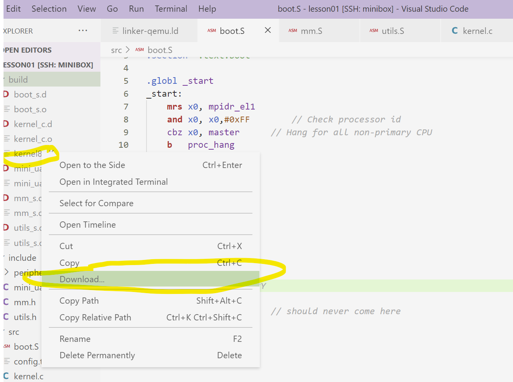
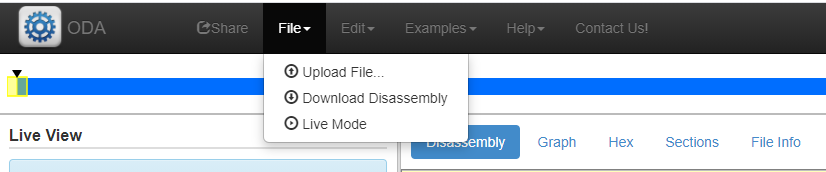
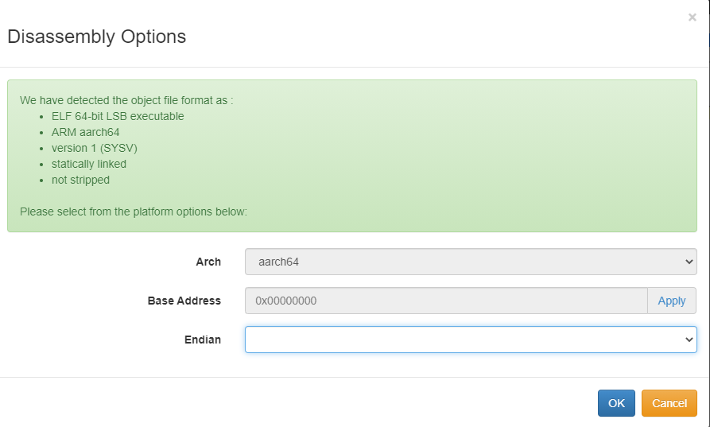
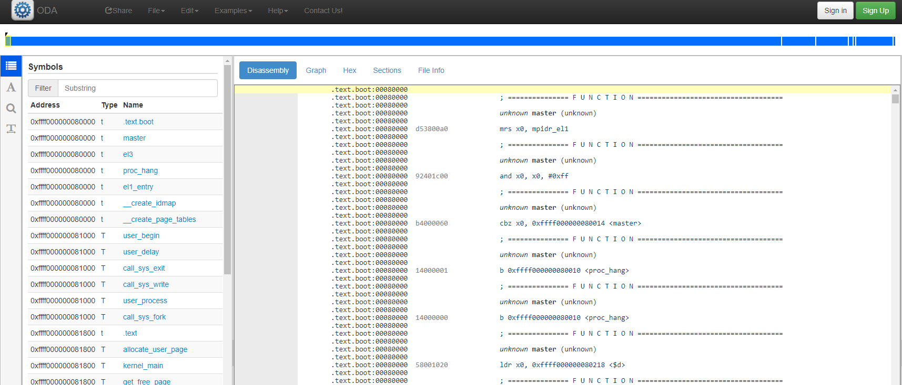
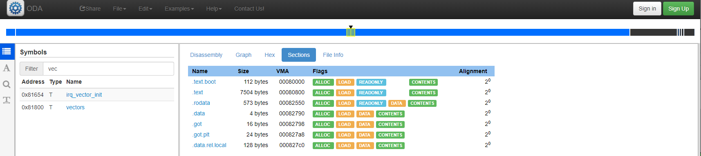
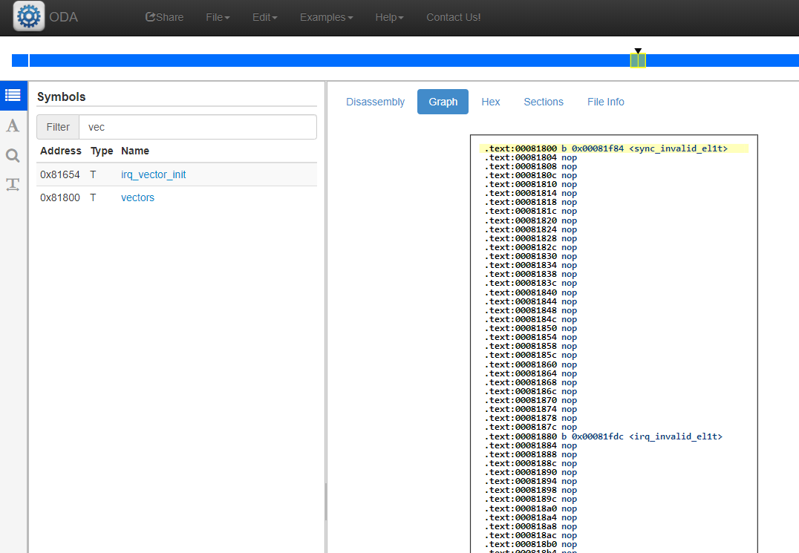

# Inspect kernel binary

## Lookup source line given an address
```
addr2line -e build/kernel8.elf 0x80038
```
Explanation: -e specifies the ELF file with debugging info, followed by a given address

## List all symbols & addresses

```
$ nm build/kernel8.elf
```

Sample output: [kernel8.nm](https://github.com/fxlin/p1-kernel/blob/master/src/lesson06/kernel8.nm)

```assembly
ffff000000082934 t a2d
ffff0000000829b4 t a2i
...
ffff000000085130 B bss_begin
ffff000000102944 B bss_end
...
ffff000000081000 T user_begin
ffff0000000810c8 T user_delay
ffff00000008112e R user_end
ffff00000008105c T user_process
```

Format: "link address" - "symbol type" - "symbol name"

## Kernel disassembly 

### Disassemble the whole kernel
```
aarch64-linux-gnu-objdump -dS build/kernel8.elf
```
Explanation: -d disassembly; -S interleave assembly instructions with source

Sample output: [kernel8.objdump](https://github.com/fxlin/p1-kernel/blob/master/src/lesson06/kernel8.objdump)

```assembly
build/kernel8.elf:     file format elf64-littleaarch64
Disassembly of section .text.boot:
ffff000000080000 <_start>:
.section ".text.boot"
.globl _start
_start:
        mrs     x0, mpidr_el1
ffff000000080000:       d53800a0        mrs     x0, mpidr_el1
        and     x0, x0,#0xFF            // Check processor id
ffff000000080004:       92401c00        and     x0, x0, #0xff
...
void user_process()
{
ffff00000008105c:       a9be7bfd        stp     x29, x30, [sp, #-32]!
ffff000000081060:       910003fd        mov     x29, sp
        call_sys_write("User process\n\r");
ffff000000081064:       90000000        adrp    x0, ffff000000081000 <loop>
ffff000000081068:       9103e000        add     x0, x0, #0xf8
ffff00000008106c:       9400001a        bl      ffff0000000810d4 <call_sys_write>
        int pid = call_sys_fork();
ffff000000081070:       9400001f        bl      ffff0000000810ec <call_sys_fork>
ffff000000081074:       b9001fa0        str     w0, [x29, #28]
...
```

### Disassemble a specific address range

```
aarch64-linux-gnu-objdump -dS build/kernel8.elf \
--start-address=0xffff000000081000 \
--stop-address=0xffff00000008112e 
```

Sample output: 

```
build/kernel8.elf:     file format elf64-littleaarch64
Disassembly of section .text.user:
ffff000000081000 <loop>:
#include "user_sys.h"
#include "user.h"
#include "printf.h"

void loop(char* str)
{
ffff000000081000:       a9bd7bfd        stp     x29, x30, [sp, #-48]!
ffff000000081004:       910003fd        mov     x29, sp
ffff000000081008:       f9000fa0        str     x0, [x29, #24]
        char buf[2] = {""};
ffff00000008100c:       790053bf        strh    wzr, [x29, #40]
        while (1){
```

### Disassemble a specific function

```
gdb -batch -ex 'file build/kernel8.elf' -ex 'disassemble /mr loop'
```

Sample output:

```assembly
Dump of assembler code for function loop:
6       {
   0x00081000 <+0>:     fd      std
   0x00081001 <+1>:     7b bd   jnp    0x80fc0
   0x00081003 <+3>:     a9 fd 03 00 91  test   $0x910003fd,%eax
   0x00081008 <+8>:     a0 0f 00 f9 bf  mov    0xbff9000f,%al

7               char buf[2] = {""};
```

## Dump a section as raw bytes

```
aarch64-linux-gnu-objdump -s -j .rodata build/kernel8.elf
```
Explanation: -j specify which elf section (.rodata in this example) to dump. 

Sample output: 

```
Contents of section .rodata:                                                                                                         [0/1839] ffff0000000849a8 4b65726e 656c2070 726f6365 73732073  Kernel process s
 ffff0000000849b8 74617274 65642e20 454c2025 640d0a00  tarted. EL %d...
 ffff0000000849c8 4572726f 72207768 696c6520 6d6f7669  Error while movi
 ffff0000000849d8 6e672070 726f6365 73732074 6f207573  ng process to us
 ffff0000000849e8 6572206d 6f64650a 0d000000 00000000  er mode.........
 ffff0000000849f8 6b65726e 656c2062 6f6f7473 202e2e2e  kernel boots ...
 ffff000000084a08 0a0d0000 00000000 6572726f 72207768  ........error wh
 ffff000000084a18 696c6520 73746172 74696e67 206b6572  ile starting ker
```

## Online disassembler (ODA)

https://onlinedisassembler.com/odaweb/

A nice web UI for disassembling ELF files

Download kernel8.elf to your local machine, if you build it on the course server. Command line users: use the  `scp` command. VSCode users: right click on kernel8.elf->Download. 



Then, upload the file to ODA.


*Figure above: upload file to ODA.* 

------------------------------


*Figure above: ODA recognizes the uploaded file as ELF for aarch64.* 

------------------




*Figure above: kernel8.elf disassembled. Top (the blue bar): a mini map of memory layout. Left: a list of symbols. Right: the list of instructions at the specified symbol.* 

------------------



*Figure above: ODA shows ELF sections of kernel8.elf.* 

----------------------------------



*Figure above: ODA visualizes the memory layout of IRQ vectors* 