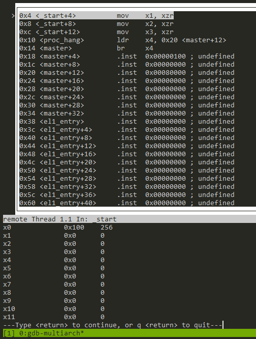
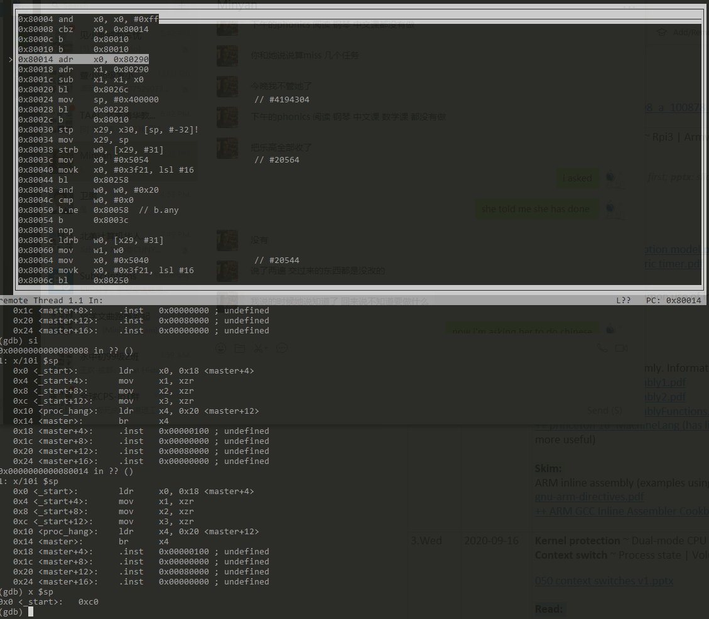

# Using GDB to debug kernel 

**NOTE**: 

1. Read the whole document before you attempt GDB. 
2. *WSL users who want to develop on local machines instead of the server*: gdbserver may not play well with WSL. See "troubleshooting"  below. You are fine if you develop on the server. 

## GDB Installation 

We've done this on the server already. Do this if developing on local machines (Linux or WSL). 

```
sudo apt install gdb-multiarch gcc-aarch64-linux-gnu build-essential 
```
Note: the gdb for aarch64 is NOT called aarch64-XXXX-gdb.

## The workflow

### Launch QEMU + the kernel and wait for the debugger

```
# will wait for gdb to connect at local tcp 1234
qemu-system-aarch64 -M raspi3 -kernel ./kernel8.img -serial null -serial stdio -s -S

# OR, will wait for gdb to connect at local tcp 5678
qemu-system-aarch64 -M raspi3 -kernel ./kernel8.img -serial null -serial stdio -gdb tcp::5678 -S
```

Explanation: -S not starting the guest until you tell it to from gdb.  -s listening for an incoming connection from gdb on TCP port 1234

**WARNING** If multiple students run the first command on the server machine, they all attempt to listen on tcp port 1234. Only one will succeed. If you see such a failure, use the second form to specify a **different** TCP port number (not necessarily 5678 which may be in use as well). 

```
xzl@granger1[~]$ netstat -tulpn|grep 5678
(Not all processes could be identified, non-owned process info
 will not be shown, you would have to be root to see it all.)
tcp        0      0 0.0.0.0:5678            0.0.0.0:*               LISTEN      -
tcp6       0      0 :::5678                 :::*                    LISTEN      -
xzl@granger1[~]$ netstat -tulpn|grep 1234
(Not all processes could be identified, non-owned process info
 will not be shown, you would have to be root to see it all.)
tcp        2      0 0.0.0.0:1234            0.0.0.0:*               LISTEN      -
tcp        0      0 127.0.0.1:12345         0.0.0.0:*               LISTEN      -
tcp        0      0 127.0.0.1:12346         0.0.0.0:*               LISTEN      -
tcp6       0      0 :::1234                 :::*                    LISTEN      -
```

### Launch GDB

From another terminal

```
gdb-multiarch build/kernel8.elf 
(gdb) target remote :1234 
(gdb) layout asm 
```

The port number (e.g. 1234) must match what you specified for QEMU.

Single step 

```
(gdb) si 
```


### Dump register contents

```
(gdb) info reg 
```




show reg information at each step. This example shows 
```
(gdb) display/10i $sp
```



### Dump memory

You can specify a symbol or a raw addr 

... as instructions

```
x/20i _start
```
... as hex (bytes)
```
x/20xb _start
```

... as hex (words)
```
x/20xw _start
```
... as a textual string
```
x/s _start
x/s $x0
```

### Print out variables/structures

```
print *mem_map
```

print the first 10 elements of mem_map, a pointer of type short*

```
print (short[10])*mem_map
```

### Set a breakpoint at addr

```
b *0xffff0000
```

### Function/source lookup

Look up type of a given symbol 
```
ptype mem_map
```

Find out function name at a given addr
```
info line *0x10000000
```

List source at a given addr
```
list *0x10000000
list *fn 
```

## The GDB "dashboard" enhancement

The basic GDB UI is too primitive to beginners. We provide you an enhancement called GDB-dashboard. The upstream source is [here](https://github.com/fxlin/gdb-dashboard-aarch64). I adapted it for aarch64. Screenshot: 


### Installation

Grab from my repository: 

```
wget -P ~ https://raw.githubusercontent.com/fxlin/gdb-dashboard-aarch64/master/.gdbinit
```

There's only one file: `.gdbinit`. It's the initial script that GDB will load upon start. The above line download it to your home directory. 

### Usage

*All GDB commands still apply*, e.g. "si" is single step per instruction; "b" is to set a breakpoint; "c" for continuing execution. See below for more. 

The major features here are multiple views: for registers, stack, assembly, and source. 

#### Customize

Open ~/.gdbinit. Go to near line 2500 where you can see initialization commands for GDB, e.g. 

```
file build/kernel8.elf
target remote :1234
```

> The port number (e.g. 1234) must match what you specified for QEMU.

GDB execute these commands whenever it starts, so you do not have to type them every time. 

In the above example, GDB loads the ELF file kernel8.elf (only for parsing symbols and debugging info); it connects to a remote target at local port 1234. 

Lines below customize gdb-dashboard behaviors, e.g. 

```
dashboard source -style height 15
dashboard assembly -style height 8
```

These lines set the height of the "source" panel and the "assembly" panel. 

The best documentation of gdb-dashboard seems from typing `help dashboard` in the GDB console. e.g. In GDB, type: 

```
>>> help dashboard expressions 
```

Cannot connect? See "troubleshooting" below.

## Other enhancement (FYI)


GEF (https://github.com/hugsy/gef) is also viable. Both GEF and GDB-dashboard: 

* Both enhanced GDB significantly. 

* GEF understands aarch64 semantics (e.g. CPU flags) very well. It can even tell why a branch was taken/not taken. However, GEF does not parse aarch64 callstack properly (at least I cannot get it work). 

* GDB-dashboard nicely parses the callstack. It, however, does not display aarch64 registers properly. 

GEF screenshot (note the CPU flags it recognized)


## Troubleshooting

**Cannot connect and need help?** Report the following:

* Your QEMU version. i.e. the output of "qemu-system-aarch64  --version"
* Have you tried other kernel binaries, e.g. from p1exp1? And the binaries provided by us? https://github.com/fxlin/p1-kernel/releases
* The full commands you use to launch QEMU. Have you tried different port numbers? 
* Launch GDB w/o loading .gdbinit: 

```
gdb-multiarch -n
```

Then enter GDB commands manually, e.g. load, target remote, etc. Does the problem persist? What's the output? 

* Attach screenshot(s) of the above steps, if possible. 

**WSL caveat:**

"gdbserver: Target description specified unknown architecture “aarch64” 
https://stackoverflow.com/questions/53524546/gdbserver-target-description-specified-unknown-architecture-aarch64 
It seems GDB server does not play well with WSL… be aware! 

## Reference 

Launch qemu with gdb 

https://en.wikibooks.org/wiki/QEMU/Debugging_with_QEMU#Launching_QEMU_from_GDB 

more info about gdb for kernel debugging 

https://wiki.osdev.org/Kernel_Debugging 

Good article

https://interrupt.memfault.com/blog/advanced-gdb#source-files

