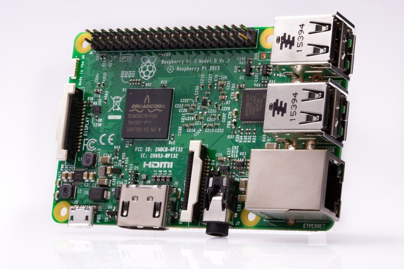
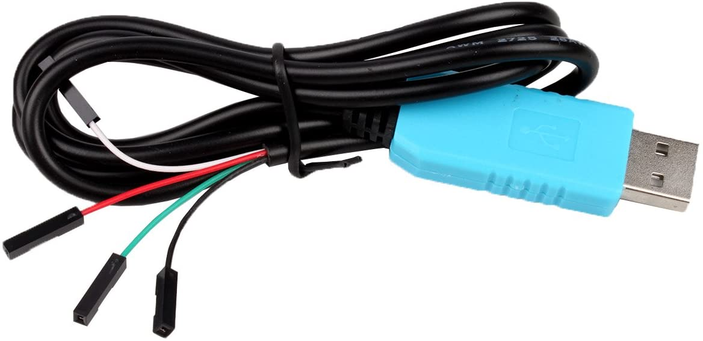
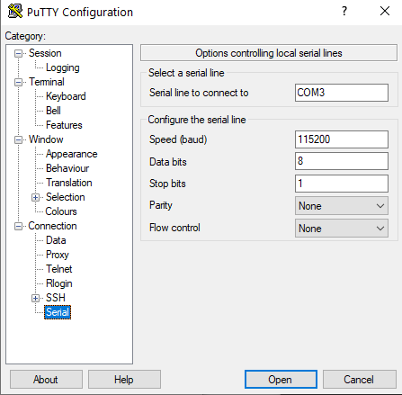

# 0: Sharpen your tools                 

**Get the code**: 

```
git clone https://github.com/fxlin/p1-kernel
```

### Terms

baremetal; kernel; kernel binary; kernel image

## Dev environment

This is where you develop kernel code. 

### If you build kernel for Rpi3 ...

Note: 

* Recommended configurations are <u>underscored</u>.

* How to connect to CS server(s): see [here](../ssh-proxy.md). 

* VSCode: optional. It's available on Win/OSX/Linux. It can be used for any configuration below.

| Your local machine runs: | Develop remotely on CS servers                               | Develop locally                   |
| ------------------------ | ------------------------------------------------------------ | --------------------------------- |
| Windows                  | WSL for SSH shell; then download (scp) kernel binary to local | <u>WSL for toolchain</u>          |
| Linux                    | SSH shell; then download (scp) kernel binary to local        | <u>Native toolchain + console</u> |
| Mac                      | <u>Terminal for SSH shell</u>                                | HomeBrew (untested)               |

### If you build kernel for QEMU ...

Note: 

* Recommended configurations are <u>underscored</u>.

* How to connect to CS server(s): see [here](../ssh-proxy.md). 

* VSCode: optional. It's available on Win/OSX/Linux. It can be used for any configuration below.

| Your local machine runs: | If develop remotely on CS servers | If develop on your local machine              |
| ------------------------ | --------------------------------- | --------------------------------------------- |
| Windows                  | <u>WSL for SSH shell</u>          | WSL for toolchain. gdbserver could be tricky. |
| Linux                    | <u>SSH shell</u>                  | <u>Native toolchain + console</u>             |
| Mac                      | <u>Terminal for SSH shell</u>     | HomeBrew (untested)                           |

### Toolchain

These are compiler, linker, etc. for us to generate the kernel code. Use the one provided by Ubuntu. 

```
# this is necessary only when you develop kernel code on your local machine 
# the server already has the toolchain installed
$ sudo apt install gcc-aarch64-linux-gnu 
$ sudo apt install gdb-multiarch

$ aarch64-linux-gnu-gcc --version
aarch64-linux-gnu-gcc (Ubuntu 9.3.0-17ubuntu1~20.04) 9.3.0
```

## Test Platform  

This is where you run the kernel code. 

### Approach 1: the real hardware 

#### Check list

|  |      |
| ------------- | ---- |
| **Required:** An Rpi3 board (Model B or B+) [link](https://www.raspberrypi.org/products/raspberry-pi-3-model-b/) | **Required:** A USB-serial cable [Amazon](https://www.amazon.com/s/ref=nb_sb_noss_2?url=search-alias%3Daps&field-keywords=usb+to+ttl+serial+cable&rh=i%3Aaps%2Ck%3Ausb+to+ttl+serial+cable). Connection **inside** the dongle: black-GND; green-TXD; white-RXD; red-VCC. |

* **Required:** A micro SD card. The capacity can be humble (e.g. 4GB). The speed does not matter much. The one I used was $6.  [Rpi's official page about uSD](https://www.raspberrypi.org/documentation/installation/sd-cards.md)

* **Required:** SD card reader. To be plugged in your PC for loading kernel to the micro SD card. A cheap one can be $7 on [Amazon](https://www.amazon.com/IOGEAR-MicroSD-Reader-Writer-GFR204SD/dp/B0046TJG1U)

* **Recommended:** A micro USB cable for powering Rpi3. 
#### Prep Raspberry Pi 3 Model B

Older versions of Raspberry Pi are not going to work with this tutorial because all lessons are designed to use a 64-bit processor that supports ARMv8 architecture, and such processor is only available in the Raspberry Pi 3. Newer versions, including [Raspberry Pi 3 Model B+](https://www.raspberrypi.org/products/raspberry-pi-3-model-b-plus/) should work fine. 

#### Load Raspbian OS to the SD card

Raspbian is a Debian-based Linux distro. It's the official OS for Rpi3. Why we need Raspbian? 1. to test USB to TTL cable connectivity initially. 2. after installing Raspbian, the SD card is formatted in the right way. All the proprietary binary blobs needed to boot Rpi3 are also in place. 

Load the SD card with Raspbian OS. Follow the official [instructions](https://www.raspberrypi.org/downloads/raspbian/). 

#### Plug in the serial cable

```
Rpi3 <-- a USB-serial cable ---> PC (running a temrinal emulator) 
```

After you get a serial cable, you need to test your connection. If you never did this before I recommend you to follow [this guide](https://cdn-learn.adafruit.com/downloads/pdf/adafruits-raspberry-pi-lesson-5-using-a-console-cable.pdf) It describes the process of connecting your Raspberry PI via a serial cable in great details. Basically, you run Raspberry's official OS to ensure the hardware setup is fine. 


#### Configure the serial emulator on your PC

Linux users: minicom recommended.

```
sudo minicom -b 115200 -o -D /dev/ttyUSB0 -C /tmp/minicom.log
```

Note: your PC may give different names to the USB-serial dongle, e.g. /dev/ttyUSB1. Find it out by looking at `dmesg` output. 

Windows users (including WSL): PuTTY recommended. A sample configuration below. 



Note: your PC may give different names to the USB-serial dongle, e.g. COM4. Find it out by looking at Windows Device Manager. 

#### Powering up RPi3

We recommend you power Rpi3 through its micro USB port. Perhaps use a flip switch on the other side of the USB power for power cycling Rpi3. The guide above also describes how to power your Raspberry Pi using a serial cable. RPi OS works fine with such kind of setup, however, in this case, you need to run your terminal emulator right after you plug in the cable. Check [this](https://github.com/s-matyukevich/raspberry-pi-os/issues/2) issue for details.

```
Rpi3 <-- micro USB ---> PC
Rpi3 <-- micro USB ---> Wall charger
```

Power cycling Rpi3, you should see Linux kernel console output on PC terminal. 

#### An example setup

This is my desktop when I hack with the Rpi3 kernel. 


#### Test your dev workflow

##### Background: what's on SD card?

On powering up, Rpi3 looks for the following files on `boot` partition of the SD card. 

* bootcode.bin: the proprietary bootloader for enabling SDRAM. This comes with Raspbian. 
* start.elf: the proprietary firmware loaded by the bootloader. Using the updated Raspbian OS. This comes with Raspbian. 
* fixup.dat: needed to use 1GB of memory. This comes with Raspbian. 
* config.txt: to be parsed by start.elf and decide boot behavior. It offers a great deal of options which is pretty cool. A default one comes with Raspbian. **This file is to be customized by us** 
* kernel8.img: our kernel. 

Summary: we need to change config.txt (once) and kernel8.img (every time we re-compile kernel) on the SD card. 

#### Update config.txt

Plug the SD card to PC via the card reader. Open config.txt which is on the boot partition. The following two lines are crucial. Add them to config.txt. 

```
arm_64bit=1
enable_uart=1
```

Note: multiple online tutorials advise options like `kernel_old=1` or `arm_control`. You do NOT need those. With our options in config.txt above, Rpi3 will load the kernel named **kernel8.img** to **0x80000**. Check the official doc for config.txt above. Look for `kernel_address`. 

Ref: the official [doc](https://www.raspberrypi.org/documentation/configuration/config-txt/boot.md) for config.txt. 

#### Build & load sample baremetal program

... to ensure our toolchain works fine. 

```
git clone git@github.com:fxlin/raspi3-tutorial.git
cd raspi3-tutorial
git checkout b026449
cd 05_uart0
make 
```

**Note**: the repo above (raspi3-tutorial.git) is NOT our project repo. It's someone's code for testing rpi3 hardware. We are just using for testing ONLY. 

Copy kernel8.img to the SD card. Eject the SD card from PC. Plug the SD to Rpi3. Make sure the serial connection is good and terminal emulator on your PC is ready. Power cycle Rpi3. You should see something like: 


(Your serial number may be different)

Viola! You just built your first baremetal program for Rpi3! 

### Approach 2: QEMU 

#### Compile QEMU from source 

*This is required no matter you develop on local machines or on the server.* 

Clean any pre-installed qemu and install necessary tools: 

```
# this is necessary only when you develop kernel code on your own machine (not recommended)
# the server already has these software uninstalled/installed
sudo apt remove qemu-system-arm
sudo apt install gdb-multiarch build-essential pkg-config
sudo apt install libglib2.0-dev libfdt-dev libpixman-1-dev zlib1g-dev
```

Grab the QEMU source.  Our QEMU is based on upstream v4.2 **with custom aarch64 debugging support.** 

```
git clone https://github.com/fxlin/qemu-cs4414.git qemu
cd qemu
./configure --target-list=aarch64-softmmu
make -j`nproc`
export PATH="$(pwd)/aarch64-softmmu:${PATH}"
```

If successful, this will result in QEMU executables in ./aarch64-softmmu/. The last line above adds the path to our search path. 

If you encounter compilation errors (e.g. unmet dependencies), make sure you run all `apt get` commands above. 

Now try QEMU & check its version. The supported machines should include Rpi3

```
$ qemu-system-aarch64  --version                 
QEMU emulator version 5.0.50 (v5.0.0-1247-gaf6f75d03f-dirty)                   
Copyright (c) 2003-2020 Fabrice Bellard and the QEMU Project developers        
patched for cs4414/6456 aarch64 kernel hacking    

$ qemu-system-aarch64 -M help|grep rasp
raspi2               Raspberry Pi 2B
raspi3               Raspberry Pi 3B
```

#### Test the compilation

Test QEMU with Rpi3 baremetal code (NOTE: this repo is for validating your toolchain & QEMU build; it is NOT our course project)

```
git clone https://github.com/fxlin/raspi3-tutorial.git
cd raspi3-tutorial
git checkout b026449
cd 05_uart0
make 
qemu-system-aarch64 -M raspi3 -kernel kernel8.img -serial stdio
```

If everything works fine, you should see QMEU print out: 

```
My serial number is: 0000000000000000
```
>  Note: the test program runs an infinite loop which will cause high CPU usage on your host machine. Kill the test program timely. 

On Linux:


On Windows (WSL) 


Move to [the QEMU cheatsheet](../qemu.md). 

```

```