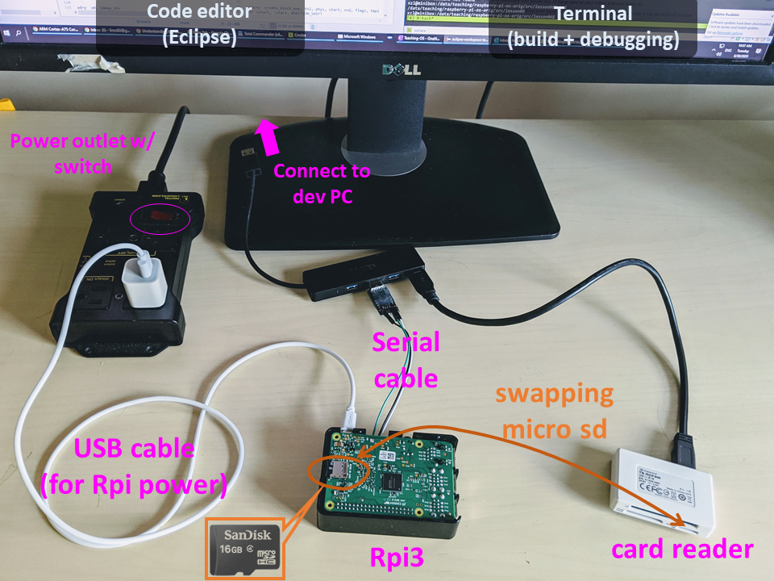
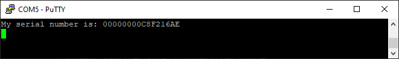

# Sharpen your tools

## About the docs

Be aware: it may contain URLs referring to the upstream git repo, which may slightly differ from what we use. 

### Terms

baremetal

kernel, kernel binary, kernel image

## Dev environment

### Host OS

- Linux: Ubuntu 18.04
- Windows: WSL 
- OS X: (??)

### Toolchain

Use the one provided by Ubuntu. Save the hassle from compiling from source, etc.

```
$ sudo apt install gcc-aarch64-linux-gnu 

$ aarch64-linux-gnu-gcc --version
aarch64-linux-gnu-gcc (Ubuntu/Linaro 7.5.0-3ubuntu1~18.04) 7.5.0
```

## Platform Setup 

### Approach 1: the real hardware 

#### Check list

* **Required:** An Rpi3 board (Model B or B+) [link](https://www.raspberrypi.org/products/raspberry-pi-3-model-b/)


* **Required:** A USB to TTL serial cable [Amazon](https://www.amazon.com/s/ref=nb_sb_noss_2?url=search-alias%3Daps&field-keywords=usb+to+ttl+serial+cable&rh=i%3Aaps%2Ck%3Ausb+to+ttl+serial+cable). Connection **inside** the dongle: black-GND; green-TXD; white-RXD; red-VCC.


* **Required:** A micro SD card. The capacity can be humble (e.g. 4GB). The speed does not matter much. The one I used was $6.  [Rpi's official page about uSD]([https://www.raspberrypi.org/documentation/installation/sd-cards.md))

* **Required:** SD card reader. To be plugged in your PC for loading kernel to the micro SD card. A cheap one can be $7 on [Amazon](https://www.amazon.com/IOGEAR-MicroSD-Reader-Writer-GFR204SD/dp/B0046TJG1U)

* **Recommended:** A micro USB cable for powering Rpi3. 
#### Prep Raspberry Pi 3 Model B

Older versions of Raspberry Pi are not going to work with this tutorial because all lessons are designed to use a 64-bit processor that supports ARMv8 architecture, and such processor is only available in the Raspberry Pi 3. Newer versions, including [Raspberry Pi 3 Model B+](https://www.raspberrypi.org/products/raspberry-pi-3-model-b-plus/) should work fine. 

#### Load Raspbian OS to the SD card

Raspbian is a Debian-based Linux distro. It's the official OS for Rpi3. Why we need Raspbian? 1. to test USB to TTL cable connectivity initially. 2. after installing Raspbian, the SD card is formatted in the right way. All the proprietary binary blobs needed to boot Rpi3 are also in place. 

Load the SD card with Raspbian OS. Follow the official [instructions](https://www.raspberrypi.org/downloads/raspbian/). 

#### Plug in the serial cable

After you get a serial cable, you need to test your connection. If you never did this before I recommend you to follow [this guide](https://cdn-learn.adafruit.com/downloads/pdf/adafruits-raspberry-pi-lesson-5-using-a-console-cable.pdf) It describes the process of connecting your Raspberry PI via a serial cable in great details. Basically, you run Raspberry's official OS to ensure the hardware setup is fine. 


#### Powering up RPi3

We recommend you power Rpi3 through its micro USB port. Perhaps use a flip switch on the other side of the USB power for power cycling Rpi3. The guide above also describes how to power your Raspberry Pi using a serial cable. RPi OS works fine with such kind of setup, however, in this case, you need to run your terminal emulator right after you plug in the cable. Check [this](https://github.com/s-matyukevich/raspberry-pi-os/issues/2) issue for details.

``` 
Rpi3 <-- micro USB ---> PC
Rpi3 <-- micro USB ---> Wall charger
```

Power cycling Rpi3, you should see Linux kernel console output on PC terminal. 

#### An example setup

This is my desktop when I hack with the Rpi3 kernel. 



#### Test your dev workflow

##### Background: what's on SD card?

On powering up, Rpi3 looks for the following files on `boot` partition of the SD card. 

* bootcode.bin: the proprietary bootloader for enabling SDRAM. This comes with Raspbian. 
* start.elf: the proprietary firmware loaded by the bootloader. Using the updated Raspbian OS. This comes with Raspbian. 
* fixup.dat: needed to use 1GB of memory. This comes with Raspbian. 
* config.txt: to be parsed by start.elf and decide boot behavior. It offers a great deal of options which is pretty cool. A default one comes with Raspbian. **This file is to be customized by us** 
* kernel8.img: our kernel. 

Summary: we need to change config.txt (once) and kernel8.img (every time we re-compile kernel) on the SD card. 

#### Update config.txt

Plug the SD card to PC via the card reader. Open config.txt which is on the boot partition. The following two lines are crucial. Add them to config.txt. 

```
arm_64bit=1
enable_uart=1
```

Note: multiple online tutorials advise options like `kernel_old=1` or `arm_control`. You do NOT need those. With our options in config.txt above, Rpi3 will load the kernel named **kernel8.img** to **0x80000**. Check the official doc for config.txt above. Look for `kernel_address`. 

Ref: the official [doc](https://www.raspberrypi.org/documentation/configuration/config-txt/boot.md) for config.txt. 

#### Build & load sample baremetal program

... to ensure our toolchain works fine. 

```
git clone git@github.com:fxlin/raspi3-tutorial.git
cd raspi3-tutorial
git checkout b026449
cd 05_uart0
make 
qemu-system-aarch64 -M raspi3 -kernel kernel8.img -serial stdio
```

Copy kernel8.img to the SD card. Eject the SD card from PC. Plug the SD to Rpi3. Make sure the serial connection is good and terminal emulator on your PC is ready. Power cycle Rpi3. You should see something like: 



(Your serial number may be different)

Viola! You just built your first baremetal program for Rpi3! 

<!--### 4. Docker
Strictly speaking, Docker is not a required dependency. It is just convenient to use Docker to build source code of the lessons, especially for Mac and Windows users. Each lesson has `build.sh` script (or `build.bat` for windows users) This script uses Docker to build source code of the lesson. Instructions how to install docker for your platform can be found on the [official docker website]
(https://docs.docker.com/engine/installation/)  If for some reasons you want to avoid using Docker, you can install the [make utility](http://www.math.tau.ac.il/~danha/courses/software1/make-intro.html) as well as  `aarch64-linux-gnu` toolchain. If you are using Ubuntu you just need to install `gcc-aarch64-linux-gnu` and `build-essential` packages.
-->

### Approach 2: QEMU 

Need QEMU (>v2.12). Newer version is likely fine. The following shows the default QEMU coming with Ubuntu 18.04 is too old. 

```
$ qemu-system-aarch64  --version
QEMU emulator version 2.11.1(Debian 1:2.11+dfsg-1ubuntu7.26)
Copyright (c) 2003-2017 Fabrice Bellard and the QEMU Project developers
```

Build QEMU from source. 

```
sudo apt remove qemu-system-arm
sudo apt install gdb-multiarch build-essential pkg-config
sudo apt install libglib2.0-dev libfdt-dev libpixman-1-dev zlib1g-dev
```

Grab source.  We use v4.2. 

```
git clone git://git.qemu.org/qemu.git
cd qemu
git checkout v4.2.0
./configure --target-list=aarch64-softmmu
make -j`nproc`
export PATH="$(pwd)/aarch64-softmmu:${PATH}"
```

Try QEMU & check its version. The supported machines should include Rpi3

```
$ qemu-system-aarch64  --version
QEMU emulator version 4.2.0 (v4.2.0-11797-g2890edc853-dirty)
Copyright (c) 2003-2019 Fabrice Bellard and the QEMU Project developers

$ qemu-system-aarch64 -M help|grep rasp
raspi2               Raspberry Pi 2
raspi3               Raspberry Pi 3
```

Test QEMU with Rpi3 baremetal code

```
git clone https://github.com/fxlin/raspi3-tutorial.git
cd raspi3-tutorial
git checkout b026449
cd 05_uart0
make 
qemu-system-aarch64 -M raspi3 -kernel kernel8.img -serial stdio
```

If everything works fine, you should see QMEU print out: 

```
My serial number is: 0000000000000000
```
