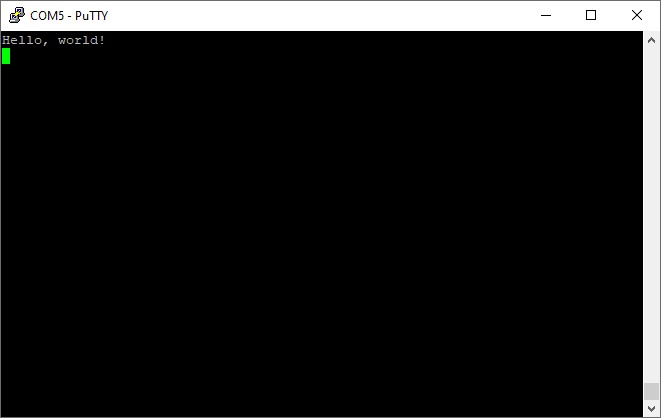

# 1: Baremetal HelloWorld

## Objectives



We will build: a minimal, baremetal program that can print "Hello world" via Rpi3's UART. 

Students will experience: 

1. The C project structure

2. The use of cross-compilation toolchain

3. arm64 assembly (lightly)

4. Basic knowledge on Rpi3 and its UART hardware

## Roadmap

Create a Makefile project. Add minimum code to boot the platform. Initialize the UART hardware. Send characters to the UART registers. 

## Terms 

1. Strictly speaking, this baremetal program is not a "kernel". We nevertheless call it so for ease of explanation. 

2. "Raspberry Pi" means the actual Rpi3 hardware. "QEMU" means the Rpi3 platform as emulated by QEMU. We will explain details where the real hardware behaves differently from QEMU. 

## Project structure

1. **Makefile** We will use the [make](http://www.math.tau.ac.il/~danha/courses/software1/make-intro.html) utility to build the kernel. `make`'s behavior is configured by a Makefile, which contains instructions on how to compile and link the source code. 
1. **src** This folder contains all of the source code.
1. **include** All of the header files are placed here. 

Note: Of all the subsequent experiments in p1, the source code has the same structure. 

<!--- 1. **build.sh or build.bat** You'll need these files if you want to build the kernel using Docker. You won't need to have the make utility or the compiler toolchain installed on your laptop. --->

### Makefile walkthrough

If you are not familiar with Makefiles, read [this](http://opensourceforu.com/2012/06/gnu-make-in-detail-for-beginners/) article. 

The complete Makefile: 

```
ARMGNU ?= aarch64-linux-gnu

COPS = -Wall -nostdlib -nostartfiles -ffreestanding -Iinclude -mgeneral-regs-only -O0 -g
ASMOPS = -Iinclude  -g

BUILD_DIR = build
SRC_DIR = src

all : kernel8.img

clean :
    rm -rf $(BUILD_DIR) *.img 

$(BUILD_DIR)/%_c.o: $(SRC_DIR)/%.c
    mkdir -p $(@D)
    $(ARMGNU)-gcc $(COPS) -MMD -c $< -o $@

$(BUILD_DIR)/%_s.o: $(SRC_DIR)/%.S
    $(ARMGNU)-gcc $(ASMOPS) -MMD -c $< -o $@

C_FILES = $(wildcard $(SRC_DIR)/*.c)
ASM_FILES = $(wildcard $(SRC_DIR)/*.S)
OBJ_FILES = $(C_FILES:$(SRC_DIR)/%.c=$(BUILD_DIR)/%_c.o)
OBJ_FILES += $(ASM_FILES:$(SRC_DIR)/%.S=$(BUILD_DIR)/%_s.o)

DEP_FILES = $(OBJ_FILES:%.o=%.d)
-include $(DEP_FILES)

kernel8.img: $(SRC_DIR)/linker.ld $(OBJ_FILES)
    $(ARMGNU)-ld -T $(SRC_DIR)/linker.ld -o $(BUILD_DIR)/kernel8.elf  $(OBJ_FILES)
    $(ARMGNU)-objcopy $(BUILD_DIR)/kernel8.elf -O binary kernel8.img
```
Let's inspect this file in detail:
```
ARMGNU ?= aarch64-linux-gnu
```
The Makefile starts with a variable definition. `ARMGNU` is a cross-compiler prefix. We need to use a [cross-compiler](https://en.wikipedia.org/wiki/Cross_compiler) because we are compiling the source code for the `arm64` architecture on an `x86` machine. So instead of `gcc`, we will use `aarch64-linux-gnu-gcc`. 

```
COPS = -Wall -nostdlib -nostartfiles -ffreestanding -Iinclude -mgeneral-regs-only
ASMOPS = -Iinclude 
```

`COPS` and `ASMOPS` are options that we pass to the compiler when compiling C and assembler code, respectively. These options require a short explanation:

* **-Wall** Show all warnings. A good practice. 
* **-nostdlib** Don't use the C standard library. Most of the calls in the C standard library eventually interact with the operating system. We are writing a bare-metal program, and we don't have any underlying operating system, so the C standard library is not going to work for us anyway.
* **-nostartfiles** Don't use standard startup files. Startup files are responsible for setting an initial stack pointer, initializing static data, and jumping to the main entry point. We are going to do all of this by ourselves.
* **-ffreestanding** A freestanding environment is an environment in which the standard library may not exist, and program startup may not necessarily be at main. The option `-ffreestanding` directs the compiler to not assume that standard functions have their usual definition.
* **-Iinclude** Search for header files in the `include` folder.
* **-mgeneral-regs-only**. Use only general-purpose registers. ARM processors also have [NEON](https://developer.arm.com/technologies/neon) registers. We don't want the compiler to use them because they add additional complexity (since, for example, we will need to store the registers during a context switch).
* **-g** Include debugging info in the resultant ELF binary. 
* **-O0** Turn off any compiler optimization. For ease of debugging. 

```
BUILD_DIR = build
SRC_DIR = src
```

`SRC_DIR` and `BUILD_DIR` are directories that contain source code and compiled object files, respectively.

```
all : kernel8.img

clean :
    rm -rf $(BUILD_DIR) *.img 
```

### Build targets & rules

The first two targets are pretty simple: the `all` target is the default one, and it is executed whenever you type `make` without any arguments (`make` always uses the first target as the default). This target just redirects all work to a different target, `kernel8.img`. 

> The name "kernel8.img" is mandated by the Rpi3 firmware. The trailing `8` denotes ARMv8 which is a 64-bit architecture. This filename tells the firmware to boot the processor into 64-bit mode.

The `clean` target is responsible for deleting all compilation artifacts and the compiled kernel image.

```
$(BUILD_DIR)/%_c.o: $(SRC_DIR)/%.c
    mkdir -p $(@D)
    $(ARMGNU)-gcc $(COPS) -MMD -c $< -o $@

$(BUILD_DIR)/%_s.o: $(SRC_DIR)/%.S
    $(ARMGNU)-gcc $(ASMOPS) -MMD -c $< -o $@
```

The next two targets are responsible for compiling C and assembler files. If, for example, in the `src` directory we have `foo.c` and `foo.S` files, they will be compiled into `build/foo_c.o` and `build/foo_s.o`, respectively. `$<` and `$@` are substituted at runtime with the input and output filenames (`foo.c` and `foo_c.o`). Before compiling C files, we also create a `build` directory in case it doesn't exist yet.

```
C_FILES = $(wildcard $(SRC_DIR)/*.c)
ASM_FILES = $(wildcard $(SRC_DIR)/*.S)
OBJ_FILES = $(C_FILES:$(SRC_DIR)/%.c=$(BUILD_DIR)/%_c.o)
OBJ_FILES += $(ASM_FILES:$(SRC_DIR)/%.S=$(BUILD_DIR)/%_s.o)
```

Here we are building an array of all object files (`OBJ_FILES`) created from the concatenation of both C and assembler source files.

```
DEP_FILES = $(OBJ_FILES:%.o=%.d)
-include $(DEP_FILES)
```

The next two lines are a little bit tricky. If you take a look at how we defined our compilation targets for both C and assembler source files, you will notice that we used the `-MMD` parameter. This parameter instructs the `gcc` compiler to create a dependency file for each generated object file. A dependency file defines all of the dependencies for a particular source file. These dependencies usually contain a list of all included headers. We need to include all of the generated dependency files so that make knows what exactly to recompile in case a header changes. 

### Bake the kernel binaries

```
$(ARMGNU)-ld -T $(SRC_DIR)/linker.ld -o kernel8.elf  $(OBJ_FILES)
```

We use the `OBJ_FILES` array to build the `kernel8.elf` file. We use the linker script `src/linker.ld` to define the basic layout of the resulting executable image (we will discuss the linker script in the next section).

------------------

```
$(ARMGNU)-objcopy kernel8.elf -O binary kernel8.img
```

**kernel8.elf & kernel8.img**

* **build/kernel8.elf ("kernel binary"):** Our build outcome as an ELF file. It contains all code, data, and debugging info. Often, to execute an ELF program in user space, there should be a loader to parse ELF, load code & data to designated memory locations, etc. For our kernel experiment, we do NOT have such a loader for the kernel itself. 
* **kernel8.img ("kernel image"):** The raw instructions & data as extracted from kernel8.elf. The raw image is to be loaded to memory. Since it's a memory dump (see below), the load is as simple as byte-by-byte copy. 

> The kernel image is produced by `objcopy`. Its manual says: 
>
> "`objcopy` can be used to generate a raw binary file by using an output target of ‘binary’ (e.g., use -O binary). When `objcopy` generates a raw binary file, it will essentially produce a memory dump of the contents of the input object file. All symbols and relocation information will be discarded. The memory dump will start at the load address of the lowest section copied into the output file."
>
> Q: can you use `readelf` to examine kernel8.elf, and explain your observation? 

<!----- **Note: the following only applies to Rpi3 hardware. QEMU, which does not implement Rpi3's firmware, does not know config.txt.** You can also boot the CPU in the 64-bit mode by using `arm_control=0x200` flag in the `config.txt` file. The RPi OS previously used this method, and you can still find it in some of the exercise answers. However, `arm_control` flag is undocumented and it is preferable to use `kernel8.img` naming convention instead. --->

### The linker script

A linker script describes how the sections in the input object files (`_c.o` and `_s.o`) should be mapped into the output file (`.elf`); it also controls the addresses of all program symbols (e.g. functions and variables). More information can be found [here](https://sourceware.org/binutils/docs/ld/Scripts.html#Scripts). Now let's take a look at the linker script:

```
SECTIONS
{
    .text.boot : { *(.text.boot) }
    .text :  { *(.text) }
    .rodata : { *(.rodata) }
    .data : { *(.data) }
    . = ALIGN(0x8);
    bss_begin = .;
    .bss : { *(.bss*) } 
    bss_end = .;
}
```

After startup, the Rpi3 GPU loads `kernel8.img` into memory 0x0 and starts execution from the beginning of the file. That's why the `.text.boot` section must come first; we are going to put the kernel startup code inside this section. QEMU behaves differently: it loads the kernel image at 0x80000. 

>  Q: How to tweak the linker script to update the start address?

The `.text`, `.rodata`, and `.data` sections contain kernel instructions, read-only data, and global data with init values. The `.bss` section contains data that should be initialized to 0. By putting such data in a separate section, the compiler can save some space in the ELF binary––only the section size is stored in the ELF header, but the section content is omitted. 

After booting up, our kernel initializes the `.bss` section to 0; that's why we need to record the start and end of the section (hence the `bss_begin` and `bss_end` symbols) and align the section so that it starts at an address that is a multiple of 8. This eases kernel programming because the `str` instruction can be used only with 8-byte-aligned addresses.

## Kernel startup

### Booting the kernel

boot.S contains the kernel startup code:

```
#include "mm.h"

.section ".text.boot"

.globl _start
_start:
    mrs    x0, mpidr_el1        
    and    x0, x0,#0xFF        // Check processor id
    cbz    x0, master        // Hang for all non-primary CPU
    b    proc_hang

proc_hang: 
    b proc_hang

master:
    adr    x0, bss_begin
    adr    x1, bss_end
    sub    x1, x1, x0
    bl     memzero

    mov    sp, #LOW_MEMORY
    bl    kernel_main
```
Let's review this file in detail:
```
.section ".text.boot"
```
First, we specify that everything defined in `boot.S` should go in the `.text.boot` section. Previously, we saw that this section is placed at the beginning of the kernel image by the linker script. So when the kernel is started, execution begins at the `start` function:
```
.globl _start
_start:
    mrs    x0, mpidr_el1        
    and    x0, x0,#0xFF        // Check processor id
    cbz    x0, master        // Hang for all non-primary CPU
    b    proc_hang
```

Rpi3 has 4 cores, and after the device is powered on, each core begins to execute the same code. Our kernel only works with the first one and put all of the other cores in an endless loop. This is exactly what the `_start` function is responsible for. It gets the processor ID from the [mpidr_el1](http://infocenter.arm.com/help/index.jsp?topic=/com.arm.doc.ddi0500g/BABHBJCI.html) system register. 

> Q: It may make more sense to put core 1-3 in deep sleep using ``wfi``. How? 

### Kernel memory layout

If the current processor ID is 0, then execution branches to the `master` function:

```
master:
    adr    x0, bss_begin
    adr    x1, bss_end
    sub    x1, x1, x0
    bl     memzero
```

Here, we clean the `.bss` section by calling `memzero`. We will define this function later. In ARMv8 architecture, by convention, the first seven arguments are passed to the called function via registers x0–x6 (cf: our cheat sheet). The `memzero` function accepts only two arguments: the start address (`bss_begin`) and the size of the section needed to be cleaned (`bss_end - bss_begin`).

```
    mov    sp, #LOW_MEMORY
    bl    kernel_main
```


After cleaning the `.bss` section, the kernel initializes the stack pointer and passes execution to the `kernel_main` function. The Rpi3 loads the kernel at address 0 (QEMU loads at 0x80000); that's why the initial stack pointer can be set to any location high enough so that stack will not override the kernel image when it grows sufficiently large. `LOW_MEMORY` is defined in [mm.h](https://github.com/s-matyukevich/raspberry-pi-os/blob/master/src/lesson01/include/mm.h) and is equal to 4MB. As our kernel's stack won't grow very large and the image itself is tiny, 4MB is more than enough for us. 

**Aside: Some ARM64 instructions used** 

For those of you who are not familiar with ARM assembler syntax, let me quickly summarize the instructions that we have used:

* [**mrs**](http://www.keil.com/support/man/docs/armasm/armasm_dom1361289881374.htm) Load value from a system register to one of the general purpose registers (x0–x30)
* [**and**](http://www.keil.com/support/man/docs/armasm/armasm_dom1361289863017.htm) Perform the logical AND operation. We use this command to strip the last byte from the value we obtain from the `mpidr_el1` register.
* [**cbz**](http://www.keil.com/support/man/docs/armasm/armasm_dom1361289867296.htm) Compare the result of the previously executed operation to 0 and jump (or `branch` in ARM terminology) to the provided label if the comparison yields true.
* [**b**](http://www.keil.com/support/man/docs/armasm/armasm_dom1361289863797.htm) Perform an unconditional branch to some label.
* [**adr**](http://www.keil.com/support/man/docs/armasm/armasm_dom1361289862147.htm) Load a label's relative address into the target register. In this case, we want pointers to the start and end of the `.bss` region.
* [**sub**](http://www.keil.com/support/man/docs/armasm/armasm_dom1361289908389.htm) Subtract values from two registers.
* [**bl**](http://www.keil.com/support/man/docs/armasm/armasm_dom1361289865686.htm) "Branch with a link": perform an unconditional branch and store the return address in x30 (the link register). When the subroutine is finished, use the `ret` instruction to jump back to the return address.
* [**mov**](http://www.keil.com/support/man/docs/armasm/armasm_dom1361289878994.htm) Move a value between registers or from a constant to a register.

Our [cheat sheet](../../cheatsheet.md) summarizes common ARM64 instructions. 

For official documentation, [here](http://infocenter.arm.com/help/index.jsp?topic=/com.arm.doc.den0024a/index.html) is the ARMv8-A developer's guide. It's a good resource if the ARM ISA is unfamiliar to you. [This page](http://infocenter.arm.com/help/index.jsp?topic=/com.arm.doc.den0024a/ch09s01s01.html) specifically outlines the register usage convention in the ABI.

### The `kernel_main` function

We have seen that the boot code eventually passes control to the `kernel_main` function. Let's take a look at it:
```
#include "mini_uart.h"

void kernel_main(void)
{
    uart_init();
    uart_send_string("Hello, world!\r\n");

    while (1) {
        uart_send(uart_recv());
    }
}
```

This function is one of the simplest in the kernel. It works with the `Mini UART` device to print to screen and read user input. The kernel just prints `Hello, world!` and then enters an infinite loop that reads characters from the user and sends them back to the screen.

## A bit about the Rpi3 hardware
The Rpi3 board is based on the BCM2837 SoC by Broadcom. The SoC manual is [here](https://github.com/raspberrypi/documentation/files/1888662/BCM2837-ARM-Peripherals.-.Revised.-.V2-1.pdf). The SoC is not friendly for OS hackers: Broadcom poorly documents it and the hardware has many quirks. Despite so, the community figured out most of the SoC details over years because Rpi3's popularity. It's not our goal to dive in the SoC. Rather, our philosophy is to deal BCM2837-specific details as few as possible -- just enough to get our kernel working. We will spend more efforts on explaining generic hardware such as ARM64 cores, generic timers, irq controllers, etc. 

> Rpi4 seems more friendly to kernel hackers. 

### Memory-mapped IO
On ARM-based SoCs, access to all devices is performed via memory-mapped registers. The Rpi3 SoC reserves physical memory address `0x3F000000` for IO devices. To configure a particular device, software reads/writes device registers. A device register is just a 32-bit region of memory. The meaning of each bit in each IO register is described in the SoC manual. 

<!---- Take a look at section 1.2.3 ARM physical addresses in the SoC manual and the surrounding documentation for more context on why we use `0x3F000000` as a base address (even though `0x7E000000` is used throughout the manual). ---->

> The term "device" is heavily overloaded in many tech docs. Sometimes it means a board, e.g. "an Rpi3 device"; sometimes it means an IO peripheral, e.g. "UART device". We will be explicit. 

### UART
UART is a simple character device allowing software to send out text characters to a different machine. If you do not care about performance, UART requires very minimum software code. Therefore, it is often the first few IO devices to bring up when we build system software for a new machine. Only with UART meaning debugging is possible. (JTAG is another option which however requires more complex setup).

In the simplest form, software writes ascii values to UART registers. The UART device converts written values to a sequence of high and low voltages on wire. This sequence is transmitted to your via the `TTL-to-serial cable` and is interpreted by your terminal emulator (e.g. PuTTY on Windows). 

Rpi3 has the two UART devices. Oddly enough, they are different. 

| Name  | Type      | Comments                                   |
| :---- | :-------- | ------------------------------------------ |
| UART0 | PL011     | Secondary, intended as Bluetooth connector |
| UART1 | mini UART | Primary, intended as debug console         |

UART1/Mini UART: easier to program; limited performance/functionalities. That's fine for our goal. For specification of the Mini UART registers: see page 8 of the SoC manual. 

UART0/PL011: richer functions; higher speed. Yet one needs to configure the board clock by talking to the GPU firmware. We won't do that. see [Example code](https://github.com/bztsrc/raspi3-tutorial/tree/master/05_uart0) if you are interested. 

<!--- A Raspberry Pi has two UARTs: Mini UART and PL011 UART. In this tutorial, we are going to work only with the first one, because it is simpler. There is, however, an optional [exercise](https://github.com/s-matyukevich/raspberry-pi-os/blob/master/docs/lesson01/exercises.md) that shows how to work with PL011 UART. -->

The above information is enough. More about Raspberry Pi UARTs: see the [official web page](https://www.raspberrypi.org/documentation/configuration/uart.md). 

### GPIO

Another IO device is GPIO [General-purpose input/output](https://en.wikipedia.org/wiki/General-purpose_input/output). GPIO provides a bunch of registers. Each bit in such a register corresponds to a pin on the Rpi3 board. By writing 1 or 0 to register bits, software can control the output voltage on the pins, e.g. for turning on/off LEDs connected to such pins. Reading is done in a similar fashion. The picture below shows GPIO pin headers populated on Rpi3. (Note: the picture shows Rpi2, which has the same pinout as Rpi3)


An SoC often has limited number of pins. Software can control the use of these pins, e.g. for GPIO or for UART. Software does so by writing to specific memory-mapped registers. 

The GPIO can be used to configure the behavior of different GPIO pins. For example, to be able to use the Mini UART, we need to activate pins 14 and 15 and set them up to use this device. The image below illustrates how numbers are assigned to the GPIO pins:


## Walkthrough: the UART code

The following init code configures pin 14 & 15 as UART in/out, sets up UART clock and its modes, etc. 

> Much of the UART init code is irrelevant to QEMU. Since QEMU "emulates" the UARTs, it can dump whatever our kernel writes to the emulated UART registers to stdio. Example: ``qemu-system-aarch64 -M raspi3 -kernel ./kernel8.img -serial null -serial stdio``
>
> The first -serial means UART0 which we do not touch; the second -serial means we direct UART1 to stdio. 

```
void uart_init ( void )
{
    unsigned int selector;

    selector = get32(GPFSEL1);
    selector &= ~(7<<12);                   // clean gpio14
    selector |= 2<<12;                      // set alt5 for gpio14
    selector &= ~(7<<15);                   // clean gpio15
    selector |= 2<<15;                      // set alt5 for gpio 15
    put32(GPFSEL1,selector);

    put32(GPPUD,0);
    delay(150);
    put32(GPPUDCLK0,(1<<14)|(1<<15));
    delay(150);
    put32(GPPUDCLK0,0);

    put32(AUX_ENABLES,1);                   //Enable mini uart (this also enables access to it registers)
    put32(AUX_MU_CNTL_REG,0);               //Disable auto flow control and disable receiver and transmitter (for now)
    put32(AUX_MU_IER_REG,0);                //Disable receive and transmit interrupts
    put32(AUX_MU_LCR_REG,3);                //Enable 8 bit mode
    put32(AUX_MU_MCR_REG,0);                //Set RTS line to be always high
    put32(AUX_MU_BAUD_REG,270);             //Set baud rate to 115200

    put32(AUX_MU_CNTL_REG,3);               //Finally, enable transmitter and receiver
}
```

Here, we use the two functions `put32` and `get32`. Those functions are very simple -- read and write some data to and from a 32-bit register. You can take a look at how they are implemented in [utils.S](https://github.com/s-matyukevich/raspberry-pi-os/blob/master/src/lesson01/src/utils.S). `uart_init` is one of the most complex and important functions in this lesson, and we will continue to examine it in the next three sections.

### Init: GPIO alternative function selection 

First, we need to activate the GPIO pins. Most of the pins can be used with different IO devices. So before using a particular pin, we need to select the pin's alternative function,  a number from 0 to 5 that can be set for each pin and configures which IO device is virtually "connected" to the pin. 

See the list of all available GPIO alternative functions in the image below (taken from page 102 of the SoC manual)


Here you can see that pins 14 and 15 have the TXD1 and RXD1 alternative functions available. This means that if we select alternative function number 5 for pins 14 and 15, they will be used as a Mini UART Transmit Data pin and Mini UART Receive Data pin, respectively. The `GPFSEL1` register is used to control alternative functions for pins 10-19. The meaning of all the bits in those registers is shown in the following table (page 92 of the SoC manual):


So now you know everything you need to understand the following lines of code that are used to configure GPIO pins 14 and 15 to work with the Mini UART device:

```
    unsigned int selector;

    selector = get32(GPFSEL1);
    selector &= ~(7<<12);                   // clean gpio14
    selector |= 2<<12;                      // set alt5 for gpio14
    selector &= ~(7<<15);                   // clean gpio15
    selector |= 2<<15;                      // set alt5 for gpio 15
    put32(GPFSEL1,selector);
```

Init: GPIO pull-up/down & how we disable it

When working with GPIO pins, you will often encounter terms such as pull-up/pull-down. These concepts are explained in great detail in [this](https://grantwinney.com/using-pullup-and-pulldown-resistors-on-the-raspberry-pi/) article. For those who are too lazy to read the whole article, I will briefly explain the pull-up/pull-down concept.

If you use a particular pin as input and don't connect anything to this pin, you will not be able to identify whether the value of the pin is 1 or 0. In fact, the device will report random values. The pull-up/pull-down mechanism allows you to overcome this issue. If you set the pin to the pull-up state and nothing is connected to it, it will report `1` all the time (for the pull-down state, the value will always be 0). In our case, we need neither the pull-up nor the pull-down state, because both the 14 and 15 pins are going to be connected all the time. 

**The pin state is preserved even after a reboot, so before using any pin, we always have to initialize its state.** There are three available states: pull-up, pull-down, and neither (to remove the current pull-up or pull-down state), and we need the third one.

Switching between pin states is not a very simple procedure because it requires physically toggling a switch on the electric circuit. This process involves the `GPPUD` and `GPPUDCLK` registers and is described on page 101 of the SoC manual:

```
The GPIO Pull-up/down Clock Registers control the actuation of internal pull-downs on
the respective GPIO pins. These registers must be used in conjunction with the GPPUD
register to effect GPIO Pull-up/down changes. The following sequence of events is
required:
1. Write to GPPUD to set the required control signal (i.e. Pull-up or Pull-Down or neither
to remove the current Pull-up/down)
2. Wait 150 cycles – this provides the required set-up time for the control signal
3. Write to GPPUDCLK0/1 to clock the control signal into the GPIO pads you wish to
modify – NOTE only the pads which receive a clock will be modified, all others will
retain their previous state.
4. Wait 150 cycles – this provides the required hold time for the control signal
5. Write to GPPUD to remove the control signal
6. Write to GPPUDCLK0/1 to remove the clock
```

**This procedure describes how we can remove both the pull-up and pull-down states from a pin**, which is what we are doing for pins 14 and 15 in the following code:

```
    put32(GPPUD,0);
    delay(150);
    put32(GPPUDCLK0,(1<<14)|(1<<15));
    delay(150);
    put32(GPPUDCLK0,0);
```

### Init: Mini UART

Now our Mini UART is connected to the GPIO pins, and the pins are configured. The rest of the `uart_init` function is dedicated to Mini UART initialization. 

```
    put32(AUX_ENABLES,1);                   //Enable mini uart (this also enables access to its registers)
    put32(AUX_MU_CNTL_REG,0);               //Disable auto flow control and disable receiver and transmitter (for now)
    put32(AUX_MU_IER_REG,0);                //Disable receive and transmit interrupts
    put32(AUX_MU_LCR_REG,3);                //Enable 8 bit mode
    put32(AUX_MU_MCR_REG,0);                //Set RTS line to be always high
    put32(AUX_MU_BAUD_REG,270);             //Set baud rate to 115200

    put32(AUX_MU_CNTL_REG,3);               //Finally, enable transmitter and receiver
```
Let's examine this code snippet line by line. 

```
    put32(AUX_ENABLES,1);                   //Enable mini uart (this also enables access to its registers)
```
This line enables the Mini UART. We must do this in the beginning, because this also enables access to all the other Mini UART registers.

-------------------

```
    put32(AUX_MU_CNTL_REG,0);               //Disable auto flow control and disable receiver and transmitter (for now)
```
Here we disable the receiver and transmitter before the configuration is finished. We also permanently disable auto-flow control because it requires us to use additional GPIO pins, and the TTL-to-serial cable doesn't support it. For more information about auto-flow control, you can refer to [this](http://www.deater.net/weave/vmwprod/hardware/pi-rts/) article.

--------------------------------------

```
    put32(AUX_MU_IER_REG,0);                //Disable receive and transmit interrupts
```
It is possible to configure the Mini UART to generate a processor interrupt each time new data is available. We want to be as simple as possible. So for now, we will just disable this feature.

-------------------

```
    put32(AUX_MU_LCR_REG,3);                //Enable 8 bit mode
```
Mini UART can support either 7- or 8-bit operations. This is because an ASCII character is 7 bits for the standard set and 8 bits for the extended. We are going to use 8-bit mode. 

-------------------

```
    put32(AUX_MU_MCR_REG,0);                //Set RTS line to be always high
```
The RTS line is used in the flow control and we don't need it. Set it to be high all the time.

-------------------

```
    put32(AUX_MU_BAUD_REG,270);             //Set baud rate to 115200
```
The baud rate is the rate at which information is transferred in a communication channel. “115200 baud” means that the serial port is capable of transferring a maximum of 115200 bits per second. The baud rate of your Raspberry Pi mini UART device should be the same as the baud rate in your terminal emulator. 

The Mini UART calculates baud rate according to the following equation:

```
baudrate = system_clock_freq / (8 * ( baudrate_reg + 1 )) 
```
The `system_clock_freq` is 250 MHz, so we can easily calculate the value of `baudrate_reg` as 270.

``` 
    put32(AUX_MU_CNTL_REG,3);               //Finally, enable transmitter and receiver
```
After this line is executed, the Mini UART is ready for work!

### Sending data over UART

After the Mini UART is ready, we can try to use it to send and receive some data. To do this, we can use the following two functions:

```
void uart_send ( char c )
{
    while(1) {
        if(get32(AUX_MU_LSR_REG)&0x20) 
            break;
    }
    put32(AUX_MU_IO_REG,c);
}

char uart_recv ( void )
{
    while(1) {
        if(get32(AUX_MU_LSR_REG)&0x01) 
            break;
    }
    return(get32(AUX_MU_IO_REG)&0xFF);
}
```

Both of the functions start with an infinite loop, the purpose of which is to verify whether the device is ready to transmit or receive data. We are using  the `AUX_MU_LSR_REG` register to do this. Bit zero, if set to 1, indicates that the data is ready; this means that we can read from the UART. Bit five, if set to 1, tells us that the transmitter is empty, meaning that we can write to the UART.

Next, we use `AUX_MU_IO_REG` to either store the value of the transmitted character or read the value of the received character.

-------------------

We also have a very simple function that is capable of sending strings instead of characters:

```
void uart_send_string(char* str)
{
    for (int i = 0; str[i] != '\0'; i ++) {
        uart_send((char)str[i]);
    }
}
```
This function just iterates over all characters in a string and sends them one by one. 

**Low efficiency?** Apparently Tx/Rx with busy wait burn lots of CPU cycles for no good. It's fine for our baremetal program -- simple & less error-prone. Production software often do interrupt-driven Rx/Tx. 


## Take the kernel for a spin

<!-- 1. Execute `./build.sh` or `./build.bat` from [src/lesson01](https://github.com/s-matyukevich/raspberry-pi-os/tree/master/src/lesson01) in order to build the kernel. -->

Run `make` to build the kernel. 

### Rpi3

The Raspberry Pi startup sequence is the following (simplified):

1. The device is powered on.
1. The GPU starts up and reads the `config.txt` file from the boot partition. This file contains some configuration parameters that the GPU uses to further adjust the startup sequence.
1. `kernel8.img` is loaded into memory and executed.

**Setup**

To be able to run our simple OS, the `config.txt` file should be the following:

```
enable_uart=1
arm_64bit=1
kernel_old=1
disable_commandline_tags=1
```

* `kernel_old=1` specifies that the kernel image should be loaded at address 0.
* `disable_commandline_tags` instructs the GPU to not pass any command line arguments to the booted image.

**Run**

1. Copy the generated `kernel8.img` file to the `boot` partition of your Raspberry Pi flash card and delete `kernel7.img` as well as any other `kernel*.img` files on your SD card. Make sure you left all other files in the boot partition untouched (see [43](https://github.com/s-matyukevich/raspberry-pi-os/issues/43) and [158](https://github.com/s-matyukevich/raspberry-pi-os/issues/158) issues for details). 
1. Modify the `config.txt` file as described above.
1. Connect the USB-to-TTL serial cable as described in the [Prerequisites](../lesson00/rpi-os.md).
1. Power on your Raspberry Pi.
1. Open your terminal emulator. You should be able to see the `Hello, world!` message there.

**Aside (optional): prepare the SD card from scratch (w/o Raspbian)**

The steps above assume that you have Raspbian installed on your SD card. It is also possible to run the RPi OS using an empty SD card.

1. Prepare your SD card:
    * Use an MBR partition table
    * Format the boot partition as FAT32
    > The card should be formatted exactly in the same way as it is required to install Raspbian. Check `HOW TO FORMAT AN SD CARD AS FAT` section in the [official documenation](https://www.raspberrypi.org/documentation/installation/noobs.md) for more information.
1. Copy the following files to the card:
    * [bootcode.bin](https://github.com/raspberrypi/firmware/blob/master/boot/bootcode.bin) This is the GPU bootloader, it contains the GPU code to start the GPU and load the GPU firmware. 
    * [start.elf](https://github.com/raspberrypi/firmware/blob/master/boot/start.elf) This is the GPU firmware. It reads `config.txt` and enables the GPU to load and run ARM specific user code from `kernel8.img`
1. Copy `kernel8.img` and `config.txt` files. 
1. Connect the USB-to-TTL serial cable.
1. Power on your Raspberry Pi.
1. Use your terminal emulator to connect to the RPi OS. 

Unfortunately, all Raspberry Pi firmware files are closed-sourced and undocumented. For more information about the Raspberry Pi startup sequence, you can refer to some unofficial sources, like [this](https://raspberrypi.stackexchange.com/questions/10442/what-is-the-boot-sequence) StackExchange question or [this](https://github.com/DieterReuter/workshop-raspberrypi-64bit-os/blob/master/part1-bootloader.md) Github repository.

### QEMU

**Setup**

Follow the instructions in [Prerequisites](../lesson00/rpi-os.md).

**Run**

```
$ qemu-system-aarch64 -M raspi3 -kernel ./kernel8.img -serial null -serial stdio
VNC server running on 127.0.0.1:5900
Hello, world!
<Ctrl-C>
```
