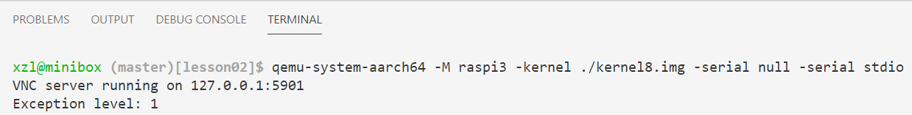

# 2: Processor initialization 



## Objectives

We are going to build: 

A baremetal program that can switch among CPU exception levels and print out the current level. 

Students will: 

1. Experiment with exception levels (ELs)
2. Observe switches among ELs -- crucial for subsequent experiments!
3. Tinker with the kernel, e.g. debugging

## Background: Exception levels (EL)

ARMv8 defines 4 exception levels. An exception level is a processor execution mode in which only a subset of all operations and registers is available. 

The least privileged exception level, i.e. lowest level, is level 0. When processor operates at this level, it mostly uses only general purpose registers (X0 - X30) and stack pointer register (SP). EL0 also allows using `STR` and `LDR` instructions to load and store data to and from memory, among other instructions commonly used by a user program.


Why exception levels? Because an OS needs to implement *isolation*. A user process should not be able to access other process's data. To achieve such behavior, a kernel always runs each user process at EL0. Operating at this exception level a process can only use it's own virtual memory and can't access any instructions that change ELs, MMUs, etc. 

The kernel itself usually works at EL1. While running at this exception level CPU gets access to the registers that allows configuring MMU as well as some system registers. 

**About EL2/3**: we will not deal with EL 2 or EL 3 until project 3 (secure hardware enclaves). Let's briefly describe them.  

*EL2 is for virtual machines.* In this case the virtual machine hypervisor runs at EL2 and guest OSes run at EL1. This allows the hypervisor to isolate guest OSes in a similar way how OS isolates user processes.

*EL3 is for Arm TrustZone*. It is used for transitions from ARM "Secure World" to "Insecure world". This abstraction exist to provide full hardware isolation between the software running in two different "worlds". Application from an "Insecure world" can in no way access or modify information (both instruction and data) that belongs to "secure world", and this restriction is enforced at the hardware level. 

### Switching ELs

In Arm architecture, there is no way a program can raise its own exception level without invoking code that is allowed to run on a higher level. This makes a perfect sense: otherwise, any program would be able to escape its assigned EL and makes unauthorized access to memory or registers. 

Current EL can be changed only if an **exception** is generated. Common causes of exceptions include:  

* software executes some illegal instruction (for example, tries to access memory location at a nonexisting address; 
* software tries to divide an integer by 0; 
* software executes special instructions (e.g. `svc`) to request exceptions. 

How about interrupts generated by IO? In Arm's lingo, interrupts are also handled as a special type of exceptions. 

Whenever an exception is generated the following sequence of steps takes place (In the description, the exception is *handled* at EL `n`, were `n` could be 1, 2 or 3).

1. Address of the current instruction is saved in `ELR_ELn` (exception link register)
1. Current processor state is stored in `SPSR_ELn` (Saved Program Status Register)
   * NB: As some of you may know, other CPU hardware may automatically push registers on stack prior to exception handling. Armv8 does NOT do that. 
1. The CPU executes an exception handler at ELn.
1. The exception handler calls `eret` instruction. This instruction restores processor state from `SPSR_ELn` and resumes execution starting from the address, stored in the `ELR_ELn`  register.

There are more details, e.g. the exception handler software also needs to store the state of all general purpose registers and restore it back afterwards, as we will discuss this process in details in the upcoming experiment. For now, we need just to understand the process in general and remember the meaning of the `ELR_ELm` and `SPSR_ELn` registers.

An important thing to know is that exception handler is not obliged to return to the same instruction where the exception originates. Both `ELR_ELm` and `SPSR_ELn` are writable and the exception handler can modify them in order to specify the instructions to execute right after the EL switch. We are going to use this technique to our advantage when we try to switch from EL3 to EL1 in our code.

## Aside: enhanced debugging

### Bring up printf()

Right now, the kernel can only print some constant string on a screen, but what I need is some analog of [printf](https://en.wikipedia.org/wiki/Printf_format_string) function. With `printf` I can easily display values of different registers and variables. Such functionality is essential for the kernel development because you don't have any other debugger support and `printf` becomes the only mean for figuring out what is going on inside Rpi3.

Let's not reinvent the wheel and use one of  [existing printf implementations](http://www.sparetimelabs.com/tinyprintf/tinyprintf.php) This function consists mostly from string manipulations and is not very interesting from a kernel developer point of view. The implementation that I used is very small and don't have external dependencies, that allows it to be easily integrated into the kernel. The only thing that I have to do is to define `putc`  function that can send a single character to the screen. This function is defined [here](https://github.com/s-matyukevich/raspberry-pi-os/blob/master/src/lesson02/src/mini_uart.c#L59) and it just uses already existing `uart_send` function. Also, we need to initialize the `printf` library and specify the location of the `putc` function. This is done in a single [line of code](https://github.com/s-matyukevich/raspberry-pi-os/blob/master/src/lesson02/src/kernel.c#L8).

### QEMU + GDB debugging

<!--- Todo: add GDB debugging ---> 

GDB allows you to do single step, etc. It may help understand/debug specific instructions. You can find extensive information online. A quick note is [here](../../gdb.md).


## Code Walkthrough

### Finding out the current EL

As we are equipped with the `printf` function, we can proceed to figure out at which exception level the kernel is booted. A small function that can answer this question looks like this.

```
.globl get_el
get_el:
    mrs x0, CurrentEL
    lsr x0, x0, #2
    ret
```

Here we use `mrs` instruction to read the value from `CurrentEL` system register into `x0` register. Then we shift this value 2 bits to the right (because the lowest 2 bits in the `CurrentEL` register are reserved and always have value 0). Finally the register `x0` contains an integer number indicating current exception level. Now the only thing that is left is to display this value, like [this](https://github.com/s-matyukevich/raspberry-pi-os/blob/master/src/lesson02/src/kernel.c#L10).

```
    int el = get_el();
    printf("Exception level: %d \r\n", el);
```

**Rpi3:** If you reproduce this experiment, you should see `Exception level: 3` on the screen. This means the CPU executes as the security monitor when it boots up. 

**QEMU:** You will see `Exception level: 2` because this is how QEMU emulates the CPU: setting the initial EL as 2. Why?

### Switching to EL1

EL1 is intended for OS kernels. Strictly speaking, our kernel is not obliged to switch to EL1 when it boots up, but EL1 is a natural choice for us because this level has just the right set of privileges to implement all common OS tasks. It also will be an interesting exercise to see how switching exceptions levels works in action. Let's take a look at the source code that does this (boot.S). 

```
master:
    ldr    x0, =SCTLR_VALUE_MMU_DISABLED
    msr    sctlr_el1, x0        

    ldr    x0, =HCR_VALUE
    msr    hcr_el2, x0

    ldr    x0, =SCR_VALUE
    msr    scr_el3, x0

    ldr    x0, =SPSR_VALUE
    msr    spsr_el3, x0

    adr    x0, el1_entry        
    msr    elr_el3, x0

    eret                
```

The code configures a few system registers. Now we are going to examine those registers one by one. The register details are documented in [the Armv8 architecture manual](https://developer.arm.com/docs/ddi0487/ca/arm-architecture-reference-manual-armv8-for-armv8-a-architecture-profile) which we will refer to as needed. 

#### SCTLR_EL1, System Control Register (EL1) 
<!----Page 2654 of AArch64-Reference-Manual--->
```
    ldr    x0, =SCTLR_VALUE_MMU_DISABLED
    msr    sctlr_el1, x0        
```

Here we set the value of the `sctlr_el1` system register. `sctlr_el1` is responsible for configuring different parameters of CPU when CPU operates at EL1. For example, it controls whether the cache is enabled and, what is most important for us, whether the MMU (Memory Management Unit) is turned on. `sctlr_el1` is accessible from all exception levels higher or equal than EL1 (you can infer this from `_el1` postfix) 

`SCTLR_VALUE_MMU_DISABLED` constant is defined [here](https://github.com/s-matyukevich/raspberry-pi-os/blob/master/src/lesson02/include/arm/sysregs.h#L16) Individual bits of this value are defined like this:

* `#define SCTLR_RESERVED                  (3 << 28) | (3 << 22) | (1 << 20) | (1 << 11)` Some bits in the description of `sctlr_el1` register are marked as `RES1`. Those bits are reserved for future usage and should be initialized with `1`.
* `#define SCTLR_EE_LITTLE_ENDIAN          (0 << 25)` Exception [Endianness](https://en.wikipedia.org/wiki/Endianness). This field controls endianess of explicit data access at EL1. We are going to configure the processor to work only with `little-endian` format.
* `#define SCTLR_EOE_LITTLE_ENDIAN         (0 << 24)` Similar to previous field but this one controls endianess of explicit data access at EL0, instead of EL1. 
* `#define SCTLR_I_CACHE_DISABLED          (0 << 12)` Disable instruction cache. We are going to disable all caches for simplicity. You can find more information about data and instruction caches [here](https://stackoverflow.com/questions/22394750/what-is-meant-by-data-cache-and-instruction-cache).
* `#define SCTLR_D_CACHE_DISABLED          (0 << 2)` Disable data cache.
* `#define SCTLR_MMU_DISABLED              (0 << 0)` Disable MMU. MMU must be disabled until the lesson 6, where we are going to prepare page tables and start working with virtual memory.

FYI - [official doc](https://developer.arm.com/docs/ddi0595/b/aarch64-system-registers/sctlr_el1)

#### HCR_EL2, Hypervisor Configuration (EL2) 
<!--- Page 2487 of AArch64-Reference-Manual.  -->

```
    ldr    x0, =HCR_VALUE
    msr    hcr_el2, x0
```

We are NOT going to implement our own [hypervisor](https://en.wikipedia.org/wiki/Hypervisor). Still we need to use this register. Among other settings, bit 31 (RW) controls the execution state at EL1, being AArch64 (1) or AArch32 (0). This register also controls at which EL we will handle IRQ. 

In `sysregs.h` we set HCR_VALUE to be (1<<31). 

[Official doc](https://developer.arm.com/documentation/100403/0200/register-descriptions/aarch64-system-registers/hcr-el2--hypervisor-configuration-register--el2)

#### SCR_EL3, Secure Configuration (EL3) 
<!----Page 2648 of AArch64-Reference-Manual --->

```
    ldr    x0, =SCR_VALUE
    msr    scr_el3, x0
```

This register is responsible for configuring security settings. For example, it controls whether all lower levels are executed in "secure" or "nonsecure" world. It also controls execution state at EL2. [Here](https://github.com/s-matyukevich/raspberry-pi-os/blob/master/src/lesson02/include/arm/sysregs.h#L26) we set that EL2 will execute at `AArch64` state, and all lower exception levels will be "non secure". 

This register has no counterpart at EL2. Therefore, we don't have to set it on qemu emulation. 

[Official doc](https://developer.arm.com/docs/ddi0595/b/aarch64-system-registers/scr_el3)

#### SPSR_EL3, Saved Program Status (EL3) 
<!-----------Page 389 of AArch64-Reference-Manual --------->

```
    ldr    x0, =SPSR_VALUE
    msr    spsr_el3, x0
```

<!---This register should be already familiar to you - we mentioned it when discussed the process of changing exception levels.-->

`spsr_el3` contains CPU state, that will be restored after we execute `eret` instruction.
What is CPU state? It consists of the following information:

* **Condition Flags** Those flags contains information about previously executed executions: whether the result was negative (N flag), zero (A flag), has unsigned overflow (C flag) or has signed overflow (V flag). Values of those flags can be used in conditional branch instructions. For example, `b.eq` instruction will jump to the provided label only if the result of the last comparison operation is equal to 0. The processor checks this by testing whether Z flag is set to 1.

* **Interrupt disable bits** Those bits allows to enable/disable different types of interrupts.

* **EL & other information**, required to fully restore the processor execution state after an exception is handled. 

Usually `spsr_el3` is saved automatically by CPU hardware, when an exception is taken to EL3. Furthermore, this register is writable by our code, so we take advantage of this fact and manually prepare CPU state. `SPSR_VALUE` is prepared [here](https://github.com/s-matyukevich/raspberry-pi-os/blob/master/src/lesson02/include/arm/sysregs.h#L35) and we initialize the following fields:

* `#define SPSR_MASK_ALL        (7 << 6)` After we change EL to EL1 all types of interrupts will be masked (or disabled, which is the same).
* `#define SPSR_EL1h        (5 << 0)` This indicates to which EL the `eret` instruction will take the CPU to. It's EL1. About EL1h: At EL1 we can either use our own dedicated stack pointer or use EL0 stack pointer. `EL1h` mode means that we are using EL1 dedicated stack pointer. 

[Official doc](https://developer.arm.com/docs/ddi0595/b/aarch64-system-registers/spsr_el3)

#### ELR_EL3, Exception Link (EL3) 
<!----- Page 351 of AArch64-Reference-Manual.---->

```
    adr    x0, el1_entry        
    msr    elr_el3, x0
    eret                
```

`elr_el3` holds the address, to which we are going to return after `eret` instruction will be executed. Here we set this address to the location of `el1_entry` label.

[Official doc](https://developer.arm.com/docs/ddi0595/b/aarch64-system-registers/elr_el3)

## Conclusion

That is pretty much it: when we enter `el1_entry` function the execution should be already at EL1 mode. 

Qemu.log: 

```
Exception return from AArch64 EL2 to AArch64 EL1 PC 0x80038
```

The address 0x80038 should point to el1_entry. Check it out using addr2line. 

Our subsequent experiments will switch between EL1 (kernel) and EL0 (user) frequently. 

Go ahead and try it out! 

<!--- add submission instructions --->