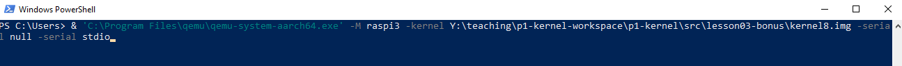
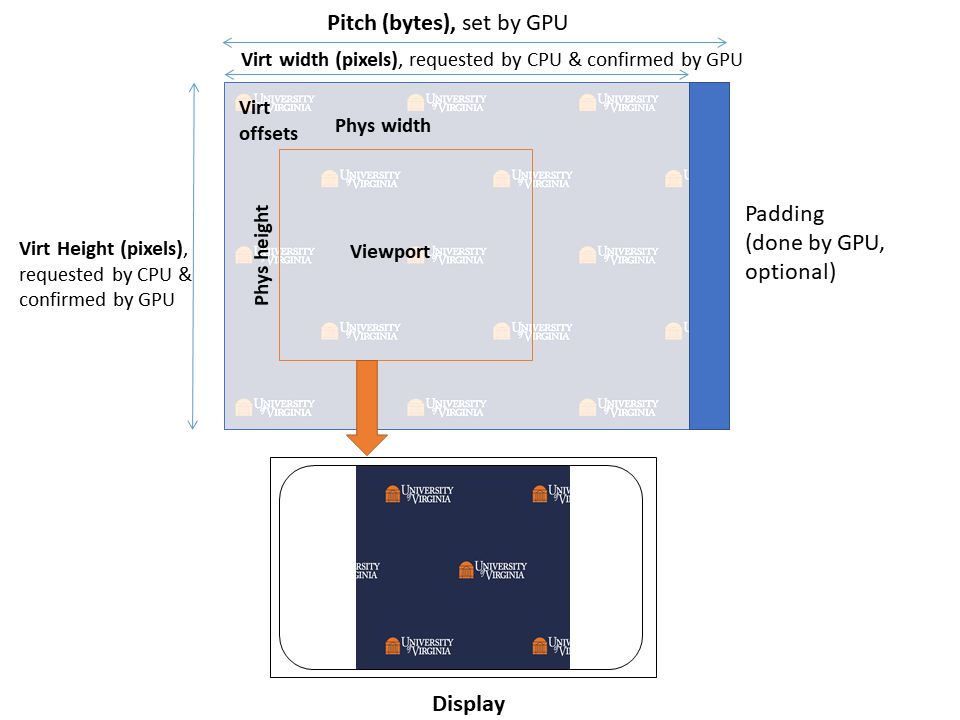
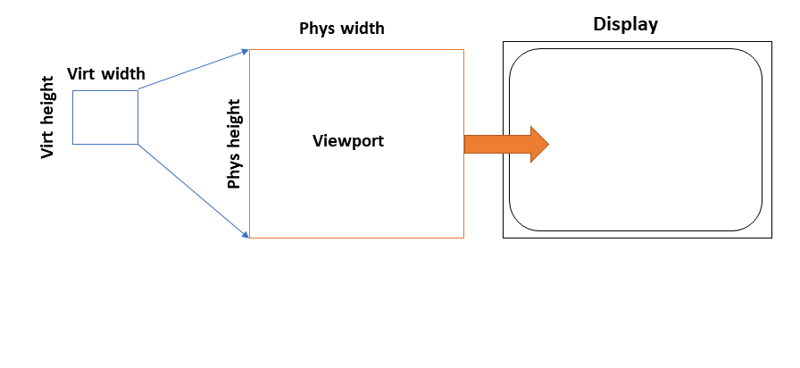
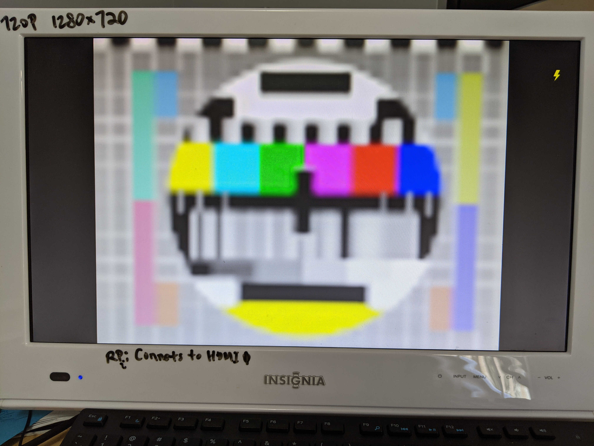
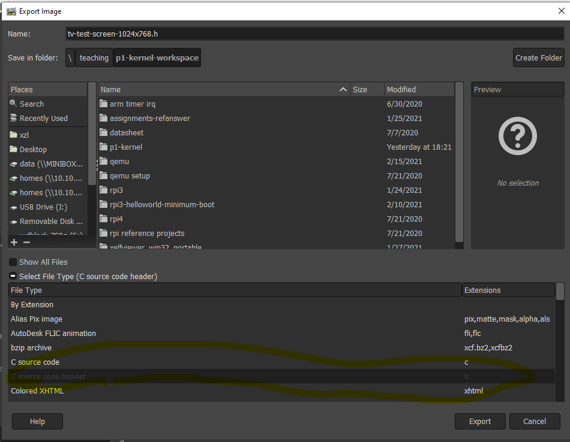

# 3 bonus: Interrupt-driven animation	

This is optional for the course purpose. Thus, this write up is not intended to be as thorough as others. 

## Objectives 

1. See a use case of interrupts
2. Learn about framebuffer 
3. Have some eye candy. 


## Environment 

**Rpi3**: need an HDMI cable connecting to a display. 

**QEMU**: run QEMU locally as we need an emulated display. 

**Windows users**: recommend to download prebuilt QEMU binaries. https://www.qemu.org/download/. You can build QEMU from source within WSL. I did that. Make sure to include graphics support. Likely slower than native binaries. 

To invoke prebuilt QEMU from PowerShell: 



**Mac users**: Ditto. See link above. 

**Linux users**: apt-get; if you build from source, make sure to include graphics support. 

## Quick start

```
cd lesson03-bonus
make clean
USE_QEMU=1 make # for QEMU
USE_QEMU make # for rpi3
```

Pre-built binaries for Rpi3:

https://github.com/fxlin/p1-kernel/releases/tag/p1exp3bonus

## Result (Rpi3)


QEMU has caveats. See below. 


## Background

**Framebuffer** A memory region for pixel data. In the simplest form, CPU write RGB values there and pixels will show up on the display. 

**Mailbox.** On Rpi3, CPU talks to GPU through hardware mailbox. It's a small piece of memory shared between CPU/GPU. CPU puts commands in the shared memory (mbox) and kicks the GPU by writing to a GPU register; GPU executes the commands and responds by writing results to the shared memory. Code: `mbox.c`

### **Rpi3 framebuffer properties** 

On Rpi3, CPU talks to the GPU to set up the framebuffer. This function constructs a mbox message for GPU with a series of framebuffer properties. 

**Virtual height/width** define the framebuffer dimension. CPU is responsible for providing these pixels. 

**Physical height/width** define a rectangular region of pixels to be displayed. These pixels are derived by GPU from the framebuffer. See below. 

**Virtual offsets** define the top-left corner of the physical region within the virtual region. 

**Pitch (bytes)** is the actual memory size that each pixel raw takes in the framebuffer. 

Note: the following is based on (1) [the Rpi foundation online documentation](https://github.com/raspberrypi/firmware/wiki/Mailbox-property-interface); (2) QEMU source code for emulating Rpi3 GPU/display; (3) my experiments on Rpi3. 

(1) can be vague or erroneous and (2) is rudimentary. 

**Case 1**: Virtual region > physical region (i.e. the viewport is a strict subpart of the framebuffer). This can be useful for screen panning and double buffering. This is how game consoles implement scrolling, e.g. over a large map pre-rendered in memory. Here's an excellent video on GameBoy: https://www.youtube.com/watch?v=FzPTK91EJY8&t=405s



The Rpi3 mechanism is shown in the figure above. 

The hardware takes the pixels in from the viewport (defined by the phys region) in the framebuffer and sends to display. Scaling is applied before the final display. The viewport size does not necessarily correspond to the resolution on display. For instance, the viewport (phys height x width) can be 300x300; the final picture on the display could occupy the full screen (with x/y ratio preserved). This is also in the figure above. 

**Case 2:** Virtual region < physical region (i.e. the viewport is a strict superpart of the framebuffer)


In this case, GPU scales the framebuffer pixels (virtual region) to the viewport (physical region). GPU seems to be doing interpolation to generate the additional pixels. Then GPU sends the physical region to display as above. 

The virtual region can be very small. "On boot, the virtual size is set to 2x2. If a framebuffer is allocated without reconfiguring the virtual size, the screen will consist of four very large virtual pixels.  Coloured red, green, yellow and blue, they produce the "rainbow" startup screen." [2]. See the picture below. This is the default display when Rpi3 boots without any additional changes to its default 2x2 (four pixel) framebuffer. 

Virtual offsets are ineffective. I confirmed that. QEMU code `fb_use_offsets` also suggests so. 

The picture below: the virtual region: 64x48 filled with a test image of 64x48; the physical region: 600x600. 



Case 3: otherwise? (untested. Per QEMU code virtual offsets will be ineffective).

### QEMU's emulation caveats 

(Observation based on QEMU's master branch as of Feb 2020.)

QEMU's emulation of Rpi3 display only realizes the most common cases, e.g. virt = physical with offsets=0. Beyond that, it's quite problematic. For instance, here's how QEMU would display when virt 64x48 < physical 600x600, showing it does not implement scaling. 


QEMU display will also flicker when CPU is updating offsets periodically. Likely a bug in the code below. 


`hw/misc/bcm2835_property.c` implements the CPU/GPU mailbox interface. Can see what framebuffer properties are implemented. 

`hw/display/bcm2835_fb.c` has the actual emulation logic. See `fb_use_offsets()` which only applies virt offsets when virtual is smaller than physical. `bcm2835_fb_validate_config()` is how QEMU think the Rpi3 framebuffer should work, which can be problematic. 

## Kernel code walkthrough

### Set up the framebuffer

`lfb.c` is the framebuffer code. `lfb_init` sets up the framebuffer dimension. `lfb_showicture()` fills in the framebuffer with pixels from an image. We do not load from an image file (no filesystem yet!). Instead, we convert an image to a C header (e.g. tv-test-scree.h) using GIMP. Pretty cool! 



The header looks like this: 

```
static unsigned int tv_width = 1280;
static unsigned int tv_height = 800;

/*  Call this macro repeatedly.  After each use, the pixel data can be extracted  */

#define HEADER_PIXEL(data,pixel) {\
pixel[0] = (((data[0] - 33) << 2) | ((data[1] - 33) >> 4)); \
pixel[1] = ((((data[1] - 33) & 0xF) << 4) | ((data[2] - 33) >> 2)); \
pixel[2] = ((((data[2] - 33) & 0x3) << 6) | ((data[3] - 33))); \
data += 4; \
}
static char *tv_data =
	"````````````````````````````````````````````````````````````````"
	"````````````````````````````````````````````````````````````````"
	"`0T]I+#A!!!!!!!!!!!!!!!!!!!!!!!!!!!!!!!!!!!!!!!!!!!!!!!!!!!!!!!!"
	"!!!!!!!!!!!!!!!!!!!!!!!!!!!!!!!!!!!!!!!!!!!!!!!!!!!!!!!!!!!!!!!!"
	"!!!!!!!!!!!!!!!!!!!!!!!!!!!!!!!!!!!!!!!!!!!!!!!!!!!!!!!!!!!!!!!!"
	"!!!!!!!!!!!!!!!!!!!!!!!!!!!!!!!!!!!!!!!!35F*Y_0D````````````````"
	"````````````````````````````````````````````````````````````````"
	...
```

The header can be large, e.g. a few MBs. 

As a result, the raw RGB values will be compiled as an array in our kernel. 

### Adjust the linker script

Now build the kernel. You may see an error like this:

```
aarch64-linux-gnu-ld -T build-qemu/linker.ld -o build-qemu/kernel8.elf  build-qemu/mbox_c.o build-qemu/lfb_c.o build-qemu/kernel_c.o build-qemu/irq_c.o build-qemu/mini_uart_c.o build-qemu/printf_c.o build-qemu/timer_c.o build-qemu/timer_s.o build-qemu/utils_s.o build-qemu/irq_s.o build-qemu/entry_s.o build-qemu/mm_s.o build-qemu/boot_s.o
build-qemu/boot_s.o: In function `el1_entry':
/data/teaching/p1-kernel-workspace/p1-kernel/src/lesson03-bonus/src/boot.S:44:(.text.boot+0x38): relocation truncated to fit: R_AARCH64_ADR_PREL_LO21 against symbol `bss_begin' defined in .bss section in build-qemu/kernel8.elf
/data/teaching/p1-kernel-workspace/p1-kernel/src/lesson03-bonus/src/boot.S:45:(.text.boot+0x3c): relocation truncated to fit: R_AARCH64_ADR_PREL_LO21 against symbol `bss_end' defined in .bss section in build-qemu/kernel8.elf
Makefile:49: recipe for target 'kernel8.img' failed
make: *** [kernel8.img] Error 1
```

Understand this is a linker error: because the message shows up when invoking `ld`. 

Per the error message, this error is about `el1_entry`. 

```
el1_entry:
	adr	x0, bss_begin
	adr	x1, bss_end
```

It refers to two symbols bss_begin and bss_end using instructions ADR ("R_AARCH64_ADR_PREL_LO21"). The instructions encode the addresses of bss_begin/end as relative offsets to PC. The maximum offsets are 21 bits ("LO21"). Now we put lots of extra bytes in .data section, el1_entry is too far away from bss_begin/end. This can be seen from the existing linker script, where .data is sandwiched in between .text.boot and .bss. 

```
SECTIONS
{
    . = START_ADDR;
	.text.boot : { *(.text.boot) }
	.text : { *(.text) }
	.rodata : { *(.rodata) }
	.data : { *(.data) }
	. = ALIGN(0x8);
	bss_begin = .;
	.bss : { *(.bss*) } 
	bss_end = .;		
}
```

Solution: move .bss to right after .text and we are good. 

### Updating the framebuffer

`lfb_update` simply increments virt offsets via mbox to the GPU. 

From the timer interrupt, we call `lfb_update`: 

```
void handle_generic_timer_irq( void ) 
{
	gen_timer_reset(interval);
	lfb_update(); // refresh fb
}
```

## Known issues

## Reference

1. https://github.com/bztsrc/raspi3-tutorial/tree/master/09_framebuffer

2. https://github.com/brianwiddas/pi-baremetal

## As tribute to...

KONAMI, Fighting Eleven World Soccer 2, Super Famicom, 1995. 


