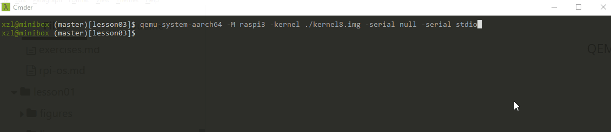

# 3: Interrupts



## Objectives

We will build a baremetal program that prints out messages, as driven by periodic interrupts from a hardware timer. 

You will learn and experience with: 

1. Exception/interrupt vectors
2. Handling interrupts
3. Program hardware timers


## Terms

"Interrupts" or "irq"? We use these two terms interchangeably. Many kernel documents use the latter. 

## Background: interrupts & exceptions in ARM64

By their canonical definitions, interrupts are asynchronous while exceptions are synchronous. However in ARM64 lingo, exception is broadly defined; interrupts are a special kind of exceptions. x86 has its own lingo, calling exceptions as "traps". In this article, we use ARM's broad definition of exceptions unless stated otherwise. 

<!---When we refer to ARM's broad definition of "exceptions" we will be explicit. In general discussion of OS designs, however, we will stick to our differentiation between interrupts vs exceptions. --->

### Exception types

ARM64 defines 4 types of exceptions. **We will focus the former two**. 

* **Synchronous exception**s Exceptions of this type are always caused by the currently executed instruction. For example, you can use `str` instruction to store some data at a non-existing memory location. In this case, a synchronous exception is generated. Synchronous exceptions also can be used to generate a "software interrupt". Software interrupt is a synchronous exception that is generated on purpose by `svc` instruction. We will use this technique in lesson 5 to implement system calls.
* **Asynchronous exceptions (IRQ)** Those are normal interrupts. They are always asynchronous, which means that they have nothing to do with the currently executed instruction.  In contrast to synchronous exceptions, they are always not generated by the processor itself, but by external hardware.
* **FIQ (Fast Interrupt Request)** This type of exception is called "fast interrupts" and exist solely for the purpose of prioritizing exceptions. It is possible to configure some interrupts as "normal" and other as "fast". Fast interrupts will be signaled first and will be handled by a separate exception handler. Linux doesn't use fast interrupts and we also are not going to do so.
* **SError (System Error)** Like `IRQ` and `FIQ`, `SError` exceptions are asynchronous and are generated by external hardware. Unlike `IRQ` and `FIQ`, `SError` always indicates some error condition. [Here](https://community.arm.com/processors/f/discussions/3205/re-what-is-serror-detailed-explanation-is-required) you can find an example explaining when `SError` can be generated.

### Exception vectors

<!---Each exception type needs its own handler. Also, separate handlers should be defined for each different execution state, in which exception is generated. There are 4 execution states that are interesting from the exception handling standpoint. If we are working at EL1 those states can be defined as follows:-->

An exception vector is a piece of code the CPU will execute when a specific exception happens. "*These would normally be branch instructions that direct the core to the full exception handler.*" (the ARM64 manual). In some other architectures an exception vector could be an address to jump to. Note the subtle difference. 

Each exception level (EL) has its own vector table. Here we focus on EL1 where the kernel executes. The kernel must provide exception handlers to be executed at EL1 in order to handle exceptions from EL0 (the user programs) or EL1 (its own execution). These should be handlers for *each* exception type above (SError, fiq, irq, and sync) and for *each* of the four execution states of the CPU:

1. **EL1t** Exception happens when CPU is at EL1 while the stack pointer (SP) was set to be shared with EL0. This happens when `SPSel` register holds the value `0`.  Recall that `SPSel` is part of the CPU's PSTATE. 
1. **EL1h** Exception happens at EL1 at the time when a dedicated SP was allocated for EL1. This happens when `SPSel` holds the value `1`. **This is the mode that our kernel is are currently using.**
1. **EL0_64** Exception is taken from EL0 executing in 64-bit mode. This experiment will not deal with EL0. Spoiler: EL0_64 corresponds to the exceptions that caused by 64-bit user programs. 
1. **EL0_32** Exception is taken from EL0 executing in 32-bit mode. This experiment will not deal with EL0 or 32-bit mode. Spoiler: this corresponds to exceptions in 32-bit user programs. 

> "The t and h suffixes are based on the terminology of *thread* and *handler*, introduced in ARMv7-M." -- ARM

In total, for EL1 the kernel needs to **define 16 exception handlers** (4 types X 4 execution states) 

### ARM64 vector table

**Each exception vector** (or handler) is a continuous sequence of instructions responsible for handling a particular exception. Each exception vector can occupy`0x80` bytes maximum. This is not much, but nobody prevents us from jumping to some other memory location from an exception vector. 

**The vector table** is an array of exception vectors. Note each EL has its own table as described above. 

Here is a short, good [reference](https://developer.arm.com/docs/100933/0100/aarch64-exception-vector-table) from Arm. 

## Code Walkthrough 

### Exception vectors, tables, etc.

Everything related to exception handling is defined in [entry.S](https://github.com/s-matyukevich/raspberry-pi-os/blob/master/src/lesson03/src/entry.S). The code mimics what the ARM64 Linux kernel does. 

Why named "entry"? Because in a full-fledged kernel, exception/irq handlers are where user programs enter the kernel for execution. Although this experiment is not building such a kernel, we follow the naming convention. 

The first macro [ventry](https://github.com/s-matyukevich/raspberry-pi-os/blob/master/src/lesson03/src/entry.S#L12) and it is used to create entries in the vector table.

```
    .macro    ventry    label
    .align    7
    b    \label
    .endm
```

As suggested above: for code clarity, we are not going to handle exceptions right inside the exception vector. Instead, we make each vector a branch instruction (`b \label`) that jumps to a label provided for the macro as `label` argument.

<!-- Instead, we jump to a label that is provided for the macro as `label` argument. -->

We need `.align 7` because all exception vectors should be spaced at `0x80` bytes (2^7) one from another. A useful assembly trick. 

The vector table is defined [here](https://github.com/s-matyukevich/raspberry-pi-os/blob/master/src/lesson03/src/entry.S#L64) and it consists of 16 `ventry` definitions. 

#### Making CPU aware of the vector table

Ok, now we have prepared the vector table, but the processor doesn't know where it is located and therefore can't use it. In order for the exception handling to work, we must set `vbar_el1` (Vector Base Address Register) to the vector table address. This is done [here](https://github.com/s-matyukevich/raspberry-pi-os/blob/master/src/lesson03/src/irq.S#L2).

```
.globl irq_vector_init
irq_vector_init:
    adr    x0, vectors        
    msr    vbar_el1, x0       
    ret
```

#### A simple handler for handling unexpected exceptions

In this experiment we are only interested in handling `IRQ` from `EL1h`. Yet, our kernel  defines all 16 handlers for EL1. This is for debugging ease: we want to print out meaningful message in case our kernel triggers some other exceptions due to our programming mistakes. 

> Note again: all these handlers are to be executed at EL1. The exceptions come from either EL0 or EL1. 

We name all the handlers that are NOT supposed to be trigged  with a `invalid` postfix. We implement these handlers using a [handle_invalid_entry](https://github.com/s-matyukevich/raspberry-pi-os/blob/master/src/lesson03/src/entry.S#L3) macro:

```
    .macro handle_invalid_entry type
    kernel_entry
    mov    x0, #\type
    mrs    x1, esr_el1
    mrs    x2, elr_el1
    bl    show_invalid_entry_message
    b    err_hang
    .endm
```

The first line invokes a macro `kernel_entry` which is the first few instructions the kernel should execute in handling an exception/interrupt (recall the term "entry"). We will discuss it below.

Then we call [show_invalid_entry_message](https://github.com/s-matyukevich/raspberry-pi-os/blob/master/src/lesson03/src/irq.c#L34) and prepare 3 arguments for it. The arguments are passed in 3 registers: x0, x1, and x2. 

* x0: the exception type. The value comes from the argument to this macro. It can take one of [these](https://github.com/s-matyukevich/raspberry-pi-os/blob/master/src/lesson03/include/entry.h#L6) values defined by our kernel code. It tells us exactly which exception handler has been executed.
* x1: information about what causes the exception. The value comes from `esr_el1` register.  `ESR` stands for Exception Syndrome Register. EL1 implies "when an exception is taken to EL1", i.e. when the exception is handled at EL1. Note: in this experiment our kernel runs at EL1 and when an interrupt happens it is handled at EL1. Read the [ref](https://developer.arm.com/docs/ddi0595/b/aarch64-system-registers/esr_el1) again. 
* x2: the address of the instruction being executed when the exception happens. The value comes from the  `elr_el1` as described earlier. For synchronous exceptions, this is the instruction that causes the exception; for irqs (asynchronous), this is the instruction completed right before irq happens. Again, the postfix EL1 indicates that "*when taking an exception to EL1, (this reg) holds the address to return to.*" 

The code next invokes `show_invalid_entry_message`  function, which prints textual information to UART. Returning from that function, the code executes in an infinite loop as we have nothing else to do. 

#### kernel_entry & exit

To handle *valid* exceptions (timer interrupts in our case), the kernel needs to save & restore the *context* of the "normal" execution, i.e. switching from the normal execution to the exception handler, executing it, and resuming the execution being interrupted. In other words, after the exception handler, we want all general purpose registers to have the same values as they had before the exception was generated. 

>  Why does NOT the above handler `handle_invalid_entry` save registers? Because it ends with an infinite loop and never intends to resume the interrupted execution. 

```
el1_irq:
	kernel_entry 
	bl	handle_irq
	kernel_exit 
```

Back to `kernel_entry`. This is the first thing to do in handling an exception: saving the processor state, notably registers x0 - x30, to the stack. To do so, it first subtracts from `sp` the size of total stored registers (#S_FRAME_SIZE) and then fills the stack space. 

According to `kernel_entry`, there is  [kernel_exit](https://github.com/s-matyukevich/raspberry-pi-os/blob/master/src/lesson03/src/entry.S#L37) to be called as the last thing of an exception handler. `kernel_exit` restores the CPU state by copying back the values of x0 - x30. The order exactly mirrors that of `kernel_entry` otherwise we will see wrong register values. Finally `kernel_exit` executes `eret`, which returns to the normal execution. 


Note: general purpose registers are not the only thing to be saved for `kernel_entry/exit`. Doing so is enough for our simple kernel for now. More on them in subsequent experiments. 

### Working with interrupts

<!--- need an overall figure: how irq connected -->

#### Configuring the interrupt controller 

Interrupts are generated by IO devices, go through the irq controller, and eventually arrive the CPU. The CPU can program the irq controller to enable/disable specific interrupt sources. By disabling an irq source, the CPU will not lose any irq from that device, but just defer receiving irq until the CPU re-enables the irq source. The CPU can also read from the irq controller which IO devices have pending interrupts, meaning that the IO devices need attention. 

Bcm2837, the SoC for Rpi3, has its own interrupt controller described on page 109 of [BCM2837 ARM Peripherals manual](https://github.com/raspberrypi/documentation/files/1888662/BCM2837-ARM-Peripherals.-.Revised.-.V2-1.pdf).
Because of the hardware quirks (e.g. many irqs are routed from GPU to CPU), the interrupt controller organizes irq sources into three groups and has registers for controlling/checking individual groups. 

> Be aware of their weird naming: these irq groups are called "Basic" (irqs routed to the ARM CPU), "1", and "2" (irqs routed from GPU to CPU). For example, `IRQ basic pending`, `IRQ pending 1`, `IRQ pending 2`.  The SoC manual has more dirty details. 

We are only interested in timer interrupts. The SoC manual, page 113 states that irq #1 and #3 are from the system timer. These irq sources belong to the irq group 1, which can be enabled using [ENABLE_IRQS_1](https://github.com/s-matyukevich/raspberry-pi-os/blob/master/src/lesson03/include/peripherals/irq.h#L10). So here is the [function](https://github.com/s-matyukevich/raspberry-pi-os/blob/master/src/lesson03/src/irq.c#L29) that enables system timer IRQ at #1.

<!--- According to the documentation, interrupts are divided into 2 banks. The first bank consists of interrupts `0 - 31`, each of these interrupts can be enabled or disabled by setting different bits of `ENABLE_IRQS_1` register. There is also a corresponding register for the last 32 interrupts - `ENABLE_IRQS_2` and a register that controls some common interrupts together with ARM local interrupts - `ENABLE_BASIC_IRQS` (We will talk about ARM local interrupts in the next chapter of this lesson). --->

<!--- The Peripherals manual, however, has a lot of mistakes and one of those is directly relevant to our discussion. Peripheral interrupt table (which is described at page 113 of the manual) should contain 4 interrupts from system timer at lines `0 - 3`. From reverse engineering Linux source code and reading [some other sources](http://embedded-xinu.readthedocs.io/en/latest/arm/rpi/BCM2835-System-Timer.html) I was able to figure out that timer interrupts 0 and 2 are reserved and used by GPU and interrupts 1 and 3 can be used for any other purposes. So here is the [function](https://github.com/s-matyukevich/raspberry-pi-os/blob/master/src/lesson03/src/irq.c#L29) that enables system timer IRQ number 1.--->

```
void enable_interrupt_controller()
{
    put32(ENABLE_IRQS_1, SYSTEM_TIMER_IRQ_1);
}
```

#### Masking/unmasking interrupts

From time to time, the kernel must mask/unmask ALL interrupts, so that some critical code regions will never be interrupted. For example, what happens if an interrupt occurs right in the middle of `kernel_entry` macro? The CPU state would be corrupted. 

Upon entry to ANY exception/interrupt, the processor automatically masks all interrupts so that the kernel can save the CPU state atomically. The kernel then unmasks exceptions (often interrupts) it wants to handle during the execution of the interrupt handler. Right before exiting the exception handling (`eret`), the kernel masks all interrupts again for atomic CPU state restore. 

<!-- Many people mistakenly think that interrupts must be masked for the whole duration of the exception handler. This isn't true - it is perfectly legal to unmask interrupts after you saved processor state and therefore it is also legal to have nested interrupts. We are not going to do this right now, but this is important information to keep in mind. -->

Note: it is perfectly legal to have nested interrupts, i.e. handling another interrupt in the middle of an interrupt handler. Nested interrupts are NOT common: for simple designs, many kernels intentionally keep interrupt handlers very short so they can mask interrupts throughout an interrupt handler without delaying future interrupts too much. However, handling *interrupts* during *exception* handlers is VERY common. Syscalls are executed as exception handlers, during which the kernel must be responsive to interrupts. 

The [following two functions](https://github.com/s-matyukevich/raspberry-pi-os/blob/master/src/lesson03/src/irq.S#L7-L15) mask and unmask interrupts.

```
.globl enable_irq
enable_irq:
    msr    daifclr, #2
    ret

.globl disable_irq
disable_irq:
    msr    daifset, #2
        ret
```

ARM processor state (PSTATE) has 4 bits holding mask status for different types of interrupts. 

* **D**  Masks debug exceptions. These are a special type of synchronous exceptions. For obvious reasons, it is not possible to mask all synchronous exceptions, but it is convenient to have a separate flag that can mask debug exceptions.
* **A** Masks `SErrors`. It is called `A` because `SErrors` sometimes are called asynchronous aborts.
* **I** Masks `IRQs`
* **F** Masks `FIQs`

Now you can probably guess why registers that are responsible for changing interrupt mask status are called `daifclr` and `daifset`. Those registers set and clear interrupt mask status bits in the processor state.

Why do we use constant value `2` in both of the functions? This is because we only want to set and clear the second (`I`) bit.


#### The IRQ handler

We have a single, common exception handler for handling all `IRQs`. This handler is defined [here](https://github.com/s-matyukevich/raspberry-pi-os/blob/master/src/lesson03/src/irq.c#L39).

<!--- update the following ---->

```
void handle_irq(void)
{
    unsigned int irq = get32(IRQ_PENDING_1);
    switch (irq) {
        case (SYSTEM_TIMER_IRQ_1):
            handle_timer_irq();
            break;
        default:
            printf("Unknown pending irq: %x\r\n", irq);
    }
}
```

In the handler, we need a way to figure out what IO device generated the interrupt. Interrupt controller can help us with this job: it has `IRQ_PENDING_1` register that holds interrupt status for interrupts `0 - 31`. Using this register we can check whether the current interrupt was generated by the timer or by some other device and call device specific interrupt handler. Note, multiple interrupts can be pending at the same time. That's why each device specific interrupt handler must acknowledge that it completed handling the interrupt and only after that interrupt pending bit in `IRQ_PENDING_1` will be cleared. Because of the same reason, for a production kernel you would probably want to wrap switch construct in the interrupt handler in a loop: in this way, you will be able to handle multiple interrupts during a single handler execution. 

### Arm's generic hardware timer 

We use the Arm generic timer, which is part of Arm64 core design (i.e. not defined by SoC). This is nice, as the generic timers exist for all Armv8 CPUs. Your experiences will apply to other Armv8 SoCs as well. Arm's [official webpage](https://developer.arm.com/architectures/learn-the-architecture/generic-timer/single-page) (ARM062-1010708621-30) describes the use of generic timers. 

The following figure shows the generic timer hardware. In a nutshell, a global, chip-level hardware counter (i.e. "System Counter") drives per-core timer instances. As hardware boots, System Counter keeps incrementing, i.e. free running. Software can read the current System Counter. But System Counter alone does not generate interrupts. Software must program the timers so that they interrupt corresponding CPU cores at specific time intervals. Note: PE means CPU cores.


As our kernel only deals with one core, we focus on one timer instance. 

How should the kernel program the timer? The timer provides two core registers (among others) as two **alternative** ways for programming the same timer. They are intuitive: 

* CVAL, a 64-bit comparator. Roughly, this sets a "threshold" for System Counter: 
  * Example: The kernel writes a value X to CVAL. When System Counter exceeds X, the timer generates an interrupt.
* TVAL, a 32-bit timer value. Roughly, this sets a "delta" for System Counter: 
  * Example: The kernel writes a value X to TVAL. The hardware updates CVAL +=  the Current System Counter + TVAL. The timer generates an interrupt according to the new CVAL. 

The above brief description would suffice in our kernel experiment. Beyond them, TVAL has another less intuitive, "countdown" function (not used in this experiment but good to know). Since the last write by software, TVAL decrements as System Counter increments. The moment TVAL counts down to 0 is when an interrupt fires. After that, TVAL will keep counting down to a minus value. 

To summarize: If software needs a timer event in X ticks of the clock, the software can write X to TVAL periodically. Alternatively, if software wants an event when the system count reaches Y, software can write Y to CVAL. If software wants to know the remaining ticks until the next interrupt, the software reads from TVAL.

#### Initialize timer (timer.S)

By programming the timer device, We turn on the timer and allow it to generate interrupts. 

```
gen_timer_init:
	mov x0, #1
	msr CNTP_CTL_EL0, x0
	ret
```

This writes 1 to the control register (`CNTP_CTL_EL0`) of **the EL1 physical timer**. See [here](https://developer.arm.com/docs/ddi0595/latest/aarch64-system-registers/cntp_ctl_el0) for the register definition. 

> How to interpret the register name "CNTP_CTL_EL0": 
>
> CTL indicates this is a control register; 
>
> CNTP_XXX_EL0 indicates that this is for the EL1 physical timer. Why _EL0? I guess it means that the timer is accessible to both EL1 and EL0. See the table below. 

| **Register**         | **Purpose**      |
| -------------------- | ---------------- |
| `<timer>_CTL_EL<x>`  | Control register |
| `<timer>_CVAL_EL<x>` | Comparator value |
| `<timer>_TVAL_EL<x>` | Timer value      |

| **Timer**                     | **Register prefix** | **`EL<x>`** |
| ----------------------------- | ------------------- | ----------- |
| EL1 physical timer            | CNTP                | `EL0`       |
| EL1 virtual time              | CNTV                | `EL0`       |
| Non-secure EL2 physical timer | CNTHP               | `EL2`       |
| Non-secure EL2 virtual timer  | CNTHV               | `EL2`       |
| EL3 physical timer            | CNTPS               | `EL1`       |
| Secure EL2 physical timer     | CNTHPS              | `EL2`       |
| Secure EL2 virtual timer      | CNTHVS              | `EL2`       |

#### Turn on timer interrupt at the CPU core

We have to deal with yet another Rpi3 quirk. The Arm generic timer IRQs are wired to a per-core interrupt controller/register. For core 0, this is `TIMER_INT_CTRL_0` at 0x40000040; bit 1 is for physical timer at EL1 (CNTP). This register is documented in the [manual](https://www.raspberrypi.org/documentation/hardware/raspberrypi/bcm2836/QA7_rev3.4.pdf) of BCM2836 (search for "Core timers interrupts"). Note the manual is NOT for the BCM2837 SoC used by Rpi3. I have no idea how community figured this out. 

```
void enable_interrupt_controller()
{
    // Enables Core 0 Timers interrupt control for the generic timer 
    put32(TIMER_INT_CTRL_0, TIMER_INT_CTRL_0_VALUE);
}
```

**To summarize**: we have to program three places in order to receive the timer interrupts: the timer device, the per-core interrupt controller, and the core itself (DAIF). 

<!----- need a figure --->

#### Handing timer interrupts

The kernel gets an irq. The kernel check if it comes from the timer; if so, the kernel sets the timer for firing the next interrupt. 

```
void handle_irq(void) {
    // Each Core has its own pending local intrrupts register
    unsigned int irq = get32(INT_SOURCE_0);
    switch (irq) {
        case (GENERIC_TIMER_INTERRUPT):
            handle_generic_timer_irq();
        	break;
    ...
```

The EL1h exception handler invokes the above function. The function reads `INT_SOURCE_0` (0x4000:0060), search for "Core interrupt sources" in the BCM2836 [manual](https://www.raspberrypi.org/documentation/hardware/raspberrypi/bcm2836/QA7_rev3.4.pdf)), where bit 1 is for our CNTP timer. 

#### Reset timer (timer.S)

The kernel writes a delta value (1<<24) to TVAL, requesting an interrupt to fire after 1<<24 ticks. 

```
gen_timer_reset:
    mov x0, #1
	lsl x0, x0, #24 
	msr CNTP_TVAL_EL0, x0
    ret
```

### Timers on Rpi3

There are other timers on Rpi3 which you may see from various online blogs/tutorials/forums. The information can be very confusing. The naming of timers does NOT help. I list them below together with Arm generic timers described above. I suggest you stay away from other timers because the experience will not be as useful. 


| Name              | Implemented by        | IRQ                                                    | QEMU support? (v5.0 )                                        | Phys Addr | Document                             |
| ----------------- | --------------------- | ------------------------------------------------------ | ------------------------------------------------------------ | --------- | ------------------------------------ |
| System Timer      | Broadcom (?)          | Global. In GPU irq space                               | Implemented as bcm2835_systmr. However free running and [cannot generate irq](https://lists.sr.ht/~philmd/qemu/patches/8811<br/>). | 3f003000  | BCM2837                              |
| ARM timer         | Arm ip (sp804)        | Global. In Arm core's private irq space ("Basic irqs") | Unimplemented. See QEMU code bcm2835_peripherals.c           | 3f00b400  | BCM2836                              |
| Local timer       | Broadcom (?)          | Per core                                               | [Partially implemented](https://forum.osdev.org/viewtopic.php?f=2&t=33537). Can generate trigger irq but readback seems unsupported. | 40000034  | BCM2836                              |
| Arm generic timer | Arm, as part of armv8 | Per core                                               | Implemented                                                  | 40000040  | Armv8 doc +  BCM2836 for IRQ routing |

#### FYI: Programming the Rpi3's system timer (not used in this experiment)

Raspberry Pi system timer is a very simple device. It has a counter that increases its value by 1 after each clock tick. It also has 4 interrupt lines that connect to the interrupt controller (so it can generate 4 different interrupts)  and 4 corresponding compare registers. When the value of the counter becomes equal to the value stored in one of the compare registers the corresponding interrupt is fired. That's why, before we will be able to use system timer interrupts, we need to initialize one of the compare registers with a non-zero value, the larger the value is - the later an interrupt will be generated. This is done in [timer_init](https://github.com/s-matyukevich/raspberry-pi-os/blob/master/src/lesson03/src/timer.c#L8) function.

```
const unsigned int interval = 200000;
unsigned int curVal = 0;

void timer_init ( void )
{
    curVal = get32(TIMER_CLO);
    curVal += interval;
    put32(TIMER_C1, curVal);
}
```

The first line reads current counter value, the second line increases it and the third line sets the value of the compare register for the interrupt number 1. By manipulating `interval` value you can adjust how soon the first timer interrupt will be generated.

Finally, we got to the timer interrupt handler. It is actually very simple.

```
void handle_timer_irq( void )
{
    curVal += interval;
    put32(TIMER_C1, curVal);
    put32(TIMER_CS, TIMER_CS_M1);
    printf("Timer iterrupt received\n\r");
}
```

Here we first update compare register so that that next interrupt will be generated after the same time interval. Next, we acknowledge the interrupt by writing 1 to the `TIMER_CS` register. In the documentation `TIMER_CS` is called "Timer Control/Status" register. Bits [0:3] of this register can be used to acknowledge interrupts coming from one of the 4 available interrupt lines.

## Hacking tips-- observe interrupts with QEMU**

```
qemu-system-aarch64 -M raspi3 -kernel ./kernel8.img -serial null -serial stdio -d int -D test.log 
```

Explanation: -d int ---> enable interrupt dedug       -D test.log  ----> put debug msg to a file test.log

Sample log from executing this project:

```
Exception return from AArch64 EL2 to AArch64 EL1 PC 0x80038
Taking exception 5 [IRQ]
...from EL1 to EL1
...with ESR 0x0/0x0
...with ELR 0x8095c
...to EL1 PC 0x81a80 PSTATE 0x3c5
Exception return from AArch64 EL1 to AArch64 EL1 PC 0x8095c
Taking exception 5 [IRQ]
...from EL1 to EL1
...with ESR 0x0/0x0
...with ELR 0x8095c
...to EL1 PC 0x81a80 PSTATE 0x3c5
Exception return from AArch64 EL1 to AArch64 EL1 PC 0x8095c
Taking exception 5 [IRQ]
...from EL1 to EL1
...with ESR 0x0/0x0
...with ELR 0x8095c
...to EL1 PC 0x81a80 PSTATE 0x3c5
Exception return from AArch64 EL1 to AArch64 EL1 PC 0x8095c
Taking exception 5 [IRQ]
...from EL1 to EL1
...with ESR 0x0/0x0
...with ELR 0x8095c
...to EL1 PC 0x81a80 PSTATE 0x3c5
Exception return from AArch64 EL1 to AArch64 EL1 PC 0x8095c
```


## Conclusion

The last thing that you might want to take a look at is the [kernel_main](https://github.com/s-matyukevich/raspberry-pi-os/blob/master/src/lesson03/src/kernel.c#L7) function where all previously discussed functionality is orchestrated. After you compile and run the sample it should print "Timer interrupt received" message after an interrupt is taken. Please, try to do it by yourself and don't forget to carefully examine the code and experiment with it.
