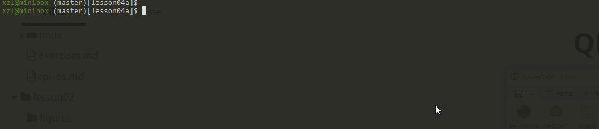
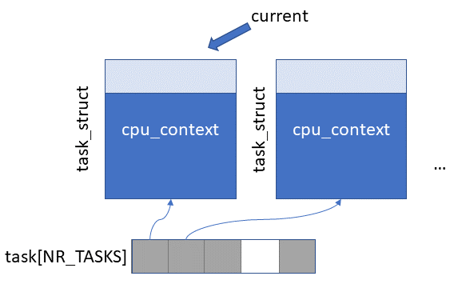
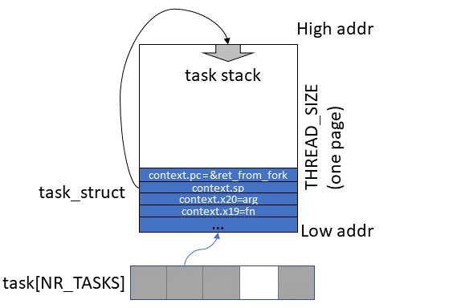

# 4a: Cooperative Multitasking

We will build a minimum kernel that can schedule multiple cooperative tasks. 



**Source code location: p1-kernel/src/lesson04a**

## Roadmap
From this experiment onward, our kernel starts to schedule multiple tasks. This makes it a true "kernel" instead of a baremetal program. 

We will intentionally leave out interrupts, i.e. **timer interrupts are OFF**. Tasks must voluntarily yield to each other. As a result, this experiment focuses on scheduling and task switch. We defer interrupt handling to upcoming experiment. . 

We will implement: 

1. The `task_struct` data structure 
2. Task creation by manipulating `task_struct`, registers, and stack
3. Minimalist memory allocation
4. A minimalist task scheduler 
   <!--- counter. must be maintained in timer_tick() for accounting ... --->

**Processes vs tasks**. As we do not have virtual memory yet, we use the term "tasks" instead of "processes". 

## Key data structures

 
*Figure above: an array of pointers to task_structs of tasks* 

### task_struct

The first thing is to create a struct that describes a task. Linux has such a struct and it is called `task_struct`  (in Linux both thread and processes are just different types of tasks; the difference is in how they share address spaces). As we are mostly mimicking Linux implementation, we are going to do the same. It looks like the following (`sched.h`).

```
struct cpu_context {
    unsigned long x19;
    unsigned long x20;
    unsigned long x21;
    unsigned long x22;
    unsigned long x23;
    unsigned long x24;
    unsigned long x25;
    unsigned long x26;
    unsigned long x27;
    unsigned long x28;
    unsigned long fp;
    unsigned long sp;
    unsigned long pc;
};

struct task_struct {
    struct cpu_context cpu_context;
    long state;
    long counter;
    long priority;
    long preempt_count;
};
```

This struct has the following members:

* `cpu_context` This is a struct that contains values of all registers that might be different between the tasks.
  * Why don't we save all registers, but only `x19 - x30` and `sp`? (`fp` is `x29` and `pc` is `x30`). Because task switch happens only when a task calls [cpu_switch_to](https://github.com/s-matyukevich/raspberry-pi-os/blob/master/src/lesson04/src/sched.S#L4) function. 
  * From the point of view of the task that is being scheduled out (i.e. the "switched-from" task), it just calls `cpu_switch_to` function and it returns after some (potentially long) time. The "switched from" task is unaware of that another task (i.e. the "switched-to" task) happens to runs during this period.  
  * Accordingly to ARM calling conventions registers `x0 - x18` can be overwritten by the callee (i.e. `cpu_switch_to()` in our case). Hence, the kernel doesn't have to save the contents of `x0 - x18` for the caller (the "switched-from" task). 
* `state` This is the state of the currently running task (NOT PSTATE -- an orthogonal concept). For a task just doing CPU work but not IO, the task state will always be [TASK_RUNNING](https://github.com/s-matyukevich/raspberry-pi-os/blob/master/src/lesson04/include/sched.h#L15). For now, this is the only state supported by our kernel. 
  * Later we add a few additional states. For example, a task waiting for an interrupt should be in a different state, because it doesn't make sense to schedule the task when it is not ready to run yet. 
* `counter` is used to determine how long the current task has been running. `counter` decreases by 1 each timer tick. When it reaches 0, the kernel will attempt to schedule another task. This supports our simple scheduling algorithm.
* `priority`  When the kernel schedules a new task, the kernel copies the task's  `priority` value `counter`. In this way, the kernel can regulate the amount of processor time the task gets relative to other tasks.
* `preempt_count` A flag. A non-zero value means that the current task is executing in a critical code region that cannot be interrupted, e.g. by switching to another task. Any timer tick should be ignored and not triggering rescheduling. 

After the kernel startup, there is only one task running: the one that runs kernel_main(). It is called "init task". Before the scheduler is enabled, we must fill `task_struct` of the init task. This is done in `INIT_TASK`.

All `task_struct`s are stored in `task` (sched.c) array. This array has only 64 slots - that is the maximum number of simultaneous tasks the kernel can have. It won't suit a production OS, but it is ok for our goals.

An important global variable is `current` (sched.c) that always points to `task_struct` of currently executing task. Both `current` and `task` array are initially set to hold a pointer to the init task. There is also a global variable `nr_task` - it contains the number of currently running tasks in the system.

## Task switch

### Preparing task_structs (kernel.c)

```
void kernel_main(void)
{
    uart_init();
    init_printf(0, putc);
    irq_vector_init();

    int res = copy_process((unsigned long)&process, (unsigned long)"12345");
    if (res != 0) {
        printf("error while starting process 1");
        return;
    }
    res = copy_process((unsigned long)&process, (unsigned long)"abcde");
    if (res != 0) {
        printf("error while starting process 2");
        return;
    }

    while (1){
        schedule();
    }
}
```

1. A new function `copy_process` is introduced. `copy_process` takes 2 arguments: a function to execute in a new thread and an argument passed to this function. `copy_process` allocates a new `task_struct`  and makes it available for the scheduler.

1. Another new function `schedule`. This is the core scheduler function: it checks whether there is a new task that needs to preempt the current one. In cooperative scheduling, a task voluntarily calls `schedule` if it doesn't have any work to do at the moment. 

   >  For preemptive multitasking, `schedule` is also called from the timer interrupt handler.

> Try your self with QEMU: set a breakpoint at copy_process & launch the kernel. Examine task_struct with `print *p`. Examine the value of cpu_context.[pc|sp|fn|arg]. 

We are calling `copy_process` 2 times, each time passing a pointer to the process function as the first argument.

 `process` function is very simple.

```
void process(char *array)
{
    while (1){
        for (int i = 0; i < 5; i++){
            uart_send(array[i]);
            delay(100000);
            schedule();
        }
    }
}
```

It just keeps printing characters from the array, which is passed as an argument. Task 1 is created with the argument "12345" and task 2 is with the argument "abcde". After printing out a string, a task yields to others by calling `schedule()`. If our scheduler implementation is correct, both threads will take turns to print strings. 

### Switching tasks (sched.c & sched.S)

This is where the magic happens. The code looks like this.

```
void switch_to(struct task_struct * next)
{
    if (current == next)
        return;
    struct task_struct * prev = current;
    current = next;
    cpu_switch_to(prev, next);
}
```

If the "next" process is not the same as the "current",  the kernel updates `current`. The `cpu_switch_to` function is where the real context switch happens. To manipulates registers, it is in assembly. 

```
.globl cpu_switch_to
cpu_switch_to:
    mov    x10, #THREAD_CPU_CONTEXT
    add    x8, x0, x10
    mov    x9, sp
    stp    x19, x20, [x8], #16        // store callee-saved registers
    stp    x21, x22, [x8], #16
    stp    x23, x24, [x8], #16
    stp    x25, x26, [x8], #16
    stp    x27, x28, [x8], #16
    stp    x29, x9, [x8], #16
    str    x30, [x8]
    add    x8, x1, x10
    ldp    x19, x20, [x8], #16        // restore callee-saved registers
    ldp    x21, x22, [x8], #16
    ldp    x23, x24, [x8], #16
    ldp    x25, x26, [x8], #16
    ldp    x27, x28, [x8], #16
    ldp    x29, x9, [x8], #16
    ldr    x30, [x8]
    mov    sp, x9
    ret
```

Let's examine it line by line.

```
    mov    x10, #THREAD_CPU_CONTEXT
    add    x8, x0, x10
```

`THREAD_CPU_CONTEXT` constant contains offset of the `cpu_context` structure in the `task_struct` (the offset is 0 in the current implementation). `x0` contains a pointer to the first argument, which is the current `task_struct` (i.e. the "switch-from" task).  After the copied 2 lines are executed, `x8` will contain a pointer to the current `cpu_context`.

```
    mov    x9, sp
    stp    x19, x20, [x8], #16        // store callee-saved registers
    stp    x21, x22, [x8], #16
    stp    x23, x24, [x8], #16
    stp    x25, x26, [x8], #16
    stp    x27, x28, [x8], #16
    stp    x29, x9, [x8], #16
    str    x30, [x8]
```


*The figure above: Registers are being saved to task_struct.context*

Next all callee-saved registers are stored in the order, in which they are defined in `cpu_context` structure. The current stack pointer is saved as `cpu_context.sp` and `x29` is saved as `cpu_context.fp` (frame pointer).

Note: `x30`, the link register containing function return address, is stored as `cpu_context.pc`. Why?

Now we calculate the address of the next task's `cpu_context`: 

```
    add    x8, x1, x10
```

This a cute hack. `x10` contains `THREAD_CPU_CONTEXT` , the offset of the `cpu_context` structure inside `task_struct`. `x1` is a pointer to the next `task_struct`, so `x8` will contain a pointer to the next `cpu_context`.

Now, restore the CPU context of "switch_to" task from memory to CPU regs. A mirror procedure. 

```
    ldp    x19, x20, [x8], #16        // restore callee-saved registers
    ldp    x21, x22, [x8], #16
    ldp    x23, x24, [x8], #16
    ldp    x25, x26, [x8], #16
    ldp    x27, x28, [x8], #16
    ldp    x29, x9, [x8], #16
    ldr    x30, [x8]
    mov    sp, x9
    ret
```

The `ret` instruction will jump to the location pointed to by the link register (`x30`). If we are switching to a task for the first time, this will be the beginning of the `ret_from_fork` function. More on that below. In all other cases this will be the location previously saved in the `cpu_context.pc` by the `cpu_switch_to` function. Think: which instruction does it point to? 

### Launching a new task

New task creation is implemented in the copy_process function.

Keep in mind: after `copy_process` finishes execution, no context switch happens yet. The function only prepares new `task_struct` and adds it to the `task` array — this task will be executed only after `schedule` function is called.

```
int copy_process(unsigned long fn, unsigned long arg)
{
    struct task_struct *p;

    p = (struct task_struct *) get_free_page();
    if (!p)
        return 1;
    p->priority = current->priority;
    p->state = TASK_RUNNING;
    p->counter = p->priority;

    p->cpu_context.x19 = fn;
    p->cpu_context.x20 = arg;
    p->cpu_context.pc = (unsigned long)ret_from_fork;
    p->cpu_context.sp = (unsigned long)p + THREAD_SIZE;
    int pid = nr_tasks++;
    task[pid] = p;
    return 0;
}
```

We examine it in details.

```
    struct task_struct *p;
```

The function starts with allocating a pointer for the new task. As interrupts are off, the kernel will not be interrupted in the middle of the `copy_process` function.

```
    p = (struct task_struct *) get_free_page();
    if (!p)
        return 1;
```

Next, a new page is allocated. At the bottom of this page, we are putting the `task_struct` for the newly created task. The rest of this page will be used as the task stack. A few lines below, `context.sp` is set as `p + THREAD_SIZE`. THREAD_SIZE is defined as 4KB. It is the total amount of kernel memory for a task. The name, again, is following the Linux kernel convention. 

|                                         |
| :----------------------------------------------------------: |
| *Figure above: a task's task_struct in relative to its stack space* |

```
    p->priority = current->priority;
    p->state = TASK_RUNNING;
    p->counter = p->priority;
```

After the `task_struct` is allocated, we can initialize its properties.  Priority and initial counters are set based on the current task priority. 

```
    p->cpu_context.x19 = fn;
    p->cpu_context.x20 = arg;
    p->cpu_context.pc = (unsigned long)ret_from_fork;
    p->cpu_context.sp = (unsigned long)p + THREAD_SIZE;
```

This is the most important part of the function. Here `cpu_context` is initialized. The stack pointer is set to the top of the newly allocated memory page (see the figure above). `pc`  is set to the ret_from_fork function. Details below. 

### ret_from_fork (entry.S)

This is the **first** piece of code executed by a newly created process. A new process P executes `ret_from_fork` after **it is switched to** for the first time. That is right after the scheduler picks P for the first time and restores P's CPU context from `task_struct` to CPU registers. Throughout its lifetime, P only executes `ret_from_fork` once. 

> About naming: despite the name "fork", we are not doing fork() as in Linux/Unix. We are simply copying a `task_struct` while fork() does far more things like duplicating process address spaces. The naming follows the Linux kernel convention; and we will evolve our `ret_from_fork` in subsequent experiments. 

```
.globl ret_from_fork
ret_from_fork:
    bl    schedule_tail // will talk about this later
    mov    x0, x20
    blr    x19         //should never return
```

What are the initial values of `x19` and `x20`? See code `copy_process` above, which saves `fn` (the process's main function) and `arg` (the argument passed to the process) to`task_struct.x19` and `x20`. When switching to P, the kernel restores `fn` and `arg` from `task_struct` to `x19` and `x20`. And here we are:  `ret_from_fork` calls the function stored in `x19` register with the argument stored in `x20`. 

> :wrench:Try your self with QEMU+GDB: set a breakpoint at ret_from_fork, launch the kernel, and single step into the new process function. 

## Memory allocation

Each task in the system should have its dedicated stack. That's why when creating a new task we must have a way to allocate memory. For now, our memory allocator is extremely primitive. (The implementation can be found in mm.c file)

```
static unsigned short mem_map [ PAGING_PAGES ] = {0,};

unsigned long get_free_page()
{
    for (int i = 0; i < PAGING_PAGES; i++){
        if (mem_map[i] == 0){
            mem_map[i] = 1;
            return LOW_MEMORY + i*PAGE_SIZE;
        }
    }
    return 0;
}

void free_page(unsigned long p){
    mem_map[(p - LOW_MEMORY) / PAGE_SIZE] = 0;
}
```

> :wrench: Try it yourself with QEMU: `ptype mem_map` then `print (short[10])*mem_map`. 

The allocator can work only with memory pages (each page is 4 KB in size). There is an array called `mem_map` that for each page in the system holds its status: whether it is allocated or free. Whenever we need to allocate a new page, we just loop through this array and return the first free page. This implementation is based on 2 assumptions:

1. We know the total amount of memory in the system. It is `1 GB - 1 MB` (the last megabyte of memory is reserved for device registers.). This value is stored in the HIGH_MEMORY constant.
1. First 4 MB of memory are reserved for the kernel image and init task stack. This value is stored in the LOW_MEMORY constant. All memory allocations start right after this point.

> Note: even with QEMU our kernel must start from 0x80000 (512KB), the above assumptions are good as there's still plenty room in 512KB -- LOW_MEMORY for our tiny kernel.

## The scheduler

Finally, we are ready to look at the scheduler algorithm. We almost precisely copied this algorithm from the first release of the Linux kernel. 

```
void _schedule(void)
{
    int next,c;
    struct task_struct * p;
    while (1) {
        c = -1;
        next = 0;
        // try to pick a task
        for (int i = 0; i < NR_TASKS; i++){
            p = task[i];
            if (p && p->state == TASK_RUNNING && p->counter > c) {
                c = p->counter;
                next = i;
            }
        }
        if (c) {
            break;
        }
        // update counters
        for (int i = 0; i < NR_TASKS; i++) {
            p = task[i];
            if (p) {
                p->counter = (p->counter >> 1) + p->priority;
            }
        }
    }
    switch_to(task[next]);
}
```

The simple algorithm works like the following:

 * The first `for` loop iterates over all tasks and tries to find a task in `TASK_RUNNING` state with the maximum counter. If such a task is found, we immediately break from the `while` loop and switch to this task. 

 * If no such task is found, this is either because i) no task is in `TASK_RUNNING`  state or ii) all such tasks have 0 counters. In a real OS, i) might happen, for example, when all tasks are waiting for an interrupt. In our current tiny kernel, all tasks are always in `TASK_RUNNING` (Why?) 

 * The scheduler moves to the 2nd `for` loop to "recharge" counters. It bumps counters for all tasks once. The increment depends on a task's priority. Note: a task counter can never get larger than `2 * priority`.

* With updated counters, the scheduler goes back to the 1st `for` loop to pick a task. 

We will augment the scheduling algorithm for preemptive multitasking later. 

## Conclusion

We have seen important nuts & bolts of multitasking. The subsequent experiment will enable task preemption. We will show a detailed workflow of context switch there. 
