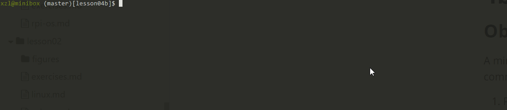
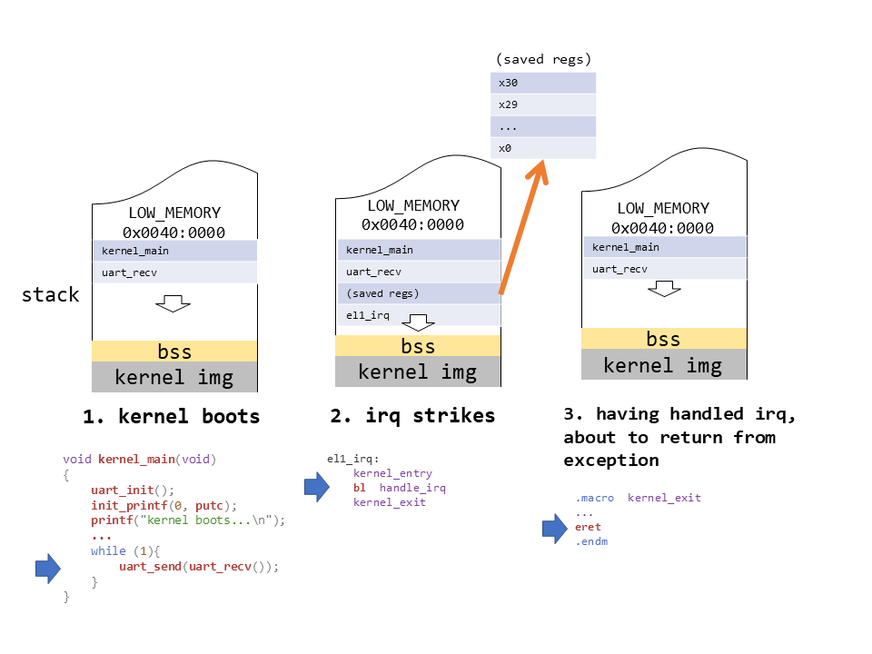
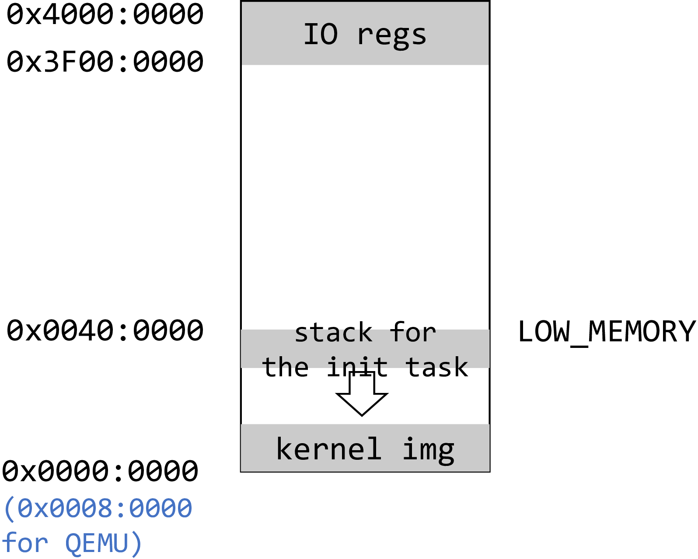
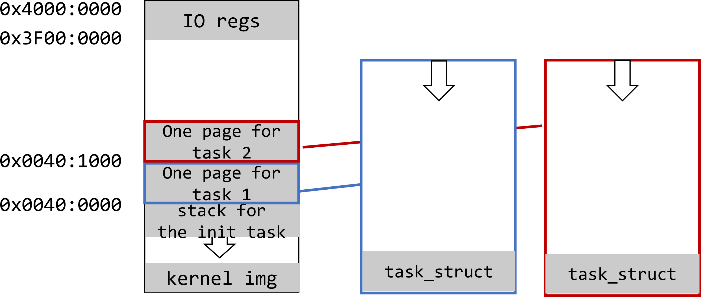
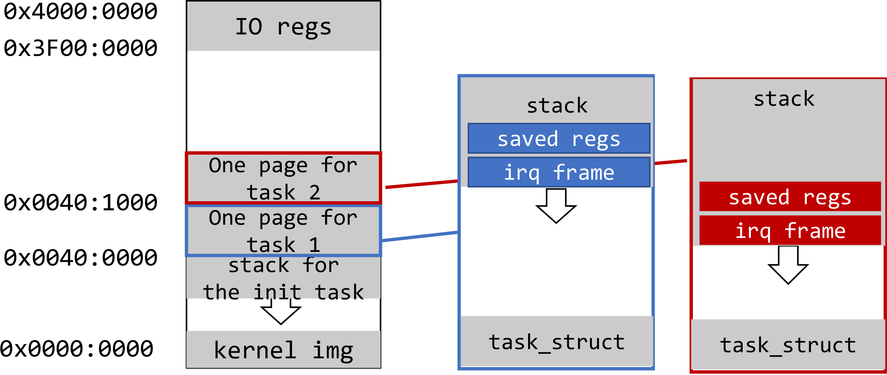

# 4b: Preemptive Multitasking

## Objectives



A minimum kernel that can schedule multiple tasks in a preemptive fashion. With this experiment, our tiny kernel is more like a "real-time kernel" commonly seen in embedded systems, e.g. FreeRTOS.

1. Preempt tasks with time interrupts
2. Understand context switch driven by interrupts, in particular switch to/from interrupt handlers
3. Atomic kernel regions where preemption is disallowed 

**Source code location: p1-kernel/src/lesson04b**

## Roadmap

We will turn on timer interrupts. In the interrupt handler, our kernel invokes its scheduler to switch among runnable tasks. 

In addition to `switch_to`, the kernel should save & restore CPU state upon entering/existing interrupt handling. 

<!--- to complete--->

## Turn on timer interrupts!

We turn on timer interrupts in `kernel_main`. 

```
void kernel_main(void) {
    uart_init();
    init_printf(0, putc);
    irq_vector_init();
    timer_init(); /* new addition */
    enable_interrupt_controller(); /* new addition */
    enable_irq(); /* new addition */
    ... 
}
```

With that, tasks no longer need to call schedule() voluntarily. 

```
void process(char *array)
{
    while (1){
        for (int i = 0; i < 5; i++){
            uart_send(array[i]);
            delay(100000);
        }
        // schedule(); 
    }
}
```

### Calling `schedule()` in timer tick

With preemptive scheduling, schedule() are called in two places. 

1. A task can call `schedule` voluntarily (as in cooperative scheduling). 
1. On a regular basis from the timer interrupt handler.

Look at `timer_tick()`, which is called from the timer interrupt.

```
void timer_tick()
{
    --current->counter;
    if (current->counter>0 || current->preempt_count >0) {
        return;
    }
    current->counter=0;
    enable_irq();
    _schedule();
    disable_irq();
    ... 
```

First of all, it decreases current task's counter. If the counter is greater then 0 or preemption is currently disabled the function returns. Otherwise`schedule` is called with interrupts enabled. (Note: we just came from an interrupt handler and CPU just automatically disabled all interrupts.) 

Why interrupts must be enabled in the scheduler? More on this later. 

## How scheduling works with interrupt entry/exit?

With preemptive scheduling, the kernel must save & restore CPU contexts for the task being interrupted. This is because, e.g. a task A may be interrupted at any point and get preempted (i.e. "losing CPU"). Later, when the kernel reschedules A, A should resume from where it was interrupted. 

**Refresh your memory**: in previous baremetal experiments with no multitasking, we have seen how kernel_entry and kernel_exit macros save and restore general-purpose CPU regs upon switch to/from an interrupt/exception handler. There, we rely on that the hardware automatically saves exception return address and CPU status in registers, `elr_el1` register and `spsr_el` register. When `eret` is executed, CPU restores execution from these registers.



*Figure above: in previous experiments w/o multitasking, save/restore registers upon entering/leaving irq handlers.* 

With multitasking, the kernel now has to create per-task copies of CPU context in memory: general-purpose registers plus `elr_el1` and `spsr_el`. 

**Where to store the CPU context?** 

We choose to store the CPU context on the current task's stack (NOT in its `task_struct.cpu_context`). There are alternative designs to be examined later. 

#### An example workflow

**Kernel boots**

kernel_main function is executed. The initial stack is configured to start at LOW_MEMORY, which is at 0x0040:0000 (4 MB).


---------------------------

**Task 1 creation**

`kernel_main` calls `copy_process` for the first time. A new 4 KB page is allocated, and `task_struct` is placed at the bottom of this page. 


------------------------

**Task 2 creation**

`kernel_main` calls `copy_process` for the second time and the same process repeats. Task 2 is created and added to the task list.


------------------------------

**Switching to task 1; task 1 runs**

`kernel_main` calls the schedule function and it decides to switch to task 1.

* `cpu_switch_to` saves callee-saved registers in the init task `cpu_context`, which is located inside the kernel image.
* `cpu_switch_to` restores callee-saved registers from task 1's `task_struct`.  At this point, `cpu_context.sp` points to `0x00401000`, lr points to ret_from_fork function, `x19` contains a pointer to the start of process() and `x20` a pointer to string "12345", which is located somewhere in the kernel image.
* `cpu_switch_to` executes  `ret`, which jumps to the `ret_from_fork` function.
* `ret_from_fork` reads `x19` and `x20` registers and  calls `process` function with the argument "12345". 
* After `process` function starts, the stack of task 1 begins to grow.


-------

**While task 1 runs, a timer interrupt occurred**

* `kernel_entry` saves all general purpose registers & `elr_el1` and `spsr_el1` to the bottom of task 1 stack ("saved regs" in the figure below).
* The kernel now executes in the irq context. It continues to grow the *current* stack which belongs to task 1. The growth is below the "saved regs" region and is marked as "irq frame" on the figure (i.e. the stack frame created by the execution in the irq context). 
* The kernel proceeds to `schedule` and picks task 2. 


-----------------------

**Switching to task 2; task 2 runs**

`cpu_switch_to` executes exactly the same sequence of steps that it does for task 1. Task 2 started to execute and it stack grows. 


**Note:** until now, the kernel has NOT executed `eret` for the previous timer irq. This is fine as an intentional choice made for this experiment. 

How can we execute task 2 in the context of the previous irq? This is allowed because ARM64 CPU does not differentiate execution in an irq context vs. in an exception (i.e. syscall) context. All the CPU knows is the current EL (we always stay at EL1 before/after the irq) and the irq enable status. And irqs have been enabled previously in timer_tick before `schedule` was called. 

> Nevertheless, there's a more common design in which the kernel finishes the previous irq handling (i.e. 'eret') before switching to a new task. See "alternative design" below. 

-------------------------
**Another timer interrupt occurred while task 2 is running**

Same as above, `kernel_entry` saves all general purpose registers + `elr_el1` and `spsr_el1` at the bottom of task 2's stack. Task 2's irq frame begins to grow.



--------------------

**Scheduling out task 2**

The kernel calls `schedule()`. It observes that all tasks have their counters set to 0 and set counters to their tasks priorities.

`schedule` selects init task to run. (This is because all tasks now have their counters set to 1 and init task is the first in the list). But actually, it would be fully legal for `schedule` to select task 1 or task 2 at this point, because their counters has equal values. We are more interested in the case when task 1 is selected so let's now assume that this is what had happened.

----------------------------

**Switching to task 1, exiting from the 1st irq**

1. `cpu_switch_to` is called and it restores previously saved callee-saved registers from task 1 `cpu_context`. Link register now points to the instruction right after `cpu_switch_to`, which was called last time when task 1 was executed. `sp` points to the bottom of task 1 interrupt stack. This is because task 1 finished handling the previous interrupt handler. 
1. From `cpu_switch_to`, task1 returns back to `switch_to`, to `_schedule`, and then to `timer_tick`. There, it disables interrupts and finally executes `kernel_exit`. There, task 1 irq frame (including the save regs) is unwound. 


----------------------

**Task 1 resumes normal execution**

`kernel_exit` restores all general purpose registers as well as `elr_el1` and `spsr_el1`. `elr_el1` now points somewhere in the middle of the `process` function. `sp` points to the bottom of task 1 stack. (Note: the remaining task size depends on the size  of local variables in `process` )


Finally, `kernel_exit` executes `eret` instruction which uses `elr_el1` register to jump back to `process` function. Task 1 resumes it normal execution!

----------------------------

#### Aside: An alternative design

* When an interrupt happens, the CPU saves irq stack frame automatically on the stack of the current task, e.g. A. This is the same as the design above. 

* The kernel copies the auto saved register contents from the irq frame to the current task's `task_struct`, representing the CPU context when this task was interrupted by irq. 
* The kernel calls its scheduler and returns from the irq (possibly to a different task). The irq stack on the A's stack is then unwound. Now irq is on. Later, when A is scheduled in, the kernel restores its CPU context from A's `task_struct`. 

Can you implement the alternative design? 

## Disable preemption

The kernel needs mechanism to (temporarily) disable preemption. 

Example: in creating a new `task_struct`, we do not want rescheduling to happen. Otherwise the scheduler may see an incomplete `task_struct`. In other words, the creation of `task_struct` should be *atomic*. 

To disable preemption, one method is to disable interrupts. Beyond that, the kernel also needs fine-grained control. 

### Per-task `preempt_count`

To `task_struct`, we add: 

```
struct task_struct {
    struct cpu_context cpu_context;
    long state;
    long counter;
    long priority;
    long preempt_count; // new addition
};
```

`preempt_count` >0  indicates that right now the current task is non-preemptable. The following two functions operate on it: 

```
void preempt_disable(void) { current->preempt_count++;}
void preempt_enable(void) { current->preempt_count--;}
```

Seeing this flag, the kernel will not invoke scheduler() at all, let alone descheduling this task (i.e. switching to a different task). This is done via the following code. 

```
void timer_tick() {
	if (current->counter>0 || current->preempt_count >0) 
		return;	
...
```

Why a count instead of a binary flag? This again mimics the Linux implementation. Individual kernel functions could increment & decrement `preempt_count`. If all kernel functions have finished decrementing `preempt_count`, the count drops to zero and the scheduler is free to deschedule the task. This mechanism is called reference count, which is common in system software. 

> `preempt_count` does not prevent a task from shooting in its own foot, though. For instance, a misbehaving task calling schedule() when `preempt_count` > 0 will likely corrupt kernel data structures. Try it out! 

### Creating a `task_struct` atomically 

Going back to making `copy_process` atomic: 

```
int copy_process(unsigned long fn, unsigned long arg)
{
    preempt_disable(); /* new addition */
    struct task_struct *p;

    p = (struct task_struct *) get_free_page();
    if (!p)
        return 1;
    p->priority = current->priority;
    p->state = TASK_RUNNING;
    p->counter = p->priority;
    p->preempt_count = 1; // new addition 

    p->cpu_context.x19 = fn;
    p->cpu_context.x20 = arg;
    p->cpu_context.pc = (unsigned long)ret_from_fork;
    p->cpu_context.sp = (unsigned long)p + THREAD_SIZE;
    int pid = nr_tasks++;
    task[pid] = p;
    preempt_enable(); /* new addition */
    return 0;
}
```

`preempt_count` is set to 1, preventing the new task, once it starts to execute, from being preempted until it completes some initialization work. After that, the new task executes `ret_from_fork`, which calls `schedule_tail()` which will call `preempt_enable()` 

```
// entry.S
.globl ret_from_fork
ret_from_fork:
	bl	schedule_tail
	...
```

<!--- not sure if this is useful as of now. schedule_tail() is the first thing called by ret_from_fork which means the new task will turn on preempt as soon as it runs for the 1st time -->

### Making the scheduling algorithm atomic

The scheduler is [non-reentrant](https://en.wikipedia.org/wiki/Reentrancy_(computing)). Making it atomic looks easy: we just call `preempt_disable/enable()` upon entering/leaving the scheduler. 

```
void _schedule(void)
{
    preempt_disable(); /* new addition */
    int next,c;
    struct task_struct * p;
    while (1) {
        c = -1;
        next = 0;
        for (int i = 0; i < NR_TASKS; i++){
            p = task[i];
            if (p && p->state == TASK_RUNNING && p->counter > c) {
                c = p->counter;
                next = i;
            }
        }
        if (c) {
            break;
        }
        for (int i = 0; i < NR_TASKS; i++) {
            p = task[i];
            if (p) {
                p->counter = (p->counter >> 1) + p->priority;
            }
        }
    }
    switch_to(task[next]);
    preempt_enable(); /* new addition */
}
```

**Why does the kernel disable preemption**, instead of disabling all interrupts?

By design, if no `TASK_RUNNING` tasks are there, the scheduler will run its while loop over and over again until some of the tasks will move to `TASK_RUNNING` state. But if we are running on a single CPU, how then a task state can change while this loop is running? The answer is that if some task is waiting for an interrupt, this interrupt can happen while `schedule` function is executed and interrupt handler can change the state of the task. 

This actually explains why interrupts must be enabled during `schedule` execution. This also demonstrates an important distinction between disabling interrupts and disabling preemption. `schedule` disables preemption for the duration of the whole function. This ensures that nested `schedule` will not be called while we are in the middle of the original function execution. However, interrupts can legally happen during `schedule` function execution.

Note: our kernel does not (yet) have the mechanism for tasks to wait for interrupts. It's a important mechanism to be added. 

> I am not very satisfied with leaving interrupt on during schedule(). There shall be an idle task which does `WFI` when no other tasks are runnable. In that way, the scheduler can avoid spinning and can run with interrupt off. To implement the idle task, the kernel shall implement task wait state.  
>

## Conclusion

We are done with scheduling, but right now our kernel can manage only kernel threads: they are executed at EL1 and can directly access any kernel functions or data. In the next 2 lessons we are going fix this and introduce system calls and virtual memory.
