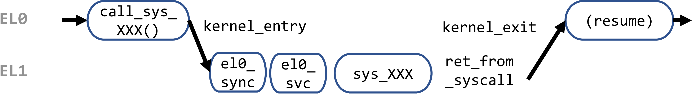
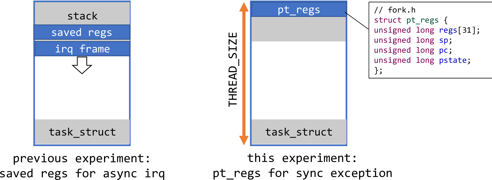

# 5: User processes and system calls


## Objectives

Our kernel is evolving from an "embedded" kernel which often lacks user/kernel separation to a multiprogrammed kernel. 

* Run tasks in EL0

* Add the syscall mechanism

* Implement a few basic syscalls

NOTE: this experiment enables running user/kernel at different ELs. Yet, it does not NOT give each task its own address space — we are going to tackle this issue in lesson 6!


**Source code location: p1-kernel/src/lesson05**


## Roadmap

1. Implement the syscall mechanism, in particular switch between EL0 and EL1 (you have already done something similar in previous experiments!)
2. Implement two mechanisms that put user tasks to EL0: 
* forking an existing user task at EL0
* moving a kernel task EL1 -> EL0

## Syscall implementation

Each system call is a synchronous exception. A user program prepares all necessary arguments, and then run `svc` instruction. Such exceptions are handled at EL1 by the kernel. The kernel validates all arguments, does the syscall, and exits from the exception. After that, the user task resumes at EL0 right after the `svc` instruction. 



We have 4 simple syscalls: 

1. `write` outputs to UART. It accepts a buffer with the text to be printed as the first argument.
1. `clone` creates a new user thread. The location of the stack for the newly created thread is passed as the first argument.
1. `malloc` allocates a memory page for a user process. There is no analog of this syscall in Linux (and I think in any other OS as well.) The only reason that we have no virtual memory yet, and all user processes work with physical memory. Each process needs a way to figure out which memory page can be used. `malloc` syscall return pointer to the newly allocated page or -1 in case of an error.
1. `exit` Each process must call this syscall after it finishes execution. It will do cleanup.

All syscalls are defined in `sys.c`. There is also an array [sys_call_table](https://github.com/s-matyukevich/raspberry-pi-os/blob/master/src/lesson05/src/sys.c) that contains pointers to all syscall handlers. Each syscall has a "syscall number" — this is just an index in the `sys_call_table` array. All syscall numbers are defined [here](https://github.com/s-matyukevich/raspberry-pi-os/blob/master/src/lesson05/include/sys.h#L6) — they are used by the assembler code to look up syscall. 

Let's use `write` syscall as an example: 

```
//sys.S, executed at the user level
.globl call_sys_write
call_sys_write:
    mov w8, #SYS_WRITE_NUMBER
    svc #0
    ret
```

Simple -- the wrapper stores the syscall number in the `w8` register and does `svc`. Convention: registers `x0` — `x7`are used for syscall arguments and `x8` is used to store syscall number. This allows a syscall to have up to 8 arguments.

In commodity OSes, such wrapper functions are usually in user library such as [glibc](https://www.gnu.org/software/libc/) but not in the kernel. 

### Switching between EL0 and EL1

We need this new mechanism. It's in the same spirit as we move from EL2/3 to EL1. (Recall: how did we do it?)

Previously, our kernel runs at EL1; when an interrupt occurs, it takes the interrupt at EL1. Now, we need to take exception (svc) from EL0 to EL1. To accommodate this, both `kernel_entry` and `kernel_exit` macros accepts an additional argument `el`, indicating the EL an exception is taken from. The information is required to properly save/restore stack pointer. Here are the two relevant parts from the `kernel_entry` and `kernel_exit` macros.

```assembly
// kernel_entry
.if    \el == 0
mrs    x21, sp_el0
.else
add    x21, sp, #S_FRAME_SIZE
.endif 
```

```assembly
// kernel_exit
.if    \el == 0
msr    sp_el0, x21
.endif 
...
eret
```

Even for the same task, we are using 2 distinct stacks for EL0 and EL1. This is a common design because we want to separate user/kernel. 

Supported by CPU hardware, after taking an exception from EL0 to EL1, the CPU automatically starts use the SP for EL1. The SP for EL0 can be found in the `sp_el0` register. 

The value of this register must be stored and restored upon entering/exiting the kernel, even if the kernel does not  use `sp_el0` in the exception handler. Reason: we need to virtualize `sp_el0` for each task because each task has its own user stack. Try to visualize this in your mind. 

When we do `kernel_exit`, how do we specify which EL to return to, EL0 or EL1? This EL level is encoded in the `spsr_el1` register that was saved, e.g. when syscall enters the kernel. So we always return to the level from which the exception was taken.

> How did we treat SP when taking interrupts (from EL1)? Revisit the figures in previous experiments. 

<!---- You may also ask why don't we restore the value of the `sp` register in the case when an exception was taken from EL1? That is because we are reusing the same kernel stack for the exception handler. Even if a context switch happens during an exception processing, by the time of `kernel_exit`, `sp` will be already switched by the `cpu_switch_to` function. (By the way, in Linux the behavior is different because Linux uses a different stack for interrupt handlers.) ---->

### Handling synchronous exceptions

In the exception table, `el0_sync` is registered as the handler for sync exception taken at EL0. 

```
// entry.S
el0_sync:
    kernel_entry 0
    mrs    x25, esr_el1                // read the syndrome register
    lsr    x24, x25, #ESR_ELx_EC_SHIFT // exception class
    cmp    x24, #ESR_ELx_EC_SVC64      // SVC in 64-bit state
    b.eq   el0_svc
    handle_invalid_entry 0, SYNC_ERROR
```

* As for all exception handlers, `kernel_entry` macro is called. 

* `esr_el1` (Exception Syndrome Register) is checked. This register contains "exception class" field at offset [ESR_ELx_EC_SHIFT](https://github.com/s-matyukevich/raspberry-pi-os/blob/master/src/lesson05/include/arm/sysregs.h#L46). If exception class is equal to [ESR_ELx_EC_SVC64](https://github.com/s-matyukevich/raspberry-pi-os/blob/master/src/lesson05/include/arm/sysregs.h#L47) this means that the current exception is caused by the `svc` instruction and it is a system call. In this case, we jump to `el0_svc` label and show an error message otherwise.

```
sc_nr   .req    x25                  // number of system calls
scno    .req    x26                  // syscall number
stbl    .req    x27                  // syscall table pointer

el0_svc:
    adr    stbl, sys_call_table      // load syscall table pointer
    uxtw   scno, w8                  // syscall number in w8
    mov    sc_nr, #__NR_syscalls
    bl     enable_irq
    cmp    scno, sc_nr               // check upper syscall limit
    b.hs   ni_sys

    ldr    x16, [stbl, scno, lsl #3] // address in the syscall table
    blr    x16                       // call sys_* routine
    b      ret_from_syscall
ni_sys:
    handle_invalid_entry 0, SYSCALL_ERROR
```

`el0_svc` first loads the address of the syscall table in the `stbl` (it is just an alias to the `x27` register.) and syscall number in the `scno` variable. Then interrupts are enabled and syscall number is compared to the total number of syscalls in the system — if it is greater or equal an error message is shown. If syscall number falls within the required range, it is used as an index in the syscall table array to obtain a pointer to the syscall handler. Next, the handler is executed and after it finishes `ret_from_syscall` is called. 

Note, that we don't touch here registers `x0` – `x7` — they are transparently passed to the handler. (Why?)

Fast forward to the completion of syscall. 

```
ret_from_syscall:
    bl    disable_irq
    str   x0, [sp, #S_X0]             // returned x0
    kernel_exit 0
```

`ret_from_syscall` first disables interrupts. Then it saves the value of `x0` register on the stack. This is required because `kernel_exit` will restore all general purpose registers from their saved values, but `x0` now contains return value of the syscall handler and we want this value to be passed to the user code. Finally `kernel_exit` is called, which returns to the user code.

## Executing a task in user mode

Atop that, the kernel implements two complementary ways for launching a user process. Overview: 


--------------

### Method 1: Forking user processes

At the user level, user_process() calls `call_sys_clone` to spawn a new task. 

```
// sys.S
.globl call_sys_clone
call_sys_clone:
    /* Save args for the child. They will be preserved throughout syscall  */
    mov    x10, x0                    /*fn*/
    mov    x11, x1                    /*arg*/
    mov    x12, x2                    /*stack*/

    /* Prep syscall args. Do the system call.  */
    mov    x0, x2                     /* stack  */
    mov    x8, #SYS_CLONE_NUMBER
    svc    0x0
    
    cmp    x0, #0
    beq    thread_start
    ret

thread_start:
    mov    x29, 0

    /* Pick up the function arg and execute.  */
    mov    x0, x11
    blr    x10
    
    /* We are done, pass the return value through x0.  */
    mov    x8, #SYS_EXIT_NUMBER
    svc    0x0
```

The `clone` wrapper above mimics the [coresponding function](https://sourceware.org/git/?p=glibc.git;a=blob;f=sysdeps/unix/sysv/linux/aarch64/clone.S;h=e0653048259dd9a3d3eb3103ec2ae86acb43ef48;hb=HEAD#l35) from in the `glibc` library. 

1. x0-x3 contain syscall arguments. They are intended for the child task. Save fn and arg to x10-x11. Why? The kernel syscall handler `el0_svc` does not preserve x0-x3. The new task will pick up x10 and x11 in `thread_start`. 
1. Save the pointer to the new task's stack in x2, as expected by `sys_clone(unsigned long stack)`. 
1. Starts syscall via `svc`. 
1. Upon returning from syscall, checks return value in x0: 
   * if 0, we are executing inside the child task. In this case, execution goes to `thread_start` label.
   * If not 0, we are executing in the parent task. x0 is the PID of the child task. 
1. thread_start executes in the new task with the give entry function (x10) and the arg to the function (x11). Note x29 (FP) is cleared for correct stack unwinding at the user level. See [here](https://github.com/s-matyukevich/raspberry-pi-os/blob/master/docs/lesson03/linux/low_level-exception_handling.md).
1. After the function finishes, `exit` syscall is performed — it never returns.

#### Implementing clone in kernel

Inside the kernel, clone() goes to is `sys_clone()` (sys.c). It just calls `copy_process()` . This function, however, has been modified since the last lesson. 

```
int copy_process(unsigned long clone_flags, unsigned long fn, unsigned long arg, unsigned long stack)
{
    preempt_disable();
    struct task_struct *p;

    p = (struct task_struct *) get_free_page();
    if (!p) {
        return -1;
    }
    
    struct pt_regs *childregs = task_pt_regs(p);
    memzero((unsigned long)childregs, sizeof(struct pt_regs));
    memzero((unsigned long)&p->cpu_context, sizeof(struct cpu_context));
    
    // new addition
    if (clone_flags & PF_KTHREAD) {
        p->cpu_context.x19 = fn;
        p->cpu_context.x20 = arg;
    } else {
        struct pt_regs * cur_regs = task_pt_regs(current);
        *childregs = *cur_regs;
        childregs->regs[0] = 0;
        childregs->sp = stack + PAGE_SIZE;
        p->stack = stack;
    }
    p->flags = clone_flags;
    p->priority = current->priority;
    p->state = TASK_RUNNING;
    p->counter = p->priority;
    p->preempt_count = 1; //disable preemtion until schedule_tail
    
    p->cpu_context.pc = (unsigned long)ret_from_fork;
    p->cpu_context.sp = (unsigned long)childregs;
    int pid = nr_tasks++;
    task[pid] = p;
    preempt_enable();
    return pid;
}
```

If creating a new kernel thread, the function does the same thing as before. If creating a user thread, the function takes care of `pt_regs` as it is unique to a user thread -- the state saved/restored upon entering/exiting the kernel. 

```
struct pt_regs * cur_regs = task_pt_regs(current);
*childregs = *cur_regs;
childregs->regs[0] = 0;
childregs->sp = stack + PAGE_SIZE;
p->stack = stack;
```

We populate the CPU context, i.e. `pt_regs`, for the new task. Note that `pt_regs` is always at the top of the stack page (recall the figure above), because when syscall enters/exits the kernel, the kernel stack is empty. 

`x0` in the new state is set to `0`, because `x0` will be the return value of the `clone` syscall. We've just seen how clone wrapper function uses this value to determine whether we are in the parent or the child task. 

Next `sp` for the new task is set to point to the top of the new user stack page. We also save the pointer to the stack page in order to do a cleanup after the task finishes.

### Method 2: Moving an existing kernel task to EL0 

Overview: upon its creation, the kernel task calls its main function, `kernel_process()`, which calls `move_to_user_mode()`. The later prepares CPU context for exiting to EL0. Then `kernel_process()` returns to `ret_from_fork` which invokes the familiar `kernel_exit`. Eventually, an `eret` instruction - boom! We land in EL0. 

**Code walkthrough**

First create a process (i.e. a task) as we did before. This is a "kernel" process to execute at EL1. 

```
// kernel.c
int res = copy_process(PF_KTHREAD, (unsigned long)&kernel_process, 0, 0);
```

The kernel process invokes [move_to_user_mode()](https://github.com/s-matyukevich/raspberry-pi-os/blob/master/src/lesson05/src/fork.c#Li47), passing a function pointer to the `user_process` as the first argument. 

```
void kernel_process() {
    printf("Kernel process started. EL %d\r\n", get_el());
    int err = move_to_user_mode((unsigned long)&user_process);
    ...
```

The `move_to_user_mode` function prepares pt_regs and the user stack, so the kernel process becomes a "legit" user process. 

```
int move_to_user_mode(unsigned long pc)
{
    struct pt_regs *regs = task_pt_regs(current);
    memzero((unsigned long)regs, sizeof(*regs));
    regs->pc = pc;
    regs->pstate = PSR_MODE_EL0t;
    unsigned long stack = get_free_page(); //allocate new user stack
    if (!stack) {
        return -1;
    }
    regs->sp = stack + PAGE_SIZE;
    current->stack = stack;
    return 0;
}
```

**pt_regs: the exception stack frame** 

In the previous experiment: when an interrupt happens, `kernel_entry` saves CPU context to a *stack frame* marked as "saved regs", which is somewhere in the middle of a kernel task's stack. 



> Dump pt_regs in GDB:
>
> ```
> >>>  p /x *(struct pt_regs *)((char *)current + 4096 - sizeof(struct pt_regs))
> $7 = {                                                              
> regs = {[0x0] = 0x401fd0, [0x1] = 0x0, [0x2] = 0x401fe7, [0x3] = 0x401f40, [0x4] = 0x0 <repeats 25 times>, [0x1d] = 0x401fc0, [0x1e] = 0x8088c}, 
> sp = 0x401fc0,                                               
> pc = 0x830cc,                                                         
> pstate = 0x60000000 }                                                 
> ```
>
> Check where syscall happens:                                                                    
> ```
> >>> info line *0x830cc                                                                        
> Line 7 of "src/sys.S" starts at address 0x830cc <call_sys_write+8> and ends at 0x830d0 <call_sys_
> malloc>.                                                                                      
> ```


In this experiment, our kernel will additionally handle sync exceptions (syscalls). When a syscall happens, the CPU will create a stack frame in the same format called [pt_regs](https://github.com/s-matyukevich/raspberry-pi-os/blob/master/src/lesson05/include/fork.h#L21). The name comes from Linux again. When syscall returns, the kernel unwinds `pt_regs`. 

For *the first time* return to EL0, `move_to_user_mode()` sets up `pt_regs`:

* `pt_regs.pc` This is the first instruction to be executed by the task once it lands in user mode via `eret`. 

* `pstate`. This specifies the CPU state for the task. Later, `kernel_exit` copies this field to `spsr_el1`. `eret` restores the CPU state from `pstate`. [PSR_MODE_EL0t](https://github.com/s-matyukevich/raspberry-pi-os/blob/master/src/lesson05/include/fork.h#L9) constant specifies that we will go to EL0. See [manual](https://developer.arm.com/docs/ddi0595/b/aarch64-system-registers/spsr_el1). 

* Furthermore, `move_to_user_mode`  allocates a new page for the user stack and sets `sp` field to point to the page top. 

**Where is pt_regs?**

It is at the top of the stack. See the figure above. Right before `kernel_exit()`, the task's stack is unwound just to the beginning of `pt_regs`. Therefore, `kernel_exit()` will restore CPU regs from the stack. 

**task_pt_regs()** calculates the address of a task's `pt_regs`. See the code below which is self-evident. Recall that THREAD_SIZE == 4KB which is the memory size for the task. 

```
struct pt_regs * task_pt_regs(struct task_struct *tsk){
	unsigned long p = (unsigned long)tsk + THREAD_SIZE - sizeof(struct pt_regs);
	return (struct pt_regs *)p;
}
```

#### ret_from_fork(), augmented

New addition is made to the middle of the [ret_from_fork](https://github.com/s-matyukevich/raspberry-pi-os/blob/master/src/lesson05/src/entry.S#L188) function: 

```
.globl ret_from_fork
ret_from_fork:
    bl    schedule_tail
    cbz   x19, ret_to_user            // not a kernel thread
    mov   x0, x20
    blr   x19
ret_to_user:
    bl disable_irq
    kernel_exit 0
```

Why are x19 and x20? That is where `copy_process()` saves the `fn` and `arg` specified for a new user process. 

Now, after a kernel thread finishes, the execution jumps to `ret_to_user`, where it disables interrupts and performs exception return (kernel_exit), using previously prepared processor state.

If you get confused, revisit the "overview" figure: 


## Exiting a task

Each user task calls the `exit` syscall at the end of its life cycle. In the current implementation, the `call_sys_clone` wrapper calls `exit`; see above.  Into the kernel, `exit` syscall goes to `exit_process()`, which deactivates a task. The function is listed below.

```
void exit_process(){
    preempt_disable();
    for (int i = 0; i < NR_TASKS; i++){
        if (task[i] == current) {
            task[i]->state = TASK_ZOMBIE;
            break;
        }
    }
    if (current->stack) {
        free_page(current->stack);
    }
    preempt_enable();
    schedule();
}
```

Following Linux convention, we are not deleting the task at once but set its state to `TASK_ZOMBIE` instead. This prevents the task from being selected and executed by the scheduler. In Linux such approach is used to allow parent process to query information about the child even after it finishes.

`exit_process` also deletes now unnecessary user stack and calls `schedule`. After `schedule` is called new task will be selected, that's why this system call never returns.

## Conclusion

Now that the kernel can manage user tasks, we become much closer to the full process isolation. But one important step is still missing: all user tasks share the same physical memory and can easily read one another's data. In the next lesson, we are going to introduce virtual memory and fix this issue.
