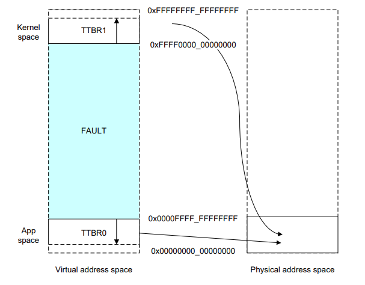

# 6: Virtual memory (VM)

## Objectives

Make our tiny kernel capable of: 

1. enforcing separate virtual address spaces, and 
2. user-level demand paging. 

<!--- todo: show a gif screenshot --->

## Roadmap

**Source code location: p1-kernel/src/lesson06**

Prior to this experiment, our kernel can run and schedule user processes, but the isolation between them is not complete - all processes and the kernel itself share the same memory. This allows any process to easily access somebody else's data and even kernel data. And even if we assume that all our processes are not malicious, there is another drawback: before allocating memory each process need to know which memory regions are already occupied - this makes memory allocation for a process more complicated.

We take the following steps. 

* Set up a pgtable for kernel. Using linear mapping. 
* Turn on MMU shortly after kernel boots. This is a common kernel design. 
* Set up pgtables for user processes
* Implement fork() for user processes
* Implement demand paging 

## Background: ARM64 translation process

The Arm's document is well written. ("Armv8-A Address Translation", [link](https://developer.arm.com/documentation/100940/0101/))

### Page table format

This experiment introduces VM to our kernel. With VM, we can formally call tasks "processes". Each task will have its own address space. They issue memory access with virtual addresses. The MMU transparently translates virtual addresses to physical addresses. The MMU uses page table (or pgtable, or "translation table" in ARM's manual). 

The following diagram summarizes ARM64 address translation with uses 4-level pgtables. 

```
                           Virtual address                                                                 Physical Memory
+-----------------------------------------------------------------------+                                +-----------------_+
|         | PGD Index | PUD Index | PMD Index | PTE Index | Page offset |                                |                  |
+-----------------------------------------------------------------------+                                |                  |
63        47     |    38      |   29     |    20    |     11      |     0                                |     Page N       |
                 |            |          |          |             +--------------------+           +---->+------------------+
                 |            |          |          +---------------------+            |           |     |                  |
          +------+            |          |                                |            |           |     |                  |
          |                   |          +----------+                     |            |           |     |------------------|
+------+  |        PGD        |                     |                     |            +---------------->| Physical address |
|TTBRx |---->+-------------+  |           PUD       |                     |                        |     |------------------|
+-EL1--+  |  |  entry #511 |  | +->+-------------+  |          PMD        |                        |     |                  |
          |  +-------------+  | |  |     #511    |  | +->+-------------+  |          PTE           |     +------------------+
          +->| PUD address |----+  +-------------+  | |  |   #511      |  | +->+--------------+    |     |                  |
             +-------------+  +--->| PMD address |----+  +-------------+  | |  |      #511    |    |     |                  |
             |  entry #0   |       +-------------+  +--->| PTE address |----+  +-------------_+    |     |                  |
             +-------------+       |       #0    |       +-------------+  +--->| Page address |----+     |                  |
                                   +-------------+       |     #0      |       +--------------+          |                  |
                                                         +-------------+       |      #0      |          |                  |
                                                                               +--------------+          +------------------+
```

Notable points: 

* Page tables have a hierarchical structure, i.e. a tree.  An item in any of the tables contains an address of the next table in the hierarchy.
  
  > Note: strictly speaking a pgtable means a contiguous array of entries at any of the four levels. So a tree has many pgtables. Some documents casually use "pgtable" to refer to an entire pgtable tree. Be careful. 
  
* There are 4 levels in the table hierarchy: PGD (Page Global Directory), PUD (Page Upper Directory), PMD (Page Middle Directory), PTE (Page Table Entry). PTE is the last table in the hierarchy and it points to the actual page in the physical memory. 

  > Don't read too much into the terms, which just represent lv1, 2, ... pgtables. Them terms come from the Linux kernel (x86), not ARM64. Over years, they became a common lingo among kernel hackers. 

* Besides holding a physical address, each pgtable item holds extra bits crucial for translation. Will examine the format below. 

* MMU starts memory translation process by locating the base address of PGD. MMU locates the base address from the `TTBRx_EL1` register which should be set by the kernel. TTBR = translation table base register.

  * bits [63-47] = 0xffff (all 1s). MMU uses `ttbr1_el1`. This is meant for the kernel space. 
  * bits [63-47] = 0x0 (all 1s). MMU uses `ttbr0_el1`. This is meant for the user process. 
  * Each process has its own address space. Therefore, it has its own copy of page table tree, starting from PGD. Therefore, the kernel keeps a separate PGD base address for each process. That is, the kernel virtualizes PGD for processes. During a context switch, the kernel loads the PGD base of the next process to `ttbr0_el1`.

* MMU walks the pgtable tree to look up the physical address. A virtual address uses only 48 out of 64 available bits.  When doing a translation, MMU splits an address into 4 parts:
  * 9 bits [39 - 47] contain an index in the PGD table. MMU uses this index to find the location of the PUD.
  * 9 bits [30 - 38] contain an index in the PUD table. MMU uses this index to find the location of the PMD.
  * 9 bits [21 - 29] contain an index in the PMD table. MMU uses this index to find the location of the PTE.
  * 9 bits [12 - 20] contain an index in the PTE table. MMU uses this index to find a page in the physical memory.
  * Bits [0 - 11] contain an offset in the physical page. MMU uses this offset to determine the exact position in the previously found page that corresponds to the original virtual address.

* Memory for a user process is always allocated in pages. A page is a contiguous memory region 4KB in size (ARM processors support larger pages, but 4KB is the most common case and we are going to limit our discussion only to this page size).

**Exercise: how large is a page table?** From the diagram above we know that index in a page table occupies 9 bits (this is true for all page table levels). This means that each page table contains `2^9 = 512` items. Each item in a page table is an address of either the next page table in the hierarchy or a physical page in case of PTE. As we are using a 64-bit processor, each address must be 64 bit or 8 bytes in size. 

This means that each pgtable is `512 * 8 = 4096` bytes or 4 KB. **A pgtable is exactly a page!** This might give you an intuition why MMU designers chose such numbers.

### Section (2MB) mapping

This is specific to ARM64 for mapping large, continuous physical memory. Instead of 4 KB pages, we directly map 2MB blocks called sections. This eliminates one level of translation. The translation diagram, in this case, looks like the following.

```
                           Virtual address                                               Physical Memory
+-----------------------------------------------------------------------+              +-----------------_+
|         | PGD Index | PUD Index | PMD Index |      Section offset     |              |                  |
+-----------------------------------------------------------------------+              |                  |
63        47     |    38      |   29     |    20            |           0              |    Section N     |
                 |            |          |                  |                    +---->+------------------+
                 |            |          |                  |                    |     |                  |
          +------+            |          |                  |                    |     |                  |
          |                   |          +----------+       |                    |     |------------------|
+------+  |        PGD        |                     |       +------------------------->| Physical address |
| TTBRx|---->+-------------+  |           PUD       |                            |     |------------------|
+--EL1-+  |  |             |  | +->+-------------+  |            PMD             |     |                  |
          |  +-------------+  | |  |             |  | +->+-----------------+     |     +------------------+
          +->| PUD address |----+  +-------------+  | |  |                 |     |     |                  |
             +-------------+  +--->| PMD address |----+  +-----------------+     |     |                  |
             |             |       +-------------+  +--->| Section address |-----+     |                  |
             +-------------+       |             |       +-----------------+           |                  |
                                   +-------------+       |                 |           |                  |
                                                         +-----------------+           |                  |
                                                                                       +------------------+
```

As you can see the difference here is that now PMD contains a pointer to the physical section. Also, the offset occupies 21 bits instead of 12 bits (this is because we need 21 bits to encode a 2MB range)

### Page descriptor format

An item in a page table is called "descriptor". A description has a special format as mandated by MMU hardware. A descriptor contains an address of either next page table or a physical page.

**The key thing to understand**: each descriptor always points to something that is **page-aligned** (either a physical page, a section or the next page table in the hierarchy). This means that last 12 bits of the address, stored in a descriptor, will always be 0. MMU uses those bits to store additional information  ("attributes") for translation. 


```
                           Descriptor format
`+------------------------------------------------------------------------------------------+
 | Upper attributes | Address (bits 47:12) | Lower attributes | Block/table bit | Valid bit |
 +------------------------------------------------------------------------------------------+
 63                 47                     11                 2                 1           0
```

* **Bit 0** This bit must be set to 1 for all valid descriptors. If MMU encounter non-valid descriptor during translation process a synchronous exception is generated. If this invalid bit was set by kernel on purpose, the kernel shall handle this exception, allocate a new page, and prepare a correct descriptor (We will look in details on how this works a little bit later)
* **Bit 1** This bit indicates whether the current descriptor points to a next page table in the hierarchy (we call such descriptor a "**table descriptor**") or it points instead to a physical page or a section (such descriptors are called "**block descriptors**").
* **Bits [11:2]** Those bits are ignored for table descriptors. For block descriptors they contain some attributes that control, for example, whether the mapped page is readable/writeable (AP), executable (XN), etc. Here also comes the MemAttr bits. See below. 
* **Bits [47:12]**. This is the place where the address that a descriptor points to is stored. As I mentioned previously, only bits [47:12] of the address need to be stored, because all other bits are always 0.
* **Bits [63:48]** Another set of attributes.

See [Arm's official page](https://armv8-ref.codingbelief.com/en/chapter_d4/d43_3_memory_attribute_fields_in_the_vmsav8-64_translation_table_formats_descriptors.html#). 

### Configuring page attributes

As I mentioned in the previous section, each block descriptor contains a set of attributes (called MemAttr, bits[5:2]) that controls various virtual page parameters, notably cacheability or shareability. However, the attributes that are most important for our discussion are NOT encoded in the descriptor. Instead, ARM processors implement a trick for compressing descriptor attributes commonly used. (The days of simpler ARM hardware were gone)

**Memory attribute indirection** 

ARMv8 architecture introduces `mair_el1` register. See [its definition](https://developer.arm.com/docs/ddi0595/b/aarch64-system-registers/mair_el1). This register consists of 8 slots, each spanning 8 bits. Each slot configures a common set of attributes. A descriptor then specifies just an index of the `mair` slot, instead of specifying all attributes directly. This allows using only 3 bits in the descriptor to reference a `mair` slot. We are using only a few of available attribute options. [Here](https://github.com/s-matyukevich/raspberry-pi-os/blob/master/src/lesson06/include/arm/mmu.h#L11) is the code that prepares values for the `mair` register.

```
/*
 * Memory region attributes:
 *
 *   n = AttrIndx[2:0]
 *            n    MAIR
 *   DEVICE_nGnRnE    000    00000000
 *   NORMAL_NC        001    01000100
 */
#define MT_DEVICE_nGnRnE         0x0
#define MT_NORMAL_NC            0x1
#define MT_DEVICE_nGnRnE_FLAGS        0x00
#define MT_NORMAL_NC_FLAGS          0x44
#define MAIR_VALUE            (MT_DEVICE_nGnRnE_FLAGS << (8 * MT_DEVICE_nGnRnE)) | (MT_NORMAL_NC_FLAGS << (8 * MT_NORMAL_NC))
```

Here we are using only 2 out of 8 available slots in the `mair` registers. The first one corresponds to device memory (IO registers) and second to normal non-cacheable memory. `MT_DEVICE_nGnRnE` and `MT_NORMAL_NC` are indexes that we are going to use in block descriptors, `MT_DEVICE_nGnRnE_FLAGS` and `MT_NORMAL_NC_FLAGS` are values that we are storing in the first 2 slots of the `mair_el1` register.

## Kernel vs user virtual memory 

After the MMU is switched on, each memory access issued by kernel must use virtual address instead of physical. One consequence is that the kernel itself must maintain its own set of page tables. One possible solution could be to reload `ttbr` (pointing to the PGD base) each time we switch from user to kernel mode. Reloading `ttbr` can be costly. (Why?) This makes syscalls and page faults expensive. 

Commodity kernels therefore avoid frequent reloads of PGD base. A kernel splits the virtual address space into 2 parts: user portion and kernel portion. When switching among user tasks, the kernel only changes the mapping of the user portion while keeping the kernel mapping unchanged. 

> This classic kernel design turns out to lead to most severe security holes in recent years. Google "spectre and meltdown". 

On 32-bit CPUs, a kernel usually allocate first 3 GB of the address space for user and reserve last 1 GB for the kernel. 64-bit architectures are much more favorable in this regard because of huge virtual address space (how large?). And even more: ARMv8 architecture comes with a native feature that can be used to easily implement user/kernel address split.

ARM64 defines 2 `TTBR` registers for holding PGD base addresses: 

* TTBR0_EL1 points to a user PGD; 
* TTBR1_EL1 points to the kernel PGD. 

MMU uses only 48 bits out of 64 bits in the virtual addresses for translation. MMU uses the upper 16 bits in a given virtual address to decide whether it uses TTBR0 or TTBR1. 

* **User virtual addresses**: upper 16 bits == 0. MMU uses the PGD base stored in TTBR0_EL1.  This value shall be changed according to process switch. 
* **Kernel virtual addresses**: upper 16 bits == `0xffff`.  MMU uses the PGD base stored in TTBR1_EL1. This value shall remain unchanged throughout the life of the kernel. 

The CPU also enforces that software at EL0 can never access virtual addresses started with `0xffff`. Doing so triggers a synchronous exception.  

Here is a picture the memory layout. Source: Arm's document "ARMv8-A Address Translation". 



### **Adjusting kernel addresses** 

All absolute kernel addresses must start with `0xffff...`. There are 2 places in the kernel source code shall be changed. 

* In the [linker script](https://github.com/s-matyukevich/raspberry-pi-os/blob/master/src/lesson06/src/linker.ld#L3) we specify base address of the image as `0xffff000000000000`. This will make the linker think that our image is going to be loaded at `0xffff000000000000` address, and therefore whenever it needs to generate an absolute address it will make it right. (There are a few more changes to the linker script, but we will discuss them later.) 

* We hardcode absolute kernel base addresses in the [header](https://github.com/s-matyukevich/raspberry-pi-os/blob/master/src/lesson06/include/peripherals/base.h#L7) where we define device base address. After switching on MMU, kernel has to access all IO via virtual addresses. We can map them starting from `0xffff00003F000000`. In the next section we will explore in detail the code that creates this mapping.

## Kernel boot: initializing kernel page tables

**Important: the linker is completely oblivious to kernel physical address**, e.g. the physical base (0x0 or 0x80000) where the kernel will be loaded. Two Implications: 

1. the linker links all kernel symbols at virtual addresses starting from `0xffff000000000000`; 
2. Before kernel boots and before it turns on MMU, the kernel will operate on physical addresses starting from 0x0 (or 0x80000 for QEMU). 

<!--- show a figure of kernel memory map --->

Keep this key constraint in mind. See below. 

-------

Right after kernel switches to EL1 and clears the BSS, the kernel populates its pgtables via  [__create_page_tables](https://github.com/s-matyukevich/raspberry-pi-os/blob/master/src/lesson06/src/boot.S#L92) function. 

```
// boot.S
__create_page_tables:
    mov    x29, x30                        // save return address
```

First, the function saves `x30` (LR). As we are going to call other functions from `__create_page_tables`, `x30` will be overwritten. Usually `x30` is saved on the stack but, as we know that we are not going to use recursion and nobody else will use `x29` during `__create_page_tables` execution, this simple method of preserving link register also works fine.

> Q: What could go wrong if we push x30 to stack here? 

```
    adrp    x0, pg_dir // adrp: form PC-relative address to 4KB page 
    mov    x1, #PG_DIR_SIZE
    bl     memzero
```

Next, we clear the initial page tables area. An important thing to understand here is where this area is located (x0) and how do we know its size (x1)? 

* Initial page tables area is defined in the [linker script](https://github.com/s-matyukevich/raspberry-pi-os/blob/master/src/lesson06/src/linker.ld#L20) - this means that we are allocating the spot for this area in the kernel image itself. 

* Calculating the size of this area is a little bit trickier. First, we need to understand the structure of the initial kernel page tables. We know that all our mappings are all inside 1 GB region (this is the size of RPi3 physical memory). One PGD descriptor can cover `2^39 = 512 GB`  and one PUD descriptor can cover `2^30 = 1 GB` of continuous virtual mapping area. (Those values are calculated based on the PGD and PUD indexes location in the virtual address.) This means that we need just one PGD and one PUD to map the whole RPi memory, and even more - both PGD and PUD will contain a single descriptor (of course we still need to allocate at least one page for them each). If we have a single PUD entry there also must be a single PMD table, to which this entry will point. (Single PMD entry covers 2 MB, there are 512 items in a PMD, so in total the whole PMD table covers the same 1 GB of memory that is covered by a single PUD descriptor.)
  Next, we know that we need to map 1 GB region of memory, which is a multiple of 2 MB. This allows us to keep things simple -- using section mapping. This means that we don't need PTE at all. So in total, we need 3 pages: one for PGD, PUD and PMD - this is precisely the size of the initial page table area.
> Q: here, MMU is off and everything should be physical address. How could the kernel possibly address functions/variables like memzero, which are  linked at virtual addresses? (Hint: check the disassembly of the kernel binary)
>
> <!---bl memzero, 0x94001246, bl #0x4918 -->

### Allocating & installing a new pgtable 

Now we are going to step outside `__create_page_tables` function and take a look on 2 essential macros: [create_table_entry](https://github.com/s-matyukevich/raspberry-pi-os/blob/master/src/lesson06/src/boot.S#L68) and [create_block_map](https://github.com/s-matyukevich/raspberry-pi-os/blob/master/src/lesson06/src/boot.S#L77).

`create_table_entry` is responsible for allocating a new page table (In our case either PGD or PUD) The source code is listed below.

```
    .macro    create_table_entry, tbl, virt, shift, tmp1, tmp2
    lsr    \tmp1, \virt, #\shift
    and    \tmp1, \tmp1, #PTRS_PER_TABLE - 1            // table index
    add    \tmp2, \tbl, #PAGE_SIZE
    orr    \tmp2, \tmp2, #MM_TYPE_PAGE_TABLE
    str    \tmp2, [\tbl, \tmp1, lsl #3]
    add    \tbl, \tbl, #PAGE_SIZE                    // next level table page
    .endm
```

This macro accepts the following arguments.

* `tbl` - a pointer to a memory region where new table has to be allocated.
* `virt` - virtual address that we are currently mapping.
* `shift` - shift that we need to apply to the virtual address in order to extract current table index. (39 in case of PGD and 30 in case of PUD)
* `tmp1`, `tmp2` - temporary registers.

This macro is very important, so we are going to spend some time understanding it.

```
    lsr    \tmp1, \virt, #\shift
    and    \tmp1, \tmp1, #PTRS_PER_TABLE - 1            // table index
```

The first two lines of the macro are responsible for extracting table index from the virtual address. We are applying right shift first to strip everything to the right of the index and then using `and` operation to strip everything to the left.

-------------------------

```
    add    \tmp2, \tbl, #PAGE_SIZE
```

Then the address of the next page table is calculated. Here we are using the convention that all our initial page tables are located in one continuous memory region. We simply assume that the next page table in the hierarchy will be adjacent to the current page table. 

----------------------------------------

```
    orr    \tmp2, \tmp2, #MM_TYPE_PAGE_TABLE
```

Next, a pointer to the next page table in the hierarchy is converted to a table descriptor. (A descriptor must have 2 lower bits set to `1`)

-----------------------------

```
    str    \tmp2, [\tbl, \tmp1, lsl #3]
```

Then the descriptor is stored in the current page table. We use previously calculated index to find the right spot in the table.

---------------------

```
    add    \tbl, \tbl, #PAGE_SIZE                    // next level table page
```

Finally, we change `tbl` parameter to point to the next page table in the hierarchy. This is convenient because now we can call `create_table_entry` one more time for the next table in the hierarchy without making any adjustments to the `tbl` parameter. This is precisely what we are doing in the [create_pgd_entry](https://github.com/s-matyukevich/raspberry-pi-os/blob/master/src/lesson06/src/boot.S#L63) macro, which is just a wrapper that allocates both PGD and PUD.

### Populating a PMD table

Next important macro is`create_block_map`. As you might guess this macro is responsible for populating entries of the PMD table. It looks like the following.

```
    .macro    create_block_map, tbl, phys, start, end, flags, tmp1
    lsr    \start, \start, #SECTION_SHIFT
    and    \start, \start, #PTRS_PER_TABLE - 1            // table index
    lsr    \end, \end, #SECTION_SHIFT
    and    \end, \end, #PTRS_PER_TABLE - 1                // table end index
    lsr    \phys, \phys, #SECTION_SHIFT
    mov    \tmp1, #\flags
    orr    \phys, \tmp1, \phys, lsl #SECTION_SHIFT            // table entry
9999:    str    \phys, [\tbl, \start, lsl #3]                // store the entry
    add    \start, \start, #1                    // next entry
    add    \phys, \phys, #SECTION_SIZE                // next block
    cmp    \start, \end
    b.ls    9999b
    .endm
```

Parameters here are a little bit different.

* `tbl` - a pointer to the PMD table.
* `phys` - the start of the physical region to be mapped.
* `start` - virtual address of the first section to be mapped.
* `end` - virtual address of the last section to be mapped.
* `flags` - flags that need to be copied into lower attributes of the block descriptor.
* `tmp1` - temporary register.

Now, let's examine the source.

```
    lsr    \start, \start, #SECTION_SHIFT
    and    \start, \start, #PTRS_PER_TABLE - 1            // table index
```

Those 2 lines extract the table index from `start` virtual address. This is done exactly in the same way as we did it before in the `create_table_entry` macro.

----------------------------

```
    lsr    \end, \end, #SECTION_SHIFT
    and    \end, \end, #PTRS_PER_TABLE - 1                // table end index
```

The same thing is repeated for the `end` address. Now both `start` and `end` contains not virtual addresses, but indexes in the PMD table, corresponding to the original addresses.

----------------------------

```
    lsr    \phys, \phys, #SECTION_SHIFT
    mov    \tmp1, #\flags
    orr    \phys, \tmp1, \phys, lsl #SECTION_SHIFT            // table entry
```

Next, block descriptor is prepared and stored in the `tmp1` variable. In order to prepare the descriptor `phys` parameter is first shifted to right then shifted back and merged with the `flags` parameter using `orr` instruction. If you wonder why do we have to shift the address back and forth - the answer is that this clears first 21 bit in the `phys` address and makes our macro universal, allowing it to be used with any address, not just the first address of the section.

----------------------------

```
9999:    str    \phys, [\tbl, \start, lsl #3]                // store the entry
    add    \start, \start, #1                    // next entry
    add    \phys, \phys, #SECTION_SIZE                // next block
    cmp    \start, \end
    b.ls    9999b  // jump back if "Unsigned Less than or equal"
```

The final part of the function is executed inside a loop. Here we first store current descriptor at the right index in the PMD table. Next, we increase current index by 1 and update the descriptor to point to the next section. We repeat the same process until current index becomes equal to the last index.

----------------------------

### Putting it together: __create_page_tables()

Now, when you understand how `create_table_entry` and `create_block_map` macros work, it will be straightforward to understand the rest of the `__create_page_tables` function.

```
    adrp    x0, pg_dir
    mov    x1, #VA_START
    create_pgd_entry x0, x1, x2, x3
```

Here we create both PGD and PUD. We configure them to start mapping from [VA_START](https://github.com/s-matyukevich/raspberry-pi-os/blob/master/src/lesson06/include/mm.h#L6) virtual address. Because of the semantics of the `create_table_entry` macro, after `create_pgd_entry`  finishes `x0` will contain the address of the next table in the hierarchy - namely PMD.

--------------------

```
    /* Mapping kernel and init stack*/
    mov     x1, xzr                            // start mapping from physical offset 0
    mov     x2, #VA_START                        // first virtual address
    ldr    x3, =(VA_START + DEVICE_BASE - SECTION_SIZE)        // last virtual address
    create_block_map x0, x1, x2, x3, MMU_FLAGS, x4
```

Next, we create virtual mapping of the whole memory, excluding device registers region. We use [MMU_FLAGS](https://github.com/s-matyukevich/raspberry-pi-os/blob/master/src/lesson06/include/arm/mmu.h#L24) constant as `flags` parameter - this marks all sections to be mapped as normal noncacheable memory. (Note, that `MM_ACCESS` flag is also specified as part of `MMU_FLAGS` constant. Without this flag each memory access will generate a synchronous exception.)

--------------------

```
    /* Mapping device memory*/
    mov     x1, #DEVICE_BASE                    // start mapping from device base address
    ldr     x2, =(VA_START + DEVICE_BASE)                // first virtual address
    ldr    x3, =(VA_START + PHYS_MEMORY_SIZE - SECTION_SIZE)    // last virtual address
    create_block_map x0, x1, x2, x3, MMU_DEVICE_FLAGS, x4
```

Then device registers region is mapped. This is done exactly in the same way as in the previous code sample, with the exception that we are now using different start and end addresses and different flags.

--------------------

```
    mov    x30, x29                        // restore return address
    ret
```

Finally, the function restored link register and returns to the caller.

### Configuring page translation

Now page tables are created and we are back to the `el1_entry` function. But there is still some work to be done before we can switch on the MMU. 

```
    mov    x0, #VA_START
    add    sp, x0, #LOW_MEMORY
```

We are updating init task stack pointer. Now it uses a virtual address, instead of a physical one. Therefore it could be used only after MMU is on. Recall that our kernel uses linear mapping therefore an offset is simply applied. 

-----------------------------

```
    adrp    x0, pg_dir
    msr    ttbr1_el1, x0
```

`ttbr1_el1` is updated to point to the previously populated PGD table.

> Q: Isn't pg_dir a virtual address (e.g. ffff000000083000) set by the linker? ttbr shall expect a physical address, right? How could this work?
>
----------------------

```
    ldr    x0, =(TCR_VALUE)
    msr    tcr_el1, x0
```

`tcr_el1` of Translation Control Register is responsible for configuring some general parameters of the MMU. (For example, here we configure that both kernel and user page tables should use 4 KB pages.)

-------------------------

```
    ldr    x0, =(MAIR_VALUE)
    msr    mair_el1, x0
```

We already discussed `mair` register in the "Configuring page attributes" section. Here we just set its value.

-------------------------

```
    ldr    x2, =kernel_main

    mov    x0, #SCTLR_MMU_ENABLED
    msr    sctlr_el1, x0 // BOOM!

    br     x2
```

`msr    sctlr_el1, x0` is the line where MMU is actually enabled. Now we can jump to the `kernel_main` function. **From this moment onward kernel runs on virtual addresses completely. **

An interesting question is why can't we just execute `br kernel_main` instruction? Indeed, we can't. Before the MMU was enabled we have been working with physical memory, the kernel is loaded at a physical offset 0 - this means that current program counter (PC) is very close to 0. Switching on the MMU doesn't update PC. `br kernel_main` uses offset relative to the current PC and jumps to the place were `kernel_main` would have been if we don't turn on the MMU. 

> Example: in generating the kernel binary, the linker starts from base address `0xffff000000000000` as controlled by our linker script. It assigns the instruction "br kernel_main" to address 0xffff000000000080; it assigns kernel_main to 0xffff000000003190. The instruction "br kernel_main" will be a relative jump, and will be emitted as "br #0x3110" (we  can verify this by disassembling the kernel binary). 
> At run time, when we reach "br kernel_main", PC is 0x80. Executing the instruction will update PC is to 0x3190. As MMU is on now, CPU fetches instruction at 0x3190 via MMU. A translation fault!

`ldr x2, =kernel_main` does not suffer from the problem. CPU loads `x2` with the link address of `kernel_main`, e.g. 0xffff000000003190. Different from `br kernel_main` which uses PC-based offset, `br x2` jumps to an absolute address stored in x2 (this is called long jmp). Therefore, PC will be updated with the link address of `kernel_main` which can be translated via MMU. In other words, by executing a long jmp, we "synchronize" the PC value with virtual addresses. 

Another question: why `ldr x2, =kernel_main` itself must be executed before we turn on the MMU? The reason is that `ldr` also uses `pc` relative offset.  See the [manual](http://infocenter.arm.com/help/index.jsp?topic=/com.arm.doc.dui0802b/LDR_reg_gen.html). On my build, it emitted as `ldr x2, #0x10c`. So if we execute this instruction *after* MMU is on but *before* we "synchronize" PC, MMU will give another translation fault.

## Compiling & loading user programs

Commodity kernels load user programs as ELF from filesystems. We won't be building a filesystem or ELF loader in this experiment. As a workaround, we will embed user programs in the kernel binary at link time, and load them at run time. For easy loading, we will store the user program in a separate ELF section of the kernel binary. Here is the relevant section of the linker script that is responsible for doing this.

```
    . = ALIGN(0x00001000);
    user_begin = .;
    .text.user : { build/user* (.text) }
    .rodata.user : { build/user* (.rodata) }
    .data.user : { build/user* (.data) }
    .bss.user : { build/user* (.bss) }
    user_end = .;
```

I made a convention: user level source code should be defined in C source files named as "userXXX". The linker script then can isolate all user related code in a continuous region, of which the start and end are marked with  `user_begin` and `user_end` symbols. At run time, the kernel simply copies everything between `user_begin` and `user_end` to the newly allocated process address space, thus simulating loading a user program. A simple hack, but suffice for our current purpose. 

### Aside: our user symbol addresses

As user programs will be linked as part the kernel binary, the linker will place all user symbols (functions & variables) in the kernel's address space (0xffff000000000000 onwards). You can verify this by, e.g. `nm kernel8.elf|grep " user_"`. How could such user programs work?

We rely on an assumption: our user programs are simple enough; they always address memory with register-relative offsets but not absolute address. You can verify this by disassembly. However, if our programs, e.g. call functions via pointers, the entailed long jmp will target absolute virtual address inside kernel and will trigger exception. 

This assumption can't go a long way. The right solution would be linking user programs and kernel separately. 

Right now there are 2 files that are compiled in the user region.

* [user_sys.S](https://github.com/s-matyukevich/raspberry-pi-os/blob/master/src/lesson06/src/user_sys.S) This file contains definitions of the syscall wrapper functions. The RPi OS still supports the same syscalls as in the previous lesson, with the exception that now instead of `clone` syscall we are going to use `fork` syscall. The difference is that `fork` copies process virtual memory, and that is something we want to try doing.
* [user.c](https://github.com/s-matyukevich/raspberry-pi-os/blob/master/src/lesson06/src/user.c) User program source code. Almost the same as we've used in the previous lesson.

## Creating first user process

As it was the case in the previous lesson, [move_to_user_mode](https://github.com/s-matyukevich/raspberry-pi-os/blob/master/src/lesson06/src/fork.c#L44) function is responsible for creating the first user process. We call this function from a kernel thread. Here is how we do this.

```
void kernel_process(){
    printf("Kernel process started. EL %d\r\n", get_el());
    unsigned long begin = (unsigned long)&user_begin;
    unsigned long end = (unsigned long)&user_end;
    unsigned long process = (unsigned long)&user_process;
    int err = move_to_user_mode(begin, end - begin, process - begin);
    if (err < 0){
        printf("Error while moving process to user mode\n\r");
    }
}
```

----------------------

Now we need 3 arguments to call `move_to_user_mode`: a pointer to the beginning of the user code area, size of the area and offset of the startup function inside it. This information is calculated based on the previously discussed `user_begin`  and `user_end` symbols (as global variables).

`move_to_user_mode` function is listed below.

```
int move_to_user_mode(unsigned long start, unsigned long size, unsigned long pc)
{
    struct pt_regs *regs = task_pt_regs(current);
    regs->pstate = PSR_MODE_EL0t;
    regs->pc = pc;
    regs->sp = 2 *  PAGE_SIZE;
    unsigned long code_page = allocate_user_page(current, 0);
    if (code_page == 0)    {
        return -1;
    }
    memcpy(code_page, start, size);
    set_pgd(current->mm.pgd);
    return 0;
}
```

Now let's try to inspect in details what is going on here.

```
    struct pt_regs *regs = task_pt_regs(current);
```

As it was the case in the previous lesson, we obtain a pointer to `pt_regs` area and set `pstate`, so that after `kernel_exit` we will end up in EL0.

```
    regs->pc = pc;
```

`pc` now points to the offset of the startup function in the user region.

```
    regs->sp = 2 *  PAGE_SIZE;
```

We made a simple convention that our user program will not exceed 1 page in size. We allocate the second page to the stack.

```
    unsigned long code_page = allocate_user_page(current, 0);
    if (code_page == 0)    {
        return -1;
    }
```

`allocate_user_page` *reserves* 1  memory page and maps it to the virtual address, provided as a second argument. In the process of mapping it populates page tables, associated with the current process. We will investigate in details how this function works later in this chapter.

```
    memcpy(code_page, start, size);
```

Next, we are going to copy the whole user region to the new address space (in the page that we have just mapped), starting from offset 0, so the offset in the user region will become an actual virtual address of the starting point.

```
    set_pgd(current->mm.pgd);
```

Finally, we call [set_pgd](https://github.com/s-matyukevich/raspberry-pi-os/blob/master/src/lesson06/src/utils.S#L24), which updates `ttbr0_el1` register and thus activate cu4rrent process translation tables.

### Aside: TLB 

If you take a look at the `set_pgd` function you will see that after it sets `ttbr0_el1` it also clears [TLB](https://en.wikipedia.org/wiki/Translation_lookaside_buffer) (Translation lookaside buffer). TLB is a cache that is designed specifically to store the mapping between physical and virtual pages. The first time some virtual address is mapped into a physical one this mapping is stored in TLB. Next time we need to access the same page we no longer need to perform full page table walk. Therefore it makes perfect sense that we invalidate TLB after updating page tables - otherwise our change will not be applied for the pages already stored in the TLB.

Usually, we try to avoid using all caches for simplicity, but without TLB any memory access would become extremely inefficient, and I don't think that it is even possible to completely disable TLB. Besides, TLB doesn't add any other complexity to the OS, in spite of the fact that we must clean it after switching `ttbr0_el1`.

### Mapping a virtual page to user

We have seen previously how [allocate_user_page](https://github.com/s-matyukevich/raspberry-pi-os/blob/master/src/lesson06/src/mm.c#L14) function is used - now it is time to see what is inside it.

```
unsigned long allocate_user_page(struct task_struct *task, unsigned long va) {
    unsigned long page = get_free_page();
    if (page == 0) {
        return 0;
    }
    map_page(task, va, page);
    return page + VA_START;
}
```

This function allocates a new page, maps it to the provided virtual address and returns a pointer to the page. When we say "a pointer" now we need to distinguish between 3 things: a pointer to a physical page, a pointer inside kernel address space and a pointer inside user address space - all these 3 different pointers can lead to the same location in memory. 

In our case `page` variable is a physical pointer (note its "unsigned long" type -- not a C pointer!) and the return value is a pointer inside kernel address space. This pointer can be easily calculated because we linearly map the whole physical memory starting at `VA_START` virtual address. Through the pointer, our kernel copies the user program to the page. Does our kernel have a virtual mapping for the new page? We do not have to worry, because kernel maps the entire physical memory in `boot.S`. 

--------------------------------

User mapping is still required to be created and this happens in the [map_page](https://github.com/s-matyukevich/raspberry-pi-os/blob/master/src/lesson06/src/mm.c#L62) function, which we will explore next.

```
void map_page(struct task_struct *task, unsigned long va, unsigned long page){
    unsigned long pgd;
    if (!task->mm.pgd) {
        task->mm.pgd = get_free_page();
        task->mm.kernel_pages[++task->mm.kernel_pages_count] = task->mm.pgd;
    }
    pgd = task->mm.pgd;
    int new_table;
    unsigned long pud = map_table((unsigned long *)(pgd + VA_START), PGD_SHIFT, va, &new_table);
    if (new_table) {
        task->mm.kernel_pages[++task->mm.kernel_pages_count] = pud;
    }
    unsigned long pmd = map_table((unsigned long *)(pud + VA_START) , PUD_SHIFT, va, &new_table);
    if (new_table) {
        task->mm.kernel_pages[++task->mm.kernel_pages_count] = pmd;
    }
    unsigned long pte = map_table((unsigned long *)(pmd + VA_START), PMD_SHIFT, va, &new_table);
    if (new_table) {
        task->mm.kernel_pages[++task->mm.kernel_pages_count] = pte;
    }
    map_table_entry((unsigned long *)(pte + VA_START), va, page);
    struct user_page p = {page, va};
    task->mm.user_pages[task->mm.user_pages_count++] = p;
}
```

`map_page` in some way duplicates what we've been doing in the `__create_page_tables` function: it allocates and populates a page table hierarchy. There are 3 important difference, however: now we are doing this in C, instead of assembler. `map_page` maps a single page, instead of the whole memory, and use normal page mapping, instead of section mapping.

------------------------

There are 2 important functions involved in the process:  [map_table](https://github.com/s-matyukevich/raspberry-pi-os/blob/master/src/lesson06/src/mm.c#L47) and [map_table_entry](https://github.com/s-matyukevich/raspberry-pi-os/blob/master/src/lesson06/src/mm.c#L40). 

`map_table` is listed below.

```
unsigned long map_table(unsigned long *table, unsigned long shift, unsigned long va, int* new_table) {
    unsigned long index = va >> shift;
    index = index & (PTRS_PER_TABLE - 1);
    if (!table[index]){
        *new_table = 1;
        unsigned long next_level_table = get_free_page();
        unsigned long entry = next_level_table | MM_TYPE_PAGE_TABLE;
        table[index] = entry;
        return next_level_table;
    } else {
        *new_table = 0;
    }
    return table[index] & PAGE_MASK;
}
```

This function has the following arguments.

* `table` This is a pointer to the parent page table. This page table is assumed to be already allocated, but might be empty.
* `shift` This argument is used to extract table index from the provided virtual address.
* `va` Virtual address itself.
* `new_table` This is an output parameter. It is set to 1 if a new child table has been allocated and left 0 otherwise.

You can think of this function as an analog of the `create_table_entry` macro. It extracts table index from the virtual address and prepares a descriptor in the parent table that points to the child table. Unlike `create_table_entry` macro we don't assume that the child table should be adjacent into memory with the parent table - instead, we rely on `get_free_table` function to return whatever page is available. It also might be the case that child table was already allocated (This might happen if child page table covers the region where another page has been allocated previously.). In this case we set `new_table` to 0 and read child page table address from the parent table.

`map_page` calls `map_table` 3 times: once for PGD, PUD and PMD. The last call allocates PTE and sets a descriptor in the PMD. Next, `map_table_entry` is called. You can see this function below.

```
void map_table_entry(unsigned long *pte, unsigned long va, unsigned long pa) {
    unsigned long index = va >> PAGE_SHIFT;
    index = index & (PTRS_PER_TABLE - 1);
    unsigned long entry = pa | MMU_PTE_FLAGS;
    pte[index] = entry;
}
```

---------------------------------

`map_table_entry` extracts PTE index from the virtual address and then prepares and sets PTE descriptor. It is similar to what we've been doing in the `create_block_map` macro. 

That's it about user page tables allocation, but `map_page` is responsible for one more important role: it keeps track of the pages that have been allocated during the process of virtual address mapping. All such pages are stored in the [kernel_pages](https://github.com/s-matyukevich/raspberry-pi-os/blob/master/src/lesson06/include/sched.h#L53) array. We need this array to be able to clean up allocated pages after a task exits. There is also [user_pages](https://github.com/s-matyukevich/raspberry-pi-os/blob/master/src/lesson06/include/sched.h#L51) array, which is also populated by the `map_page` function. This array store information about the correspondence between process virtual pages any physical pages. We need this information in order to be able to copy process virtual memory during `fork` (More on this later).

## Forking a user process

Let's summarize where we are so far: we've seen how first user process is created, its page tables populated, code & data copied to the proper location and stack initialized. After all of this preparation, the process is ready to run. The code that is executed inside user process is listed below.

```
void loop(char* str)
{
    char buf[2] = {""};
    while (1){
        for (int i = 0; i < 5; i++){
            buf[0] = str[i];
            call_sys_write(buf);
            user_delay(1000000);
        }
    }
}

void user_process() 
{
    call_sys_write("User process\n\r");
    int pid = call_sys_fork();
    if (pid < 0) {
        call_sys_write("Error during fork\n\r");
        call_sys_exit();
        return;
    }
    if (pid == 0){
        loop("abcde");
    } else {
        loop("12345");
    }
}
```

### The familiar fork() semantics

The code itself is very simple as we expect. Unlike `clone`, when doing `fork` we don't need to provide the function that needs to be executed in a new process. Also, the [fork wrapper function](https://github.com/s-matyukevich/raspberry-pi-os/blob/master/src/lesson06/src/user_sys.S#L26) is much easier than the `clone` one. All of this is possible because of the fact that `fork` make a full copy of the process virtual address space, so the fork wrapper function return twice: one time in the original process and one time in the new one. At this point, we have two identical processes, with identical stacks and `pc` positions. The only difference is the return value of the `fork` syscall: it returns child PID in the parent process and 0 in the child process. Starting from this point both processes begin completely independent life and can modify their stacks and write different things using same addresses in memory - all of this without affecting one another.

### Implementation

Now let's see how `fork` system call is implemented. [copy_process](https://github.com/s-matyukevich/raspberry-pi-os/blob/master/src/lesson06/src/fork.c#L7) function does most of the job.

```
int copy_process(unsigned long clone_flags, unsigned long fn, unsigned long arg)
{
    preempt_disable();
    struct task_struct *p;

    unsigned long page = allocate_kernel_page();
    p = (struct task_struct *) page;
    struct pt_regs *childregs = task_pt_regs(p);

    if (!p)
        return -1;

    if (clone_flags & PF_KTHREAD) {
        p->cpu_context.x19 = fn;
        p->cpu_context.x20 = arg;
    } else {
        struct pt_regs * cur_regs = task_pt_regs(current);
        *childregs = *cur_regs;
        childregs->regs[0] = 0;
        copy_virt_memory(p);
    }
    p->flags = clone_flags;
    p->priority = current->priority;
    p->state = TASK_RUNNING;
    p->counter = p->priority;
    p->preempt_count = 1; //disable preemtion until schedule_tail

    p->cpu_context.pc = (unsigned long)ret_from_fork;
    p->cpu_context.sp = (unsigned long)childregs;
    int pid = nr_tasks++;
    task[pid] = p;

    preempt_enable();
    return pid;
}
```

This function looks almost exactly the same as in the previous lesson with one exception: when copying user processes, now, instead of modifying new process stack pointer and program counter, we instead call [copy_virt_memory](https://github.com/s-matyukevich/raspberry-pi-os/blob/master/src/lesson06/src/mm.c#L87). `copy_virt_memory` looks like this.

```
int copy_virt_memory(struct task_struct *dst) {
    struct task_struct* src = current;
    for (int i = 0; i < src->mm.user_pages_count; i++) {
        unsigned long kernel_va = allocate_user_page(dst, src->mm.user_pages[i].virt_addr);
        if( kernel_va == 0) {
            return -1;
        }
        memcpy(kernel_va, src->mm.user_pages[i].virt_addr, PAGE_SIZE);
    }
    return 0;
}
```

It iterates over `user_pages` array, which contains all pages, allocated by the current process. Note, that in `user_pages` array we store only pages that are actually available to the process and contain its source code or data; we don't include here page table pages, which are stored in `kernel_pages` array. Next, for each page, we allocate another empty page and copy the original page content there. We also map the new page using the same virtual address, that is used by the original one. This is how we get the exact copy of the original process address space.

All other details of the forking procedure work exactly in the same way, as they have been in the previous lesson.

> Q: does our fork() implement COW? 

<!--- ### Allocating new pages on demand --->

## Demand paging

If you go back and take a look at the `move_to_user_mode` function, you may notice that we only map a single page, starting at offset 0. But we also assume that the second page will be used as a stack. Our kernel will map stack page, as well as any other page that a process needs to access as soon as it will be requested for the first time. Now we are going to explore the inner-workings of this mechanism.

### Setting up page faults

When a process tries to access some address which belongs to the page that is not yet mapped, a synchronous exception is generated. This is the second type of synchronous exception that we are going to support (the first type is an exception generated by the `svc` instruction which is a system call). Synchronous exception handler now looks like the following.

```
el0_sync:
    kernel_entry 0
    mrs    x25, esr_el1                // read the syndrome register
    lsr    x24, x25, #ESR_ELx_EC_SHIFT        // exception class
    cmp    x24, #ESR_ELx_EC_SVC64            // SVC in 64-bit state
    b.eq    el0_svc
    cmp    x24, #ESR_ELx_EC_DABT_LOW        // data abort in EL0
    b.eq    el0_da
    handle_invalid_entry 0, SYNC_ERROR
```

Here we use `esr_el1` register to determine exception type. If it is a page fault exception (or, which is the same, data access exception) `el0_da` function is called.

```
el0_da:
    bl    enable_irq
    mrs    x0, far_el1
    mrs    x1, esr_el1
    bl    do_mem_abort
    cmp x0, 0
    b.eq 1f
    handle_invalid_entry 0, DATA_ABORT_ERROR
1:
    bl disable_irq
    kernel_exit 0
```

`el0_da` redirects the main work to the [do_mem_abort](https://github.com/s-matyukevich/raspberry-pi-os/blob/master/src/lesson06/src/mm.c#L101) function. This function takes two arguments
1. The memory address which we tried to access. This address is taken from `far_el1`  register (Fault address register)
1. The content of the `esr_el1` (Exception syndrome register)

### Handling page faults

`do_mem_abort` is listed below.

```
int do_mem_abort(unsigned long addr, unsigned long esr) {
    unsigned long dfs = (esr & 0b111111);
    if ((dfs & 0b111100) == 0b100) {
        unsigned long page = get_free_page();
        if (page == 0) {
            return -1;
        }
        map_page(current, addr & PAGE_MASK, page);
        ind++;
        if (ind > 2){
            return -1;
        }
        return 0;
    }
    return -1;
}
```

In order to understand this function, you need to know a little bit about the specifics of that `esr_el1` register. Bits [32:26] of this register are called "Exception Class". We check those bits in the `el0_sync` handler to determine whether it is a syscall, or a data abort exception or potentially something else. Exception class determines the meaning of bits [24:0] - those bits are usually used to provide additional information about the exception. The meaning of [24:0] bits in case of the data abort exception is described on the page 2460 of the `AArch64-Reference-Manual`. In general, data abort exception can happen in many different scenarios (it could be a permission fault, or address size fault or a lot of other things). We are only interested in a translation fault which happens when some of the page tables for the current virtual address are not initialized.
So in the first 2 lines of the `do_mem_abort` function, we check whether the current exception is actually a translation fault. If yes we allocate a new page and map it to the requested virtual address. All of this happens completely transparent for the user program - it doesn't notice that some of the memory accesses were interrupted and new page tables were allocated in the meantime.

## Conclusion

This was a long and difficult chapter, but I hope it was useful as well. Virtual memory is really one of the most fundamental pieces of any operating system and I am glad we've passed through this chapter and, hopefully, started to understand how it works at the lowest level. With the introduction of virtual memory we now have full process isolation, but the RPi OS is still far from completion. It still doesn't support file systems, drivers, signals and interrupt waitlists, networking and a lot of other useful concepts, and we will continue to uncover them in the upcoming lessons.
