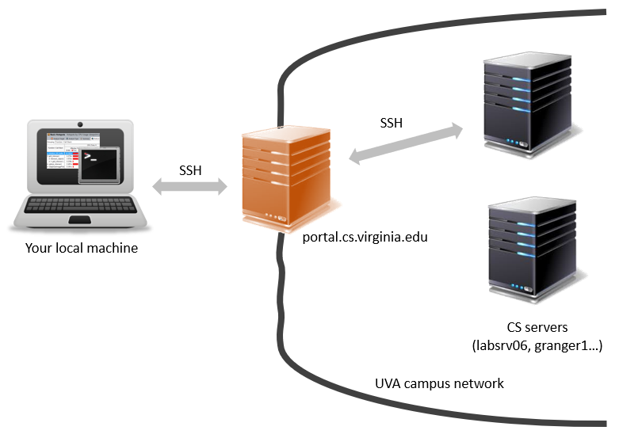
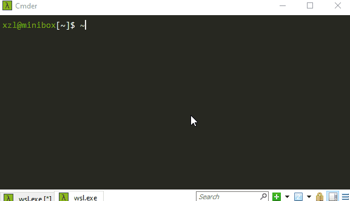
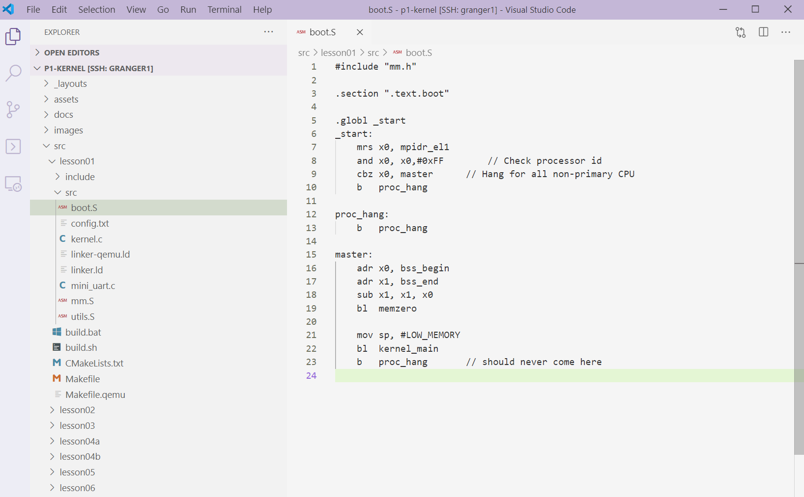
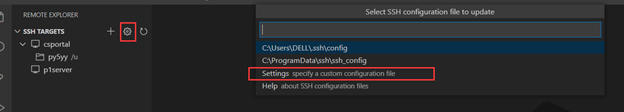
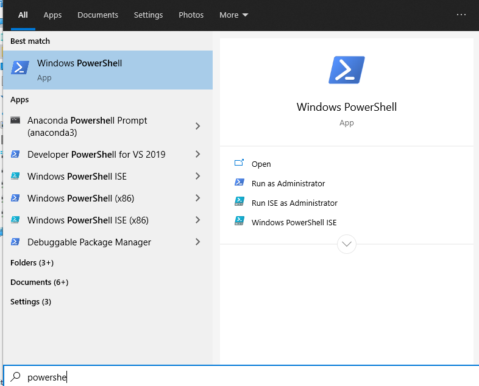
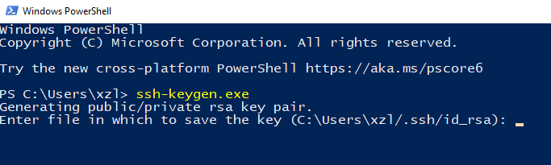
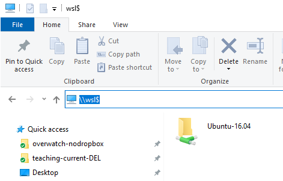
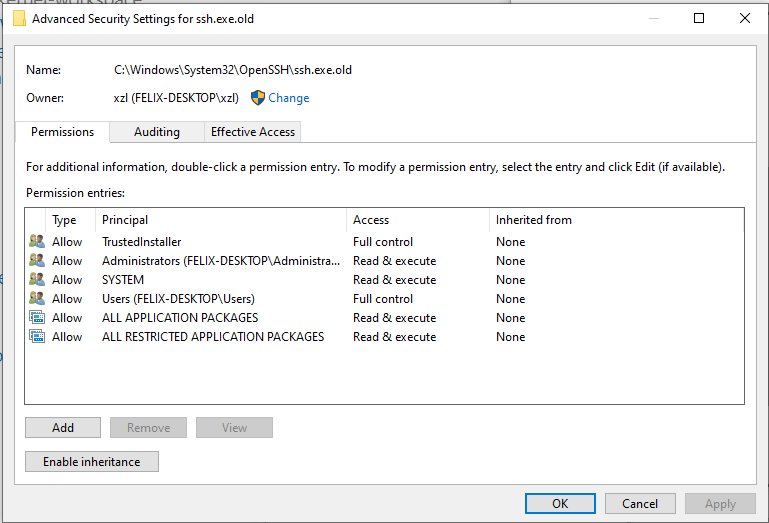
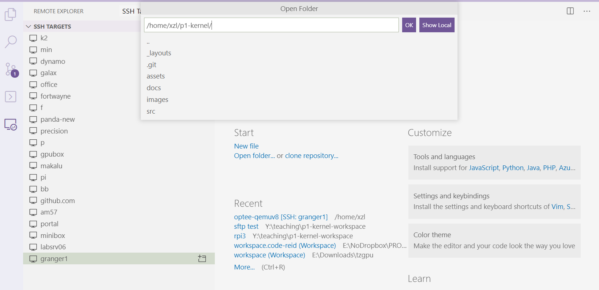

# Accessing the course server(s)

This document describes server resources and how to connect for development. 

|                                                              | Projects   | hardware specs                                | OS               |
| ------------------------------------------------------------ | ---------- | --------------------------------------------- | ---------------- |
| granger1.cs.virginia.edu                                     | p1-p4      | Dual Xeon 2630v4 Broadwell (10c20t), 20 cores | Ubuntu 20.04 LTS |
| labsrv06.cs.virginia.edu (Jan 30: temporarily out of service) | All but p2 | Single Xeon Silver 4410 CPU (8c16t), 8 cores  | Ubuntu 20.04 LTS |

<!--- Using your CS credentials (not the UVA ones). See [wiki page](https://www.cs.virginia.edu/wiki/doku.php?id=compute_resources). Contact felixlin@ if you do not have CS credentials.  --->

These servers are behind the campus firewall. You need to first SSH to **portal.cs.virginia.edu**, and from there SSH over to the course servers, e.g. labsrv06. This is described [here](https://www.cs.virginia.edu/wiki/doku.php?id=linux_ssh_access). 

**WARNING:** portal is managed by the UVA IT. You use your existing computing ID & password. The course server is managed by cs4414 staff. Use the credentials that we share with you. 


*Figure above: your local machine, the portal, and the server. Texts on the bottom: key files and their purpose.* 

## Terminal over SSH

```
$ ssh xl6yq@portal.cs.virginia.edu
(type in password...)
Warning: No xauth data; using fake authentication data for X11 forwarding.
Last login: Sun Jan 24 16:48:29 2021 from c-71-62-166-85.hsd1.va.comcast.net
********************************** **********************
Type "module avail" to see software available.
See: www.cs.virginia.edu/computing for more information.

$ ssh xl6yq@granger1.cs.virginia.edu
(type in password...)
Welcome to Ubuntu 20.04 LTS (GNU/Linux 5.4.0-45-generic x86_64)
```

Connecting to the course servers can be automated. 



The picture shows the final results: From a local terminal (e.g. my minibox), connecting to a course server by simply typing `ssh granger1`. Read on for how to configure.

### 1. Use key-based authentication in lieu of password 

Applicable local environment: Linux, MacOS, & Windows (WSL)

The pub key on your local machine is at `~/.ssh/id_rsa.pub`. Check out the file & its content. If it does not exist, generate a pub key by running `ssh-keygen`. 

```
# on the local console (Linux or WSL)
$ ssh-keygen
Generating public/private rsa key pair.
Enter file in which to save the key (/home/xzl/.ssh/id_rsa):
```

Now, append your public key to both portal and granger1 (`~/.ssh/authorized_keys`). 

Don't do this manually. Instead, do so by the command `ssh-copy-id`. For instance: 

```
# copy the pubkey from your local machine to portal
$ ssh-copy-id xl6yq@portal.cs.virginia.edu
(... type in password ...)

# connect to "portal", it should no longer ask for password
$ ssh xl6yq@portal.cs.virginia.edu

# now we are on "portal". generate a new pair of public/private keys, which will be used between portal and granger1 
$ ssh-keygen

# copy the new public key from portal to granger1
$ ssh-copy-id xl6yq@granger1.cs.virginia.edu
(... type in password ...)

# it should no longer ask for password
$ ssh xl6yq@granger1.cs.virginia.edu
```

**An alternative procedure (02/07/21):** Peiyi Yang, our TA, reported her successful configuration procedure as follows. 

Started from scratch. First edited the ssh config file on the local computer saying to jump through portal when going to granger1. Then ran ssh-copy-id id@portal and entered the password to install the local's pubkey on portal. Then from local, ran ssh-copy-id id@granger1 and entered the password to install the local's pubkey on granger1.

So there is only one key pair. The pubkey is copied to portal and then to granger1. 

### Troubleshooting: the server still asks for password? 

Let's use granger1 as an example. 

* On granger1, check the content of ~/.ssh/authorized_keys. You should see your public key saved there. For instance, mine is: 

```
$ cat ~/.ssh/authorized_keys
ssh-rsa AAAAB3NzaC1yc2EAAAADAQABAAABAQCkkCZ2PO7GdX5CBL26zcIFz4XgMiHSQjaU32evuidvMXsC
ZExT9QHl3Ou00QfuagmfebugxB0aruGAsKmBxEBmlj0r1uAVCekYaIn8IPA5jynQnDRDdIABaZBWlsPx9jKo
KQqLlKgdG4JziQOAr0HaUgr+oIXgRUq7V/W1OhV9SQVF+vcIy8vVwNdLBNdbw/GtU0oKb76yxfXOC/VZM7eZ
xhovb/J450U5Op8tL/+Lg5x2sJKqR2juCFAicGbVNuXXazEDrXHgDQp+WQS8rYK4Zs95KqAsMfxvsFSbs8lf
h0pIs+sozBNUt+1noJkcyLfxhzu0yGEsxMULHE/KdAst xl6yq@portal03                        
```

"xl6yq@portal03" is the textual tag of the pubkey, indicating it is a pubkey generated on portal.cs

* On granger1, check the permission of ~/.ssh. It should be: 

```
$ ls -la ~ | grep .ssh
drwx------ 
```
Check the permission of ~/.ssh/authorized_keys. It should be: 

```
$ ls -l ~/.ssh/authorized_keys
-rw------- 
```

If none of the above works, you can put ssh in the verbose mode to see what's going on. From `portal`, type
```
ssh -vv granger1.cs.virginia.edu
```
Explanation: -vv tells ssh to dump its interactions with granger1 on negotiating keys. As a reference, my output is [here](granger1-ssh-output.txt). At the end of the output, you can see granger1 accepts my key offered from portal. 

**Note to Windows Users**: if you try to invoke ssh-copy-id that comes with Windows (the one you can invoke in PowerShell, not the one in WSL), there may be some caveats. See [here](https://www.chrisjhart.com/Windows-10-ssh-copy-id/). I would say just invoke ssh-copy-id in WSL. 

### 2. Save connection info in SSH config

Append the following to your ssh client configuration (`~/.ssh/config`). **Replace USERNAME with your actual username**: 

```
Host granger1
   User USERNAME
   HostName granger1.cs.virginia.edu
   ProxyJump USERNAME@portal.cs.virginia.edu:22
```
With the configuration, your local ssh client knows that when connecting  to host `granger1`, use `portal` as the jump proxy. So you can directly connect to `granger1` from your local machine: 
```
$ ssh granger1
```
### (FYI) a one-liner for connecting to course servers 

```
$ ssh -l USERNAME granger1.cs.virginia.edu -J portal.cs.virginia.edu
```
The -J option is available with your local ssh client OpenSSH >= 7.3p1. See [here](https://unix.stackexchange.com/questions/423205/can-i-access-ssh-server-by-using-another-ssh-server-as-intermediary/423211#423211) for more details. For instance, my version: 

```
$ ssh -V
OpenSSH_7.6p1 Ubuntu-4ubuntu0.3, OpenSSL 1.0.2n  7 Dec 2017
```
## Remote development with VSCode 

Many students may prefer VSCode. Here is how to make it work for our kernel hacking. 

End results: being able to develop, compile, and do version control from VSCode. See an example screenshot below. 



So we will use VSCode's official Remote.SSH extension. I do not recommend 3rd party extensions, e.g. sftp. 

An official tutorial is [here](https://code.visualstudio.com/docs/remote/ssh). 

tl;dr: VSCode will connect to the course server (Linux) using SSH under the hood. To do so you install the "Remote development" [package](https://marketplace.visualstudio.com/items?itemName=ms-vscode-remote.vscode-remote-extensionpack) which will install the "Remote.SSH" extension for VSCode. 


> *Screenshot from Peiyi Yang (py5yy@). Her VSCode color scheme is different from mine.* 

### Windows caveat 1: ssh keys

The extension (Remote.SSH) will invoke Window's ssh client (`c:\Windows\System32\OpenSSH\ssh.exe`), which different from the ssh client that you run in WSL. The Window's ssh client expects its config file at `C:\Users\%USERNAME%\.ssh\config`. 



>  *Screenshot from Peiyi Yang (py5yy@). * 

If you haven't generated your SSH keys so far, you can do so by launching a PowerShell console and run `ssh-keygen` there. 

|  |  |  |
| -------------------------- | ------------------------------------ | ----------------------- |
| *Launch PowerShell*        | *ssh-keygen in PowerShell*           | *Access WSL root*       |

Or, you can you copy existing ssh keys and config (e.g. from WSL `~/.ssh/`) to the location mentioned above. Btw, the way to access WSL's root filesystem is to type `\\wsl$` in the explorer address bar. See the figure above. 

### Windows caveat 2: an outdated ssh client 

The current VSCode has a bug that breaks ssh with jumphost. You have to manually fix it by following [this](https://github.com/microsoft/vscode-remote-release/issues/18#issuecomment-507258777). In a nutshell, manual download a newer win32 ssh to overwrite the one shipping with Win 10 (it's a good idea to save a back up). Window's security mechanism is in your way. Work around it. 

|  |  |
| ------------------------------------------------------------ | ------------------------------------------------------------ |
| *Turning off protection on ssh.exe (see link above)*         | *The newer ssh client manually installed*                    |


Now, you should be good to go with VSCode. 

Make sure you have the Remote.SSH extension installed. Click "Remote Explorer" on the left bar. The extension will pick up your ssh config file (again that's `C:/Users/%USERNAME%/.ssh/config`) and present a list of hosts recognized. Click one to connect to it. The extension will copy a bunch of stuffs to the host and launch some daemon on the host. Then you are connected. 

### Launch a terminal

After connection, click "remote" on the left bar to bring up a remote terminal, in which you can execute commands to build projects, etc. Make sure to click the "+" sign to create a new shell terminal. 


### File browsing & editing

Then you will specify a remote folder on the server to "open": 



To browse & edit files on the server, click "explorer" on the left bar


Click  "source control" on the left bar for a handy git interface. 